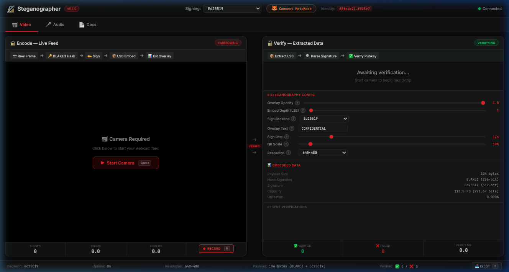
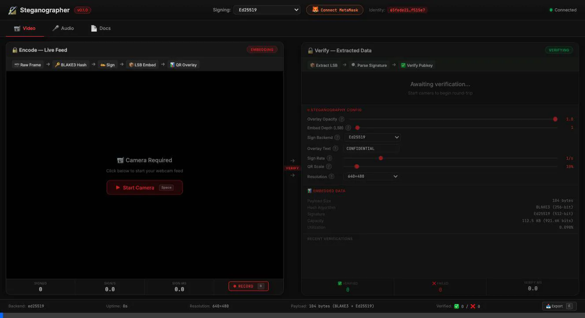
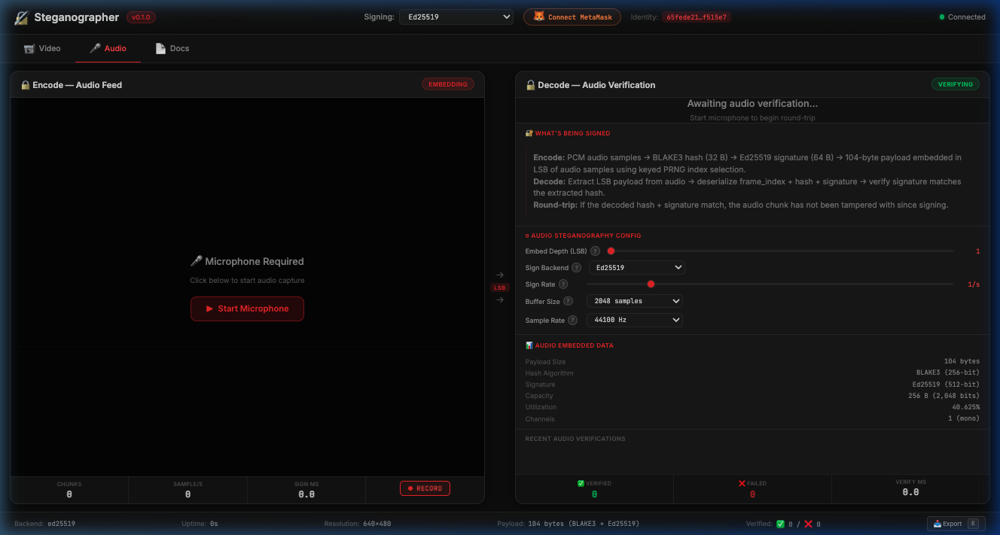
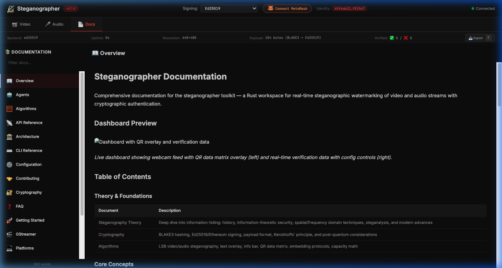

<p align="center">
  
</p>

<h1 align="center">🔒 Steganographer</h1>

<p align="center">
  <strong>Real-time cryptographic watermarking for video & audio — built entirely in Rust</strong>
</p>

<p align="center">
  <a href="docs/getting-started.md">Getting Started</a> •
  <a href="docs/architecture.md">Architecture</a> •
  <a href="docs/cryptography.md">Cryptography</a> •
  <a href="docs/cli-reference.md">CLI Reference</a> •
  <a href="docs/faq.md">FAQ</a>
</p>

<p align="center">
  
  
  
  
</p>

---

Steganographer embeds **cryptographic signatures** (BLAKE3 + Ed25519) and **visible watermarks** into live media streams using LSB steganography, QR overlays, and GStreamer pipelines. Every video frame and audio chunk is hashed, signed, and verified in real time.

<details>
<summary><strong>📹 Dashboard Demo</strong> — click to expand</summary>
<br>

<br><em>The three-tab dashboard: Video encoding/verification, Audio steganography, and in-app Documentation viewer.</em>
</details>

---

## ⚡ Quick Start

```bash
git clone https://github.com/docxology/steganographer.git
cd steganographer
cargo build --workspace
cargo test --workspace   # 282 tests, 0 failures
./run.sh                 # Interactive terminal menu
```

> 📖 Full setup guide: [**Getting Started**](docs/getting-started.md) — includes prerequisites, build instructions, and first-run tutorial.

---

## 🏗️ How It Works

```text
  Raw Frame/Audio → BLAKE3 Hash → Ed25519 Sign → LSB Embed → QR Overlay
       ↓                                              ↓
  Tamper-evident media                          Visible provenance
```

Every frame goes through a **four-stage pipeline**:

1. **Hash** — [BLAKE3](docs/cryptography.md#blake3-hashing) computes a 256-bit digest over `frame_index ∥ video_bytes ∥ audio_bytes`
2. **Sign** — [Ed25519 or Ethereum/secp256k1](docs/cryptography.md#ed25519-signing) signs the hash for tamper detection
3. **Embed** — [LSB steganography](docs/algorithms.md#lsb-video-protocol) hides the 109-byte payload in pixel/sample least-significant bits
4. **Overlay** — [QR code + text watermark](docs/algorithms.md#qr--info-bar-overlay) burns visible provenance into the frame

> 🔐 Deep dive: [**Cryptography**](docs/cryptography.md) · [**Algorithms**](docs/algorithms.md) · [**Steganography Theory**](docs/steganography-theory.md) · [**Threat Model**](docs/threat-model.md)

---

## 🖥️ Live Dashboard

A three-tab web GUI for real-time round-trip verification:

| Tab | What it does |
| ----- | ------------- |
| **Video** | Webcam → LSB encode → decode → verify (live). Controls for opacity, LSB bits, sign rate, QR scale, resolution |
| **Audio** | Microphone → PCM capture → LSB embed → extract → verify. Waveform + spectrum visualization, WAV recording |
| **Docs** | Browse all 17 project docs in-dashboard with search and navigation |

<details>
<summary>🔽 <strong>Dashboard screenshots</strong></summary>
<br>
<table>
  <tr>
    <td></td>
    <td></td>
  </tr>
  <tr>
    <td align="center"><em>Video: encode + verify + config</em></td>
    <td align="center"><em>Audio: waveform + LSB verification</em></td>
  </tr>
  <tr>
    <td></td>
    <td></td>
  </tr>
  <tr>
    <td align="center"><em>Docs: in-dashboard documentation</em></td>
    <td align="center"><em>QR overlay with timestamp</em></td>
  </tr>
</table>
</details>

```bash
# Launch the dashboard
./run.sh    # select 'd' for dashboard, or 'a' for all
# Or directly:
cargo run -p steganographer-cli -- dashboard --port 8080 --backend ed25519
```

> 📖 Full API reference: [**API Reference**](docs/api-reference.md) — all HTTP/WebSocket endpoints, JSON schemas, and configuration payloads.

---

## 🧩 Architecture

Four Rust crates with strict dependency layering:

```text
┌──────────────────────────────────────────────┐
│  steganographer-cli       (binary)           │  Clap CLI: 10 subcommands
├──────────────────────────────────────────────┤
│  steganographer-dashboard (web server)       │  Axum + WebSocket, 3 tabs
│  steganographer-gst       (GStreamer plugin)  │  AppSink/AppSrc pipeline
├──────────────────────────────────────────────┤
│  steganographer-core      (algorithms)       │  Pure Rust, 0 system deps
└──────────────────────────────────────────────┘
```

| Crate | Purpose | Tests | Docs |
| ------- | --------- | ------- | ------ |
| **[steganographer-core](steganographer-core/)** | Crypto, LSB, DCT, spread-spectrum, encryption, error correction, multi-frame, overlay, config | 247 | [Architecture](docs/architecture.md) |
| **[steganographer-dashboard](steganographer-dashboard/)** | Live web GUI | 23 | [API Reference](docs/api-reference.md) |
| **[steganographer-gst](steganographer-gst/)** | GStreamer integration | 1 | [GStreamer Guide](docs/gstreamer.md) |
| **[steganographer-cli](steganographer-cli/)** | CLI binary | 10 | [CLI Reference](docs/cli-reference.md) |

> 📖 Full breakdown: [**Architecture**](docs/architecture.md) — crate hierarchy, module map, data flow diagrams.

---

## 🔑 Crypto Design

| Component | Algorithm | Details |
| ----------- | ----------- | --------- |
| **Hashing** | BLAKE3 / SHA-256 / SHA-3 | Configurable; BLAKE3 default, 256-bit digest of `frame_index ∥ video_bytes ∥ audio_bytes` |
| **Signing** | Ed25519 | 64-byte EUF-CMA secure signature over the hash |
| **Payload** | 104 bytes | `frame_index (8) + hash (32) + signature (64)` |
| **Video embed** | Length-prefixed LSB | 1–4 bit replacement with 32-bit length header |
| **Audio embed** | Keyed ChaCha8 PRNG | Pseudo-random sample permutation for scatter embedding |
| **Encryption** | ChaCha20-Poly1305 | AEAD encryption for payload confidentiality before embedding |
| **Error correction** | Reed-Solomon GF(2⁸) | Payload recovery from corrupted bits |
| **Alt video embed** | DCT-domain | Mid-frequency coefficient embedding for compression resistance |
| **Alt video embed** | Spread-spectrum | PN-sequence modulation for noise resistance |
| **Multi-frame** | Shard spreading | One signature spread across N frames for partial loss resilience |
| **Alt signing** | Ethereum secp256k1 | EIP-191 personal_sign, MetaMask-compatible |

> 📖 Deep dives: [**Cryptography**](docs/cryptography.md) · [**Security Model**](docs/security.md) · [**Threat Model**](docs/threat-model.md)

---

## 🛠️ CLI Usage

```bash
# Generate a key pair
steganographer keygen --output mykey

# Offline encode
steganographer encode --input frame.rgb --output signed.rgb --stego-type lsb_video --bits 1

# Report steganographic capacity of a file
steganographer info --input frame.rgb --stego-type lsb_video --bits 1

# Verify
steganographer verify --input signed.rgb --public-key <hex> --stego-type lsb_video --format json

# Validate a TOML configuration file
steganographer config check

# Live video (GStreamer)
steganographer video --config steganographer.toml

# Live audio
steganographer audio --config steganographer.toml

# Dashboard
steganographer dashboard --port 8080 --backend ed25519
```

> 📖 All commands and options: [**CLI Reference**](docs/cli-reference.md)

---

## ⚙️ Configuration

Two config files, fully documented:

- [`steganographer.toml`](steganographer.toml) — Master configuration (video/audio sources, signing keys, stego modules)
- [`config/example.toml`](config/example.toml) — Minimal annotated example

```toml
[video]
source = "avfvideosrc"
width = 1280
height = 720

[signing]
backend = "ed25519"

[[stego.modules]]
type = "lsb_video"
bits = 2
```

> 📖 Full TOML schema: [**Configuration**](docs/configuration.md) — all fields, template placeholders, module chains.

---

## ✅ Tests

282 tests across 4 crates — all passing:

| Category | Count | Location |
| ---------- | ------- | ---------- |
| Core unit tests | 171 | `steganographer-core/src/*.rs` |
| Core integration tests | 76 | `steganographer-core/tests/integration_tests.rs` |
| CLI integration tests | 10 | `steganographer-cli/tests/cli_integration_tests.rs` |
| Dashboard tests | 23 | `steganographer-dashboard/tests/dashboard_tests.rs` |
| GStreamer + Doc-tests | 2 | `steganographer-gst/src/` + doc-test |
| **Total** | **282** | **0 failures** |

```bash
cargo test --workspace                # All 282 tests
cargo test -p steganographer-core     # Core only (247 tests)
cargo test -p steganographer-dashboard # Dashboard only (23 tests)
```

---

## 🌍 Platform Support

| Platform | Video Source | Audio Source | Docs |
| ---------- | ------------- | ------------- | ------ |
| **macOS** | `avfvideosrc` | `osxaudiosrc` | [Platforms](docs/platforms.md) |
| **Linux** | `v4l2src` | `pulsesrc` / `pipewiresrc` | [Platforms](docs/platforms.md) |
| **Docker** | Headless | Headless | [Platforms](docs/platforms.md) |

> ⚠️ GStreamer is optional. The core crate and offline encode/verify commands work without it.

---

## 📚 Documentation

17 comprehensive guides in [`docs/`](docs/):

| Guide | Description |
| ------- | ------------- |
| [**Getting Started**](docs/getting-started.md) | Prerequisites, build, first-run tutorial |
| [**Architecture**](docs/architecture.md) | Crate hierarchy, module map, data flow |
| [**Cryptography**](docs/cryptography.md) | BLAKE3, Ed25519, Ethereum signing |
| [**Algorithms**](docs/algorithms.md) | LSB protocols, capacity math, QR overlay |
| [**Steganography Theory**](docs/steganography-theory.md) | Information-theoretic security foundations |
| [**Security**](docs/security.md) | Cachin's ε-security, deployment guidance |
| [**Threat Model**](docs/threat-model.md) | Adversary model, attack catalog, mitigations |
| [**CLI Reference**](docs/cli-reference.md) | All 6 commands with examples |
| [**API Reference**](docs/api-reference.md) | HTTP + WebSocket endpoints, JSON schemas |
| [**Configuration**](docs/configuration.md) | Full TOML schema, template variables |
| [**GStreamer**](docs/gstreamer.md) | Pipeline integration, AppSink/AppSrc |
| [**Platforms**](docs/platforms.md) | macOS, Linux, Docker setup |
| [**Contributing**](docs/contributing.md) | Dev workflow, testing, PR checklist |
| [**Roadmap**](docs/roadmap.md) | DCT-domain, ML-DSA, post-quantum plans |
| [**FAQ**](docs/faq.md) | 30+ questions and answers |

---

## 📄 License

MIT — see [LICENSE](LICENSE) for details.
