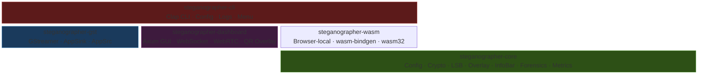

# Steganographer Documentation

Comprehensive documentation for the steganographer toolkit — a Rust workspace for real-time steganographic watermarking of video and audio streams with cryptographic authentication.

## Dashboard Preview


*Live dashboard showing webcam feed with QR data matrix overlay (left) and real-time verification data with config controls (right).*

## Table of Contents

### Theory & Foundations

| Document | Description |
| ---------- | ------------- |
| [Steganography Theory](steganography-theory.md) | Deep dive into information hiding: history, information-theoretic security, spatial/frequency domain techniques, steganalysis, and modern advances |
| [Cryptography](cryptography.md) | BLAKE3 hashing, Ed25519/Ethereum signing, payload format, Kerckhoffs' principle, and post-quantum considerations |
| [Algorithms](algorithms.md) | LSB video/audio steganography, text overlay, info bar, QR data matrix, embedding protocols, capacity math |

### Core Concepts

| Document | Description |
| --- | --- |
| [Architecture](architecture.md) | System design, five-crate structure, data flow, threading models, dashboard websocket + WebRTC transport architecture |
| [Security](security.md) | Security model, threat analysis, steganalysis resistance, dashboard security, and hardening guidelines |
| [Threat Model](threat-model.md) | Adversary model, 10 threat categories (T1–T10), security boundaries, use-case scenarios, and residual risk analysis |

### User Guides

| Document | Description |
| --- | --- |
| [Getting Started](getting-started.md) | Installation, first build, quick tutorial, dashboard quickstart, and pipeline customization |
| [CLI Reference](cli-reference.md) | Complete command-line interface documentation with all options and examples |
| [Configuration](configuration.md) | Full TOML config format with pipeline, stego, overlay, and live dashboard settings |

### Integration

| Document | Description |
| --- | --- |
| [GStreamer Integration](gstreamer.md) | Pipeline architecture, AppSink/AppSrc, config-driven pipeline construction |
| [Platform Guide](platforms.md) | Linux v4l2, macOS AVFoundation, virtual devices, audio routing, Docker |
| [OTS Integration](ots-integration.md) | OpenTimestamps attestation: stamping, verification, and configuration |

### Development

| Document | Description |
| --- | --- |
| [API Reference](api-reference.md) | Complete Rust API: types, traits, structs, methods, dashboard endpoints, and `LiveConfig` |
| [Contributing](contributing.md) | Development workflow, coding standards, testing, adding new algorithms |
| [Roadmap](roadmap.md) | Planned features, extension points, and future work |
| [Compatibility](compatibility.md) | Compatibility & deprecation policy: SemVer semantics, wire-format rules, golden-vector stability, MSRV, and platform matrix |
| [Steganography Platform Plan](plans/steganography-platform/README.md) | Composable v0.6.x–v1.0 program for generic packets, carriers, formats, forensics, documents, CLI/WASM, validation, and migration |
| [FAQ](faq.md) | 30+ Q&As on concepts, build, usage, crypto, dashboard, and configuration |

## Quick Links

- **Run**: `./run.sh` (interactive menu, reads `steganographer.toml`)
- **Dashboard**: `./run.sh` → option `1` (launches web GUI at `http://localhost:8080`)
- **Build**: `cargo build --workspace`
- **Test**: `cargo test --workspace` (count: canonical Tests line in root `AGENTS.md`; verify with the command itself)
- **CLI**: `cargo run -p steganographer-cli -- --help`
- **Config**: [`steganographer.toml`](../steganographer.toml) (master config)
- **Example**: [`config/example.toml`](../config/example.toml)

## Architecture at a Glance



## Dashboard Features

| Feature | Description |
| --------- | ------------- |
| **Live Feed** | Zero-latency webcam via `requestAnimationFrame` |
| **QR Overlay** | Data matrix encoding frame index, BLAKE3 hash, timestamp, backend |
| **Opacity Slider** | Controls QR overlay visibility (0.0–1.0) |
| **Verification Data** | Right panel shows status banner, hash, latency, scrolling log |
| **Config Controls** | LSB bits, sign backend, overlay text, sign rate — all live |
| **MetaMask** | Connect Ethereum wallet for secp256k1 signing |
| **Stego Info** | Capacity, utilization, payload size — recalculated in real time |
| **Audio Tab** | Microphone capture, waveform/spectrum visualization, audio LSB signing |
| **Docs Tab** | Browse all 19 project docs in-dashboard, rendered client-side with marked.js |
| **Dynamic LSB** | Encode/decode handlers stay in sync when LSB slider changes (1–4 bits) |
| **Signature Preview** | Decoded payload shows first 16 bytes of Ed25519/secp256k1 signature |
| **Record & Save** | Record signed video (WebM) or audio (WAV) with embedded integrity data |
| **Tooltips** | Detailed mouseover explanations on every control for all experience levels |

## Test Summary

```text
steganographer-core (unit):   381 tests (packet/carrier incl. PCM S16 LSB, keyed + interleaved placement, crypto, LSB, overlay, config, audio, metrics, signing incl. real ML-DSA, encryption, ECC, KDF, password KDF incl. Argon2id, transforms incl. TRANSFORM_KDF_ARGON2ID, multi-frame, spread-spectrum, DCT, MDCT, adaptive, hash-chain, steganalysis, forensics incl. detector registry, OOXML container analysis, Unicode text detectors, nested decode, OTS)
steganographer-core (integ):  125 tests (E2E, pipeline, template, info_bar, signer_backend incl. ML-DSA, encryption, ECC, OTS, golden vectors, detector calibration)
steganographer-cli (unit):     22 tests (media descriptors/I/O, canonical carrier binding, verify validation/revocation)
steganographer-cli (integ):    46 tests (legacy/generic round trips, exit-code contract, config incl. limits/profiles, key files, encryption, Argon2id password path, ECC, DCT, image/WAV policy, analysis, password derivation, generic packet transforms, keyed placement, WAV generic packet vertical slice, exact info report, forensic scan incl. Unicode + container findings, extract command)
steganographer-dashboard:     57 tests (LiveConfig incl. transport, DashboardState, router, API, auth, WS origin/token gates, WebRTC signaling, real verification, config validation; 8 doc-tests)
steganographer-gst:           24 tests (plugin, stegovideo/stegoaudio elements, pad-template gates, stride-safe embedding, clear-payload, multi-channel audio, doctest)
steganographer-wasm:           9 tests (packet encode/decode, RGB/PCM carriers, forensic scan, decode-limit overrides)
━━━━━━━━━━━━━━━━━━━━━━━━━━━━━━━━━━━
Total:                        705 tests, 0 failures
```
