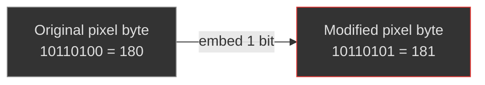
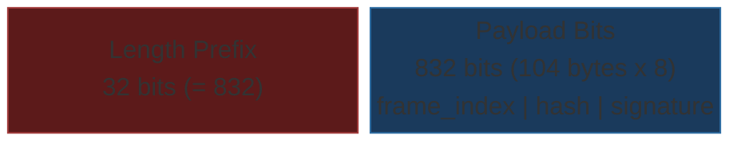
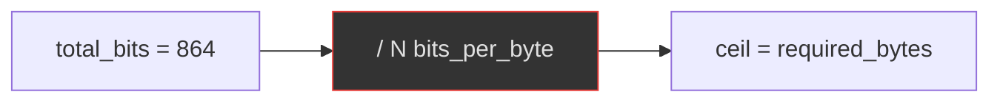
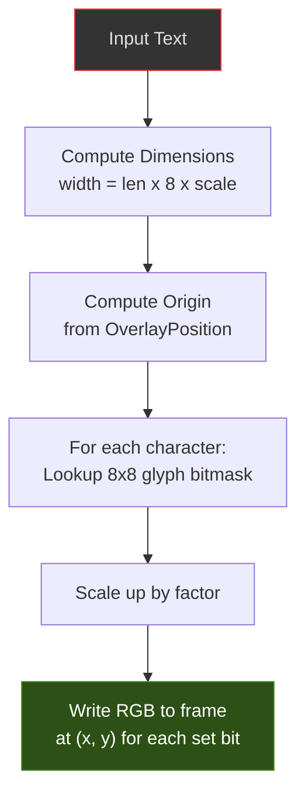

# Algorithms

## Overview

Steganographer implements three categories of watermarking algorithms, each serving a distinct purpose:

| Algorithm | Type | Visibility | Extractable | Module |
| --- | --- | --- | --- | --- |
| LSB Video | Data hiding | Invisible | ✅ Yes | `lsb_video.rs` |
| LSB Audio | Data hiding | Inaudible | ✅ Yes | `lsb_audio.rs` |
| Text Overlay | Visual mark | Visible | ❌ No | `overlay.rs` |
| Info Bar | Visual + Machine | Visible | ✅ Yes (scan) | `info_bar.rs` |
| QR Data Matrix | Visual metadata | Visible | ✅ Yes (scan) | `app.js` (client-side) |

---

## LSB Video Steganography

### Principle

Least Significant Bit (LSB) replacement modifies the lowest-order bits of pixel values to encode data. Since the LSBs contribute the least to the pixel's visual appearance, changes are imperceptible to the human eye.



### Embedding Protocol

1. **Serialize** the `SignaturePayload` (104 bytes = 832 bits)
2. **Prepend** a 32-bit length prefix (big-endian, value = 832)
3. **Replace** the lowest `N` bits of each pixel byte sequentially



**Total: 864 bits to embed**

### Capacity Requirements

The frame must have enough pixel bytes to hold all embedded bits:



| LSB Bits (N) | Required Bytes | Min Frame Size (RGB8) |
| --- | --- | --- |
| 1 | 864 bytes | 288 pixels (17×17) |
| 2 | 432 bytes | 144 pixels (12×12) |
| 3 | 288 bytes | 96 pixels (10×10) |
| 4 | 216 bytes | 72 pixels (9×8) |

A typical 640×480 RGB frame has 921,600 bytes — far more than needed.

### Extraction Protocol

1. Read `N` LSBs from each pixel byte sequentially
2. Reconstruct the 32-bit length prefix
3. Validate the length matches `SignaturePayload::SERIALIZED_SIZE * 8` (832)
4. Reconstruct the 104-byte payload from the next 832 bits
5. Deserialize into a `SignaturePayload`

If the length prefix doesn't match 832, extraction returns `None` (no payload found).

### Visual Impact

| Bits | Max Pixel Change | SNR Impact | Perceptibility |
| --- | --- | --- | --- |
| 1 | ±1 value | ~48 dB | Imperceptible |
| 2 | ±3 values | ~42 dB | Imperceptible |
| 3 | ±7 values | ~36 dB | Barely perceptible |
| 4 | ±15 values | ~30 dB | Noticeable in smooth areas |

**Recommendation**: Use 1 bit for maximum stealth, 2 bits for a good balance.

### Supported Formats

| Format | Embedding Plane | Notes |
| --- | --- | --- |
| RGB8 | All 3 channels | Sequential across R, G, B |
| BGRA8 | All 4 channels | Includes alpha channel |
| YUV420 | Not yet supported | Future: embed in Y (luma) plane only |

---

## LSB Audio Steganography

### Principle

Similar to video LSB, but operates on 16-bit PCM audio samples. The key difference is that audio uses **pseudo-random index selection** via a keyed PRNG, making the embedding pattern unpredictable without the key.

### Why Pseudo-Random Indices?

Sequential embedding in audio is more detectable than in video because:

1. Audio analysis tools can detect statistical anomalies in sequential LSBs
2. Audio is often subject to spectral analysis that reveals patterns
3. Human hearing is sensitive to regular patterns in noise

By permuting sample indices with a secret key, the embedded bits are scattered throughout the buffer, defeating statistical steganalysis.

### Key-Derived Permutation

```rust
// Derive per-frame seed from key ⊕ frame_index
let mut seed = [0u8; 32];
for (i, byte) in key.iter().enumerate() {
    seed[i] = byte ^ frame_index_bytes[i % 8];
}
let mut rng = StdRng::from_seed(seed);  // ChaCha8-based PRNG

// Fisher-Yates shuffle
let mut indices: Vec<usize> = (0..sample_count).collect();
indices.shuffle(&mut rng);
```

**Properties**:

- Same key + same frame_index → same permutation (deterministic)
- Different frame_index → different permutation (prevents cross-frame analysis)
- Without the key, the permutation is computationally infeasible to recover

### Embedding Protocol

Same length-prefix protocol as video, but bits are written to samples at permuted indices:

```text
For each permuted index i:
    sample[i] = (sample[i] & mask) | embedded_bits
```

The `mask` clears the lowest `N` bits: `mask = !((1 << N) - 1)`

### Capacity (16-bit PCM, Mono 44.1 kHz)

| Duration | Samples | Capacity (1-bit) | Capacity (2-bit) |
| --- | --- | --- | --- |
| 10 ms | 441 | 441 bits (55 bytes) | 882 bits |
| 100 ms | 4,410 | 4,410 bits (551 bytes) | 8,820 bits |
| 1 sec | 44,100 | 44,100 bits (5.4 KB) | 88,200 bits |

The 104-byte payload needs 832 bits → only **832 samples** minimum (≈19 ms at 44.1 kHz).

### Audibility Impact

| Bits | Max Sample Change | SNR Impact | Audibility |
| --- | --- | --- | --- |
| 1 | ±1 (out of 32,768) | ~90 dB | Completely inaudible |
| 2 | ±3 | ~84 dB | Inaudible |
| 3 | ±7 | ~78 dB | Inaudible in music/speech |
| 4 | ±15 | ~72 dB | Barely audible in silence |

---

## Text Overlay

### Principle

Burns visible text directly into frame pixel data using a built-in 8×8 bitmap font. This is not steganography (the text is visible), but serves as a complementary visual watermark.

### Built-in Font

The overlay module includes a complete 8×8 pixel bitmap font covering:

- All uppercase and lowercase Latin letters (A-Z, mapped case-insensitively)
- Digits 0-9
- Common punctuation: `! # : - . / { } _`
- Unknown characters render as a filled rectangle

Each glyph is encoded as 8 bytes (one per row), where each bit represents a pixel.

### Rendering Pipeline



### Configuration

| Parameter | Default | Options |
| --- | --- | --- |
| `text` | `"STEGANOGRAPHER"` | Any ASCII string; supports `{timestamp}`, `{frame_index}`, `{date}`, `{time}` placeholders |
| `position` | `bottom-right` | `top-left`, `top-right`, `bottom-left`, `bottom-right`, `center` |
| `color` | `(255, 255, 255)` | Any RGB tuple |
| `scale` | 2 (16×16 px chars) | 1–8 |
| `font_size` | 16 | Maps to scale via `scale = font_size / 8` |

> **Dynamic Substitution**: Template placeholders like `{timestamp}` and `{frame_index}` are expanded at embed-time on every frame, so each frame gets a fresh UTC timestamp and its own frame number burned into the overlay.

### Supported Formats

| Format | Color Mapping |
| --- | --- |
| RGB8 | Direct R, G, B write |
| BGRA8 | Swapped to B, G, R, A=255 |
| YUV420 | Not supported (no-op) |

---

## Info Bar Overlay (Exoteric Mark)

### Principle

Unlike steganography (which hides data) or simple text overlays, the Info Bar provides an **exoteric** (publicly visible and machine-readable) proof of encoding. It burns a high-contrast bar at the bottom of the video frame containing cryptographic and contextual data.

### Components

The Info Bar dynamically generates and renders four components per frame:

1. **Timestamp**: ISO 8601 UTC timestamp of the exact rendering moment
2. **Details String**: A summary of the applied steganography (e.g., `STEGO: LSB-1 | KEY: 8E78... | PAYLOAD: 104B`)
3. **1D Barcode (Code-128)**: A machine-readable encoding of the core signature or payload identifier
4. **2D QR Code**: A dense square code linking to the verification portal or containing the full public key/hash

### Rendering Pipeline

1. Clear the bottom 80 pixels of the frame to black
2. Render white text for the timestamp and details string
3. Generate the Code-128 barcode matrix from data
4. Generate the QR Code matrix from data
5. Scale and bitmap-blit the codes into the black region alongside the text

### Purpose

- **Immediate Verifiable Proof**: Allows a viewer with a smartphone to instantly scan the screen and verify the cryptographic signature without requiring raw video extraction.
- **Deterrence**: Visibly asserts that the stream is cryptographically monitored and signed.
- **Machine Readability**: The barcodes survive screencasts and lossy compression much better than LSB steganography.

---

## QR Data Matrix Overlay (Dashboard)

### Principle

The dashboard renders a client-side **QR-style data matrix** overlay on every video frame. Unlike the server-side Info Bar, this is rendered in JavaScript within the browser canvas and is controlled by the Overlay Opacity slider.

### Encoded Data (20 bytes)

| Field | Bytes | Encoding |
| --- | --- | --- |
| Local frame counter | 4 | Little-endian u32 |
| Server frame index | 4 | Little-endian u32 |
| BLAKE3 hash prefix | 8 | First 8 bytes of 32-byte hash |
| Timestamp (seconds) | 2 | UTC seconds mod 65536 |
| Backend ID | 1 | 0 = Ed25519, 1 = Ethereum |
| Verification status | 1 | 0 = Unverified, 1 = Verified |

### Rendering

1. **Encode** 20 bytes → 160 bits → 13×13 cell grid (with 9 padding bits)
2. **Add finder pattern**: 3×3 filled square in top-left corner (like QR alignment)
3. **Draw cells**: Each cell is a colored square — **red** for 1, **black** for 0
4. **Apply opacity**: `ctx.globalAlpha = opacitySlider.value`
5. **Position**: Bottom-right corner of the video canvas
6. **Label**: Text line above the grid showing `F:<count> | <BACKEND>` and overlay text (e.g., "CONFIDENTIAL")

### Opacity Control

The Overlay Opacity slider (0.0–1.0) directly controls the `globalAlpha` of the canvas context when drawing the QR overlay, allowing smooth fading from fully visible to fully transparent.


---

## Algorithm Comparison

| Property | LSB Video | LSB Audio | Text Overlay | Info Bar |
| --- | --- | --- | --- | --- |
| Visibility | Invisible | Inaudible | Visible | V. Visible |
| Extractable | ✅ | ✅ | ❌ | ✅ (Optical) |
| Index selection | Sequential | Pseudo-random | N/A | N/A |
| Survives transcoding | ❌ | ❌ | Partially | ✅ (Optical) |
| Survives screenshots | ❌ | N/A | ✅ | ✅ |
| Payload size | 104 bytes | 104 bytes | N/A | ~100 bytes |
| Configurable bits | 1–4 per byte | 1–4 per sample | N/A | N/A |

---

## Future Algorithms

### DCT-Based Embedding (Planned)

Embed data in the frequency domain (Discrete Cosine Transform coefficients) for robustness against lossy compression. This would survive JPEG/H.264 re-encoding.

### Spread-Spectrum (Planned)

Spread embedded data across a wide frequency band using a PN sequence, making it robust against noise and compression.

### Video Seal Integration (Planned)

Wrap Meta's Video Seal (MIT-licensed) as a `VideoStegoModule` for neural-network-based robust watermarking that survives aggressive transcoding.

---

## Steganalysis Resistance

### LSB Video (Sequential)

Sequential LSB replacement is vulnerable to classical steganalysis attacks. However, Steganographer's extremely low embedding rate (~104 bytes in a 921,600-byte frame = 0.09%) provides significant inherent resistance:

| Attack | Applicability | Notes |
| --- | --- | --- |
| Chi-squared (Westfeld & Pfitzmann) | Medium | Detects pairs-of-values equalization, but requires high embedding rate to be effective |
| RS Analysis (Fridrich et al.) | Low | Embedding rate too low for reliable detection |
| Sample Pair Analysis | Low | Extremely low payload-to-carrier ratio |
| Deep learning (SRNet, YeNet) | Very Low | Training requires examples at similar low embedding rates |

### LSB Audio (Keyed PRNG)

Keyed permutation provides significantly better steganalysis resistance than sequential embedding:

1. **Scattered indices** — Bits are spread pseudo-randomly across the buffer, defeating sequential analysis
2. **Key-dependent** — Different keys produce completely different index patterns
3. **Frame-varying** — Each frame's permutation changes (seed = key ⊕ frame_index)

### Overlay Modules

Text Overlay and Info Bar are *visible by design* — they are not subject to steganographic security analysis since they make no attempt at concealment.

---

## Further Reading

- [Steganography Theory](steganography-theory.md) — Information-theoretic foundations, steganalysis deep dive
- [Cryptography](cryptography.md) — BLAKE3 + Ed25519 details
- [Security](security.md) — Threat model and attack resistance
- [Threat Model](threat-model.md) — Adversary analysis, 8 threat categories, use-case scenarios
- [Configuration](configuration.md) — Configuring LSB bits, overlay, and pipeline parameters
- [Roadmap](roadmap.md) — Planned DCT-domain and spread-spectrum algorithms
