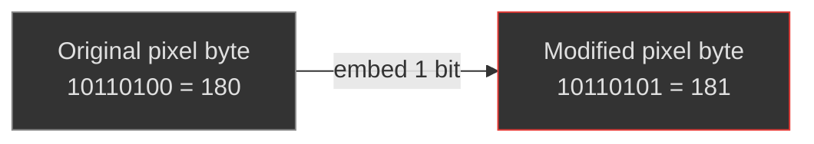
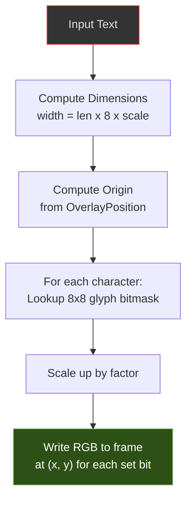
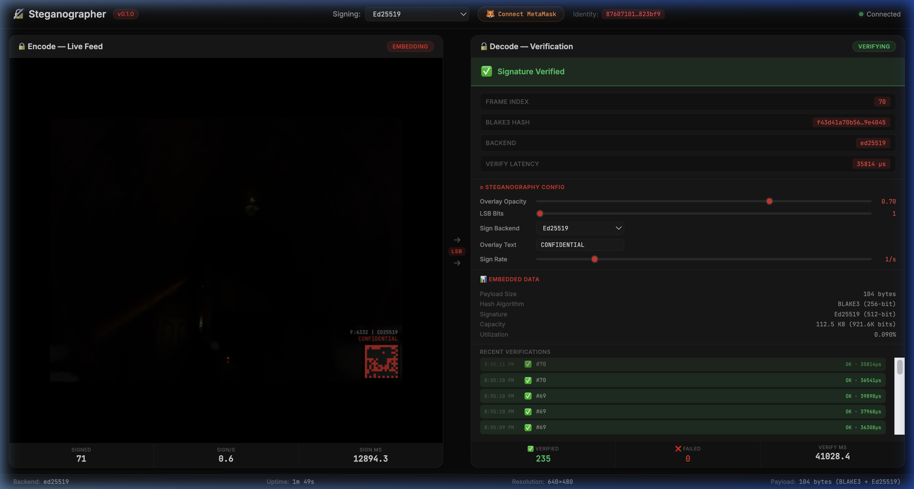

# Algorithms

## Overview

Steganographer implements three categories of watermarking algorithms, each serving a distinct purpose:

| Algorithm | Type | Visibility | Extractable | Module |
| --- | --- | --- | --- | --- |
| LSB Video | Data hiding | Invisible | ✅ Yes | `lsb_video.rs` |
| LSB Audio | Data hiding | Inaudible | ✅ Yes | `lsb_audio.rs` |
| Spread Spectrum | Data hiding | Invisible | ✅ Yes | `spread_spectrum.rs` |
| DCT Video | Data hiding | Invisible | ✅ Yes | `dct_video.rs` |
| Text Overlay | Visual mark | Visible | ❌ No | `overlay.rs` |
| Info Bar | Visual + Machine | Visible | ✅ Yes (scan) | `info_bar.rs` |
| QR Data Matrix | Visual metadata | Visible | ✅ Yes (scan) | `app.js` (client-side) |

---

## LSB Video Steganography

### Principle

Least Significant Bit (LSB) replacement modifies the lowest-order bits of pixel values to encode data. Since the LSBs contribute the least to the pixel's visual appearance, changes are imperceptible to the human eye.



### Embedding Protocol

1. **Serialize** the `SignaturePayload` (109 bytes = 872 bits)
2. **Prepend** a 32-bit length prefix (big-endian, value = 872)
3. **Replace** the lowest `N` bits of each pixel byte sequentially


**Total: 904 bits to embed**

### Capacity Requirements

The frame must have enough pixel bytes to hold all embedded bits:


| LSB Bits (N) | Required Bytes | Min Frame Size (RGB8) |
| --- | --- | --- |
| 1 | 904 bytes | 302 pixels (18×18) |
| 2 | 452 bytes | 151 pixels (13×12) |
| 3 | 302 bytes | 101 pixels (11×10) |
| 4 | 226 bytes | 76 pixels (9×9) |

A typical 640×480 RGB frame has 921,600 bytes — far more than needed.

### Extraction Protocol

1. Read `N` LSBs from each pixel byte sequentially
2. Reconstruct the 32-bit length prefix
3. Validate the length matches `SignaturePayload::SERIALIZED_SIZE * 8` (872)
4. Reconstruct the 109-byte payload from the next 872 bits
5. Deserialize into a `SignaturePayload`

If the length prefix doesn't match 872, extraction returns `None` (no payload found). The payload is further validated by checking the 4-byte magic header (`STEG`) and 1-byte version number during deserialization.

### Visual Impact

| Bits | Max Pixel Change | SNR Impact | Perceptibility |
| --- | --- | --- | --- |
| 1 | ±1 value | ~48 dB | Imperceptible |
| 2 | ±3 values | ~42 dB | Imperceptible |
| 3 | ±7 values | ~36 dB | Barely perceptible |
| 4 | ±15 values | ~30 dB | Noticeable in smooth areas |

**Recommendation**: Use 1 bit for maximum stealth, 2 bits for a good balance.

### Supported Formats

| Format | Embedding Plane | Notes |
| --- | --- | --- |
| RGB8 | All 3 channels | Sequential across R, G, B |
| BGRA8 | All 4 channels | Includes alpha channel |
| YUV420 | Not yet supported | Future: embed in Y (luma) plane only |

---

## LSB Audio Steganography

### Principle

Similar to video LSB, but operates on 16-bit PCM audio samples. The key difference is that audio uses **pseudo-random index selection** via a keyed PRNG, making the embedding pattern unpredictable without the key.

### Why Pseudo-Random Indices?

Sequential embedding in audio is more detectable than in video because:

1. Audio analysis tools can detect statistical anomalies in sequential LSBs
2. Audio is often subject to spectral analysis that reveals patterns
3. Human hearing is sensitive to regular patterns in noise

By permuting sample indices with a secret key, the embedded bits are scattered throughout the buffer, defeating statistical steganalysis.

### Key-Derived Permutation

```rust
// Derive per-frame seed from key ⊕ frame_index
let mut seed = [0u8; 32];
for (i, byte) in key.iter().enumerate() {
    seed[i] = byte ^ frame_index_bytes[i % 8];
}
let mut rng = StdRng::from_seed(seed);  // ChaCha8-based PRNG

// Fisher-Yates shuffle
let mut indices: Vec<usize> = (0..sample_count).collect();
indices.shuffle(&mut rng);
```

**Properties**:

- Same key + same frame_index → same permutation (deterministic)
- Different frame_index → different permutation (prevents cross-frame analysis)
- Without the key, the permutation is computationally infeasible to recover

### Embedding Protocol

Same length-prefix protocol as video, but bits are written to samples at permuted indices:

```text
For each permuted index i:
    sample[i] = (sample[i] & mask) | embedded_bits
```

The `mask` clears the lowest `N` bits: `mask = !((1 << N) - 1)`

### Capacity (16-bit PCM, Mono 44.1 kHz)

| Duration | Samples | Capacity (1-bit) | Capacity (2-bit) |
| --- | --- | --- | --- |
| 10 ms | 441 | 441 bits (55 bytes) | 882 bits |
| 100 ms | 4,410 | 4,410 bits (551 bytes) | 8,820 bits |
| 1 sec | 44,100 | 44,100 bits (5.4 KB) | 88,200 bits |

The 109-byte payload needs 872 bits → only **872 samples** minimum (≈20 ms at 44.1 kHz).

### Audibility Impact

| Bits | Max Sample Change | SNR Impact | Audibility |
| --- | --- | --- | --- |
| 1 | ±1 (out of 32,768) | ~90 dB | Completely inaudible |
| 2 | ±3 | ~84 dB | Inaudible |
| 3 | ±7 | ~78 dB | Inaudible in music/speech |
| 4 | ±15 | ~72 dB | Barely audible in silence |

---

## Text Overlay

### Principle

Burns visible text directly into frame pixel data using a built-in 8×8 bitmap font. This is not steganography (the text is visible), but serves as a complementary visual watermark.

### Built-in Font

The overlay module includes a complete 8×8 pixel bitmap font covering:

- All uppercase and lowercase Latin letters (A-Z, mapped case-insensitively)
- Digits 0-9
- Common punctuation: `! # : - . / { } _`
- Unknown characters render as a filled rectangle

Each glyph is encoded as 8 bytes (one per row), where each bit represents a pixel.

### Rendering Pipeline



### Configuration

| Parameter | Default | Options |
| --- | --- | --- |
| `text` | `"STEGANOGRAPHER"` | Any ASCII string; supports `{timestamp}`, `{frame_index}`, `{date}`, `{time}` placeholders |
| `position` | `bottom-right` | `top-left`, `top-right`, `bottom-left`, `bottom-right`, `center` |
| `color` | `(255, 255, 255)` | Any RGB tuple |
| `scale` | 2 (16×16 px chars) | 1–8 |
| `font_size` | 16 | Maps to scale via `scale = font_size / 8` |

> **Dynamic Substitution**: Template placeholders like `{timestamp}` and `{frame_index}` are expanded at embed-time on every frame, so each frame gets a fresh UTC timestamp and its own frame number burned into the overlay.

### Supported Formats

| Format | Color Mapping |
| --- | --- |
| RGB8 | Direct R, G, B write |
| BGRA8 | Swapped to B, G, R, A=255 |
| YUV420 | Not supported (no-op) |

---

## Info Bar Overlay (Exoteric Mark)

### Principle

Unlike steganography (which hides data) or simple text overlays, the Info Bar provides an **exoteric** (publicly visible and machine-readable) proof of encoding. It burns a high-contrast bar at the bottom of the video frame containing cryptographic and contextual data.

### Components

The Info Bar dynamically generates and renders four components per frame:

1. **Timestamp**: ISO 8601 UTC timestamp of the exact rendering moment
2. **Details String**: A summary of the applied steganography (e.g., `STEGO: LSB-1 | KEY: 8E78... | PAYLOAD: 104B`)
3. **1D Barcode (Code-128)**: A machine-readable encoding of the core signature or payload identifier
4. **2D QR Code**: A dense square code linking to the verification portal or containing the full public key/hash

### Rendering Pipeline

1. Clear the bottom 80 pixels of the frame to black
2. Render white text for the timestamp and details string
3. Generate the Code-128 barcode matrix from data
4. Generate the QR Code matrix from data
5. Scale and bitmap-blit the codes into the black region alongside the text

### Purpose

- **Immediate Verifiable Proof**: Allows a viewer with a smartphone to instantly scan the screen and verify the cryptographic signature without requiring raw video extraction.
- **Deterrence**: Visibly asserts that the stream is cryptographically monitored and signed.
- **Machine Readability**: The barcodes survive screencasts and lossy compression much better than LSB steganography.

---

## QR Data Matrix Overlay (Dashboard)

### Principle

The dashboard renders a client-side **QR-style data matrix** overlay on every video frame. Unlike the server-side Info Bar, this is rendered in JavaScript within the browser canvas and is controlled by the Overlay Opacity slider.

### Encoded Data (20 bytes)

| Field | Bytes | Encoding |
| --- | --- | --- |
| Local frame counter | 4 | Little-endian u32 |
| Server frame index | 4 | Little-endian u32 |
| BLAKE3 hash prefix | 8 | First 8 bytes of 32-byte hash |
| Timestamp (seconds) | 2 | UTC seconds mod 65536 |
| Backend ID | 1 | 0 = Ed25519, 1 = Ethereum |
| Verification status | 1 | 0 = Unverified, 1 = Verified |

### Rendering

1. **Encode** 20 bytes → 160 bits → 13×13 cell grid (with 9 padding bits)
2. **Add finder pattern**: 3×3 filled square in top-left corner (like QR alignment)
3. **Draw cells**: Each cell is a colored square — **red** for 1, **black** for 0
4. **Apply opacity**: `ctx.globalAlpha = opacitySlider.value`
5. **Position**: Bottom-right corner of the video canvas
6. **Label**: Text line above the grid showing `F:<count> | <BACKEND>` and overlay text (e.g., "CONFIDENTIAL")

### Opacity Control

The Overlay Opacity slider (0.0–1.0) directly controls the `globalAlpha` of the canvas context when drawing the QR overlay, allowing smooth fading from fully visible to fully transparent.




---

## Algorithm Comparison

| Property | LSB Video | LSB Audio | Spread Spectrum | DCT Video | Text Overlay | Info Bar |
| --- | --- | --- | --- | --- | --- | --- |
| Visibility | Invisible | Inaudible | Invisible | Invisible | Visible | V. Visible |
| Extractable | ✅ | ✅ | ✅ | ✅ | ❌ | ✅ (Optical) |
| Index selection | Sequential | Pseudo-random | Keyed PRNG | Block-based | N/A | N/A |
| Survives transcoding | ❌ | ❌ | ✅ Partially | ✅ (JPEG) | Partially | ✅ (Optical) |
| Survives screenshots | ❌ | N/A | ❌ | ❌ | ✅ | ✅ |
| Payload size | 109 bytes | 109 bytes | 109 bytes | 109 bytes | N/A | ~100 bytes |
| Configurable bits | 1–4 per byte | 1–4 per sample | Amplitude+spread | Coef+quant | N/A | N/A |

---

## Spread-Spectrum Steganography

### Principle

Spread-spectrum embedding modulates payload bits onto a pseudo-noise (PN) sequence and adds it to pixel/sample values. Unlike LSB replacement, each payload bit is spread across many pixels, making it robust against local noise and compression artifacts.

### Algorithm

For each payload bit `b`:

1. **Generate** a PN sequence `pn[i] ∈ {-1, +1}` of length `spread_factor` using a keyed PRNG (seed = `key ⊕ frame_index ⊕ bit_position`)
2. **Embed**: `pixel[i] += pn[i] * amplitude * (2*b - 1)` (clamped to 0–255)
3. **Extract**: compute `correlation = Σ(pixel[i] - 128) * pn[i]`. If correlation > 0 → bit = 1, else bit = 0

### Parameters

| Parameter | Default | Range | Effect |
| --- | --- | --- | --- |
| `key` | (required) | 32 bytes | Secret key for PN sequence — without it, extraction is impossible |
| `amplitude` | 3 | 1–5 | Higher = more robust to noise but more visible |
| `spread_factor` | 64 | 8–256 | Higher = more robust but lower capacity |

### Capacity

Capacity = `data_length / spread_factor`. For a 109-byte payload (872 bits) at default spread_factor=64:

- **Video**: needs 872 × 64 = 55,808 pixel bytes (easily fits in 640×480 RGB = 921,600 bytes)
- **Audio**: needs 872 × 64 = 55,808 samples (≈1.3 sec at 44.1 kHz)

### Noise Resistance

Spread-spectrum is significantly more robust than LSB against:
- Additive Gaussian noise (correlation detection survives SNR > 10 dB)
- JPEG compression at moderate quality settings
- Partial pixel/sample corruption (only affects local correlation)

### Supported Formats

| Format | Module | Notes |
| --- | --- | --- |
| RGB8 | `SpreadSpectrumVideo` | Operates on raw pixel bytes |
| BGRA8 | `SpreadSpectrumVideo` | Operates on raw pixel bytes |
| PCM16 | `SpreadSpectrumAudio` | Operates on i16 samples |

---

## DCT-Domain Video Steganography

### Principle

Embeds payload bits into mid-frequency DCT (Discrete Cosine Transform) coefficients of 8×8 pixel blocks. Since JPEG compression operates in the DCT domain, this method survives JPEG re-encoding far better than spatial-domain LSB.

### Algorithm

1. **Divide** the frame into 8×8 pixel blocks
2. **Apply** a 2D DCT to each block (using f64 precision)
3. **Modify** a mid-frequency coefficient (selected by zigzag index):
   - Round the coefficient to the nearest `quant_step` boundary
   - If bit=1, move to the upper half of the quantization cell
   - If bit=0, move to the lower half
4. **Apply** the inverse DCT to reconstruct the block
5. **Extract**: apply DCT, read the coefficient, determine which half of the quantization cell it falls in

### Parameters

| Parameter | Default | Range | Effect |
| --- | --- | --- | --- |
| `coef_index` | 20 | 1–63 (zigzag) | Which DCT coefficient to modify (mid-frequencies recommended) |
| `quant_step` | 16 | 8–32 | Quantization step size — higher = more robust but more visible |
| `channel` | 1 (green) | 0, 1, 2 | Color channel to embed in (green is least perceptible) |

### Capacity

Each 8×8 block holds one payload bit. For a 109-byte payload (872 bits):
- Need 872 blocks = ~30×30 blocks = 240×240 pixel minimum
- A 640×480 frame has 80×60 = 4,800 blocks — far more than needed

### JPEG Resistance

DCT embedding survives JPEG compression because the data lives in the same frequency domain that JPEG operates on. At moderate quality (Q=75+), extraction remains reliable.

### Supported Formats

| Format | Supported | Notes |
| --- | --- | --- |
| RGB8 | ✅ | Channel 0=R, 1=G, 2=B |
| BGRA8 | ✅ | Channel 0=B, 1=G, 2=R |
| YUV420 | ❌ | Not supported (planar format) |

---

## Future Algorithms

### Video Seal Integration (Planned)

Wrap Meta's Video Seal (MIT-licensed) as a `VideoStegoModule` for neural-network-based robust watermarking that survives aggressive transcoding.

---

## Steganalysis Resistance

### LSB Video (Sequential)

Sequential LSB replacement is vulnerable to classical steganalysis attacks. However, Steganographer's extremely low embedding rate (~104 bytes in a 921,600-byte frame = 0.09%) provides significant inherent resistance:

| Attack | Applicability | Notes |
| --- | --- | --- |
| Chi-squared (Westfeld & Pfitzmann) | Medium | Detects pairs-of-values equalization, but requires high embedding rate to be effective |
| RS Analysis (Fridrich et al.) | Low | Embedding rate too low for reliable detection |
| Sample Pair Analysis | Low | Extremely low payload-to-carrier ratio |
| Deep learning (SRNet, YeNet) | Very Low | Training requires examples at similar low embedding rates |

### LSB Audio (Keyed PRNG)

Keyed permutation provides significantly better steganalysis resistance than sequential embedding:

1. **Scattered indices** — Bits are spread pseudo-randomly across the buffer, defeating sequential analysis
2. **Key-dependent** — Different keys produce completely different index patterns
3. **Frame-varying** — Each frame's permutation changes (seed = key ⊕ frame_index)

### Spread-Spectrum

Spread-spectrum embedding provides strong steganalysis resistance:

1. **Below noise floor** — The PN-sequence modulation is spread across many pixels at low amplitude, making it statistically indistinguishable from sensor noise
2. **Key-dependent** — The PN sequence is derived from a secret key, so without it, the signal cannot be detected or removed
3. **Correlation detection** — Only a verifier with the key can extract the payload via correlation

### DCT-Domain

DCT embedding is inherently less detectable than LSB:

1. **Frequency domain** — Modifications are in the DCT domain, which is less visible per-pixel than spatial LSB
2. **Mid-frequency** — Embedding in mid-frequencies avoids both the DC component (too visible) and high frequencies (too easily destroyed)
3. **Block-based** — Each 8×8 block carries one bit, making statistical analysis harder

### Overlay Modules

Text Overlay and Info Bar are *visible by design* — they are not subject to steganographic security analysis since they make no attempt at concealment.

---

## Further Reading

- [Steganography Theory](steganography-theory.md) — Information-theoretic foundations, steganalysis deep dive
- [Cryptography](cryptography.md) — BLAKE3 + Ed25519 details
- [Security](security.md) — Threat model and attack resistance
- [Threat Model](threat-model.md) — Adversary analysis, 8 threat categories, use-case scenarios
- [Configuration](configuration.md) — Configuring LSB bits, overlay, and pipeline parameters
- [Roadmap](roadmap.md) — Planned DCT-domain and spread-spectrum algorithms
