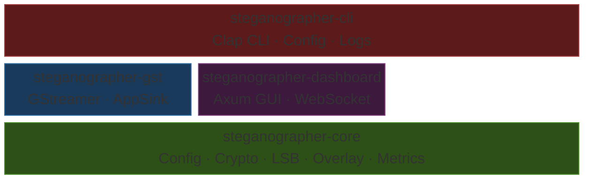
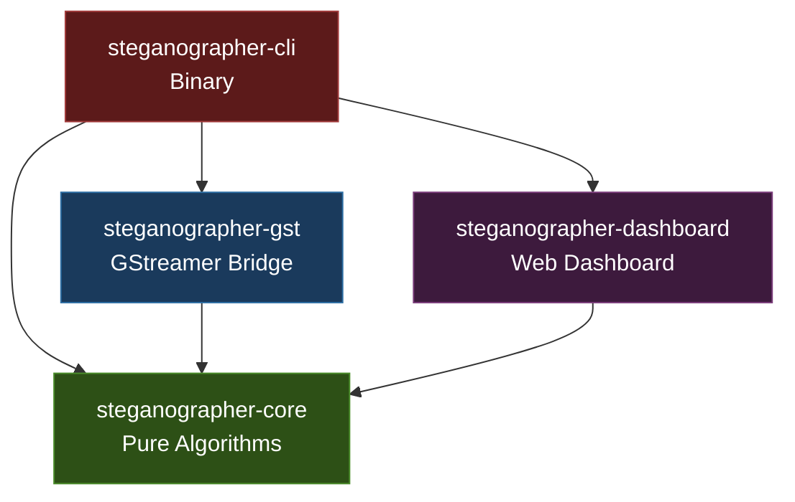
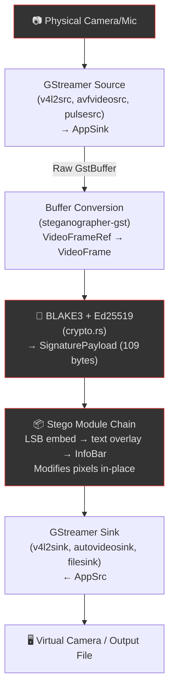
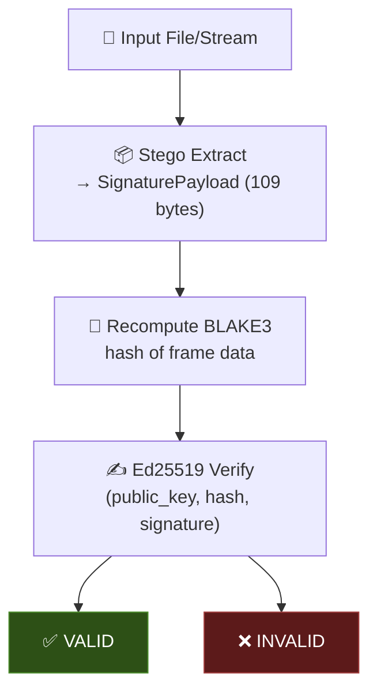
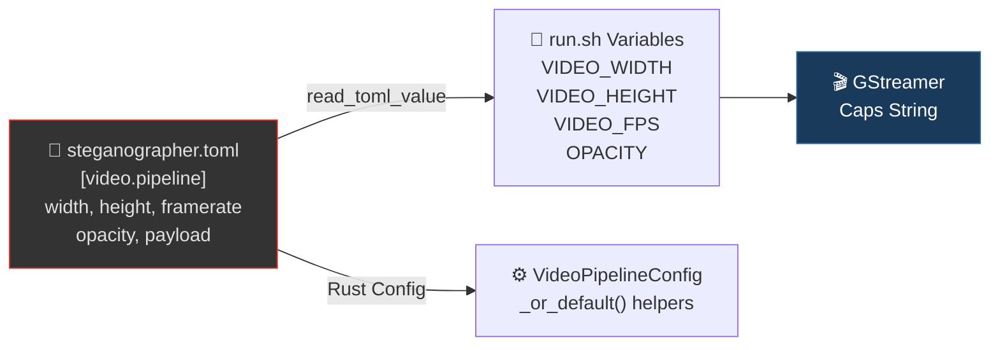

# Architecture

## Overview

Steganographer is organized as a four-crate Cargo workspace following a strict layered architecture with clean dependency boundaries.



## Design Principles

### 1. Strict Layering

- **`steganographer-core`** has **zero** dependencies on GStreamer, OS APIs, or I/O. It only knows about raw `&[u8]` buffers and metadata structs. This makes it testable without any system dependencies.
- **`steganographer-gst`** depends on `core` and provides the bridge between GStreamer buffer types and core's `VideoFrame`/`AudioBuffer` types.
- **`steganographer-dashboard`** depends on `core` and provides a live web GUI for round-trip steganography verification via Axum + WebSocket.
- **`steganographer-cli`** depends on all three and adds user interaction (CLI, config files, logging).

### 2. Trait-Based Extensibility

All steganography algorithms implement one of two traits:

```rust
pub trait VideoStegoModule: Send {
    fn embed(&mut self, frame: &mut VideoFrame, sig: Option<&SignaturePayload>) -> Result<()>;
    fn extract(&self, frame: &VideoFrame) -> Result<Option<SignaturePayload>>;
}

pub trait AudioStegoModule: Send {
    fn embed(&mut self, buf: &mut AudioBuffer, sig: Option<&SignaturePayload>) -> Result<()>;
    fn extract(&self, buf: &AudioBuffer) -> Result<Option<SignaturePayload>>;
}
```

New algorithms (DCT, spread-spectrum, wavelet, etc.) simply implement the trait and plug into the pipeline.

### 3. Configurable Pipeline Chains

The config system supports ordered lists of stego modules:

```toml
[video.stego]
pipeline = ["lsb_signature", "overlay"]
```

Each module is instantiated in order and applied sequentially to every frame.

---

## Crate Dependency Graph



---

## Module Map

### steganographer-core

| Module | Purpose | Lines | Tests |
| --- | --- | --- | --- |
| `config.rs` | TOML configuration model and parsing | ~180 | 4 |
| `crypto.rs` | BLAKE3 hashing + Ed25519 signing/verification | ~260 | 7 |
| `signer_backend.rs` | Pluggable signing backends (Ed25519, Ethereum/secp256k1) | ~440 | 14 |
| `video.rs` | `VideoFrame`, `VideoFormat`, `VideoStegoModule` trait | ~55 | — |
| `audio.rs` | `AudioBuffer`, `AudioStegoModule` trait | ~42 | — |
| `lsb_video.rs` | Sequential LSB video embedding/extraction | ~290 | 5 |
| `lsb_audio.rs` | Keyed PRNG LSB audio embedding/extraction | ~340 | 7 |
| `overlay.rs` | Text overlay with built-in bitmap font | ~340 | 9 |
| `info_bar.rs` | Exoteric overlay (QR, barcode, hash, timestamp) | ~150 | 5 |
| `metrics.rs` | Lock-free pipeline performance counters | ~120 | 5 |
| `lib.rs` | Module declarations and re-exports | ~37 | — |

### steganographer-gst

| Module | Purpose | Lines |
| --- | --- | --- |
| `lib.rs` | GStreamer init, pipeline launch helpers | ~40 |
| `plugin.rs` | Plugin registration skeleton | ~45 |
| `video_filter.rs` | AppSink/AppSrc video buffer processing | ~180 |
| `audio_filter.rs` | AppSink/AppSrc audio buffer processing | ~175 |

### steganographer-dashboard

| Module | Purpose | Lines | Tests |
| --- | --- | --- | --- |
| `lib.rs` | LiveConfig, DashboardState, Axum router, HTTP handlers, session API | ~290 | 12 |
| `ws_handler.rs` | WebSocket encode/decode handlers, frame signing, full signature + timestamp | ~660 | — |
| `static/index.html` | Three-tab dashboard (Video/Audio/Docs), config controls, copy-to-clipboard | ~690 | — |
| `static/app.js` | Client JS: webcam, QR overlay, config, MetaMask, keyboard shortcuts, session export | ~1000 | — |
| `static/audio_tab.js` | Audio tab: microphone, waveform/spectrum, audio WebSocket, WAV recording | ~710 | — |
| `static/docs_tab.js` | Documentation viewer: markdown rendering, syntax highlighting, search | ~250 | — |
| `static/style.css` | Premium dark theme, glassmorphism, animations, help tooltips, kbd hints | ~1790 | — |

### steganographer-cli

| Module | Purpose | Lines |
| --- | --- | --- |
| `main.rs` | Clap CLI entry point, 11 subcommands (incl. dashboard, analyze, derive, info, config) | ~440 |
| `cmd_video.rs` | Live video pipeline command | ~130 |
| `cmd_audio.rs` | Live audio pipeline command | ~90 |
| `cmd_encode.rs` | Offline encoding + key generation | ~135 |
| `cmd_verify.rs` | Signature verification | ~130 |

---

## Data Flow

### Embedding Pipeline



### Verification Pipeline



---

## Threading & Memory Models

### macOS Audio/Video Context (`NSRunLoop`)

macOS native UI APIs (like `NSWindow` used by `osxvideosink`) and AVFoundation capture devices (`avfvideosrc`) strictly require that they are instantiated on a thread running an active `NSRunLoop` (specifically the main thread).
To bridge GStreamer into this Apple ecosystem, the application uses `gstreamer::macos_main()`.

1. The **Main Thread** is hijacked to pump the `NSRunLoop` (via `[NSApp run]`).
2. The **Pipeline Setup and Iteration** runs inside a spawned GCD background closure.

### AppSink Decoupling

Live media sources (cameras) drop frames or lock up if they cannot push their streams in real-time. Because our steganography operations run entirely in software on the CPU, we decouple the timing domains of the `AppSink` (source capture) and `AppSrc` (playback/sink) using explicit buffering:

```text
... ! queue max-size-buffers=5 ! appsink   [CPU Processing]   appsrc ! queue max-size-buffers=5 ! ...
```

This prevents deadlock where the rendering sink waiting on the main thread blocks the camera capture thread.

### CVPixelBuffer and Objective-C AutoRelease Pools

When pulling frames from `avfvideosrc` into Rust's background threads, the raw macOS `CVPixelBuffer` references are temporarily bridged into GStreamer. However, because GCD background threads do not automatically pump an `NSAutoreleasePool`, these buffer references leak.

Unreleased frames will permanently exhaust Apple's hardware pool limit of ~35 frames (exactly 1 second of 30FPS video), halting the camera entirely. We bypass this via a custom RAII `Drop` guard:

```rust
struct AutoReleasePool; // Calls objc_autoreleasePoolPush/Pop
```

Instantiated on every frame loop iteration, it forces the hardware pool to instantly recycle memory.

---

## Error Handling

- Core crate uses `anyhow::Result` for all fallible operations
- Capacity errors (frame too small for payload) are explicit `anyhow::bail!` with descriptive messages
- GStreamer errors map to `gst::FlowError` for pipeline integration
- CLI uses `anyhow::Result` in `main()` for clean error reporting

---

## Config-Driven Pipeline Construction

The `run.sh` interactive menu reads pipeline parameters from `steganographer.toml` at startup:



The Rust `VideoPipelineConfig` struct mirrors this TOML section with `_or_default()` helper methods.

---

## Architectural Decision: C2PA Interoperability

**Status:** Deferred — monitor, do not implement yet.

**Context:** C2PA (Coalition for Content Provenance and Authenticity) / Content
Credentials is a mature, industry-backed standard (Adobe, Google, Microsoft) for
content provenance. It defines manifest stores embedded in media files (JPEG, PNG,
MP4) that record creation/editing history, signing identity, and assertions.

**Decision:** Steganographer will **not** emit or consume C2PA manifests in the
near term. The custom steganographic format (BLAKE3 + Ed25519 + LSB embedding)
serves a different use case — real-time per-frame signing of live streams — that
C2PA's file-based manifest model does not directly address.

**Rationale:**
1. C2PA operates on finished files, not live streams. Steganographer's core
   value is signing frames as they are captured, before they hit a container.
2. C2PA's manifest store adds ~2-10KB per file, which would be impractical for
   per-frame embedding in a live pipeline.
3. The custom format's QR overlay provides human-visible provenance that C2PA
   does not offer.

**Revisit when:**
- C2PA adds a streaming/real-time profile
- A user needs to produce C2PA-compliant output from Steganographer-signed media
- The project targets content authentication workflows where C2PA is a hard
  requirement (e.g., newsroom ingest, legal evidence)

**If implemented:** Add a `steganographer c2pa-export` command that reads a
signed media file and produces a C2PA manifest from the embedded signatures,
rather than replacing the custom format.

---

## Further Reading

- [Configuration](configuration.md) — Full TOML schema with `[video.pipeline]`
- [GStreamer Integration](gstreamer.md) — Pipeline construction details
- [API Reference](api-reference.md) — Complete Rust API including `VideoPipelineConfig` and audio WebSocket handlers
- [Steganography Theory](steganography-theory.md) — Information hiding foundations
- [Security](security.md) — Threat models, use cases, deployment guidance
- [Threat Model](threat-model.md) — Adversary model, attack categories, security boundaries
- [Contributing](contributing.md) — Adding new modules and config options
