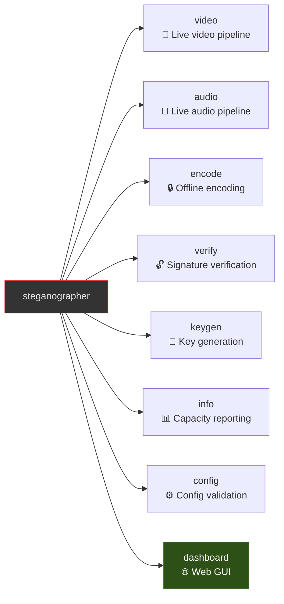

# CLI Reference

## Synopsis

```text
steganographer [OPTIONS] <COMMAND>
```



## Global Options

| Option | Short | Default | Description |
| --- | --- | --- | --- |
| `--config <PATH>` | `-c` | `config/example.toml` | Path to TOML configuration file |
| `--log-level <LEVEL>` | `-l` | `info` | Log verbosity: `trace`, `debug`, `info`, `warn`, `error` |
| `--quiet` | `-q` | `false` | Suppress all output except final result (for scripting) |
| `--help` | `-h` | — | Print help information |
| `--version` | `-V` | — | Print version |

---

## Commands

### `video` — Live Video Pipeline

Run a real-time video pipeline: capture frames from a source, apply steganography, and push to a sink.

```bash
steganographer video [OPTIONS]
```

| Option | Default | Description |
| --- | --- | --- |
| `--source <PIPELINE>` | From config | GStreamer source element string |
| `--sink <PIPELINE>` | From config | GStreamer sink element string |
| `--max-frames <N>` | Unlimited | Stop after processing N frames |

**Examples**:

```bash
# Test source → display window (macOS)
steganographer video --source "videotestsrc" --sink "osxvideosink"

# Webcam → virtual camera (Linux with v4l2loopback)
steganographer video \
    --source "v4l2src device=/dev/video0" \
    --sink "v4l2sink device=/dev/video42"

# Using config file
steganographer video --config config/example.toml

# Process exactly 100 frames
steganographer video --source "videotestsrc" --sink "autovideosink" --max-frames 100
```

---

### `audio` — Live Audio Pipeline

Run a real-time audio pipeline with LSB steganography.

```bash
steganographer audio [OPTIONS]
```

| Option | Default | Description |
| --- | --- | --- |
| `--source <PIPELINE>` | From config | GStreamer audio source element |
| `--sink <PIPELINE>` | From config | GStreamer audio sink element |
| `--max-buffers <N>` | Unlimited | Stop after processing N audio buffers |

**Examples**:

```bash
# Test tone → speakers
steganographer audio \
    --source "audiotestsrc wave=sine freq=440" \
    --sink "autoaudiosink"

# Microphone → PulseAudio output
steganographer audio \
    --source "pulsesrc" \
    --sink "pulsesink"
```

---

### `encode` — Offline File Encoding

Embed steganographic signatures into raw media files.

```bash
steganographer encode [OPTIONS]
```

| Option | Short | Default | Description |
| --- | --- | --- | --- |
| `--input <PATH>` | `-i` | Required | Input file path |
| `--output <PATH>` | `-o` | Required | Output file path |
| `--stego-type <TYPE>` | — | `lsb_video` | Algorithm: `lsb_video`, `lsb_audio`, `spread_spectrum_video`, `dct_video` |
| `--bits <N>` | — | `1` | LSB bits per sample/pixel (1–4) |
| `--format <FORMAT>` | — | `plain` | Output format: `plain` (human-readable) or `json` (machine-readable) |

**Currently supported formats**:

- `lsb_video`: Raw RGB pixel data (3 bytes per pixel)
- `lsb_audio`: Raw S16LE PCM audio (2 bytes per sample, mono)
- `spread_spectrum_video`: PN-sequence modulation for noise resistance
- `dct_video`: DCT-domain embedding for compression resistance

**Examples**:

```bash
# Encode video with 1-bit LSB
steganographer encode -i frame.rgb -o frame_signed.rgb --stego-type lsb_video --bits 1

# Encode audio with 2-bit LSB
steganographer encode -i audio.raw -o audio_signed.raw --stego-type lsb_audio --bits 2
```

**Output**: Prints the public key (hex) needed for verification.

---

### `verify` — Signature Verification

Extract and verify steganographic signatures from media files.

```bash
steganographer verify [OPTIONS]
```

| Option | Short | Default | Description |
| --- | --- | --- | --- |
| `--input <PATH>` | `-i` | Required | Input file path |
| `--stego-type <TYPE>` | — | `lsb_video` | Algorithm: `lsb_video`, `lsb_audio`, `spread_spectrum_video`, `dct_video` |
| `--public-key <HEX>` | — | None | Public key for signature verification |
| `--embedding-key <HEX>` | — | None | Embedding key (hex, 32 bytes) for audio/spread-spectrum extraction |
| `--format <FORMAT>` | — | `plain` | Output format: `plain` (human-readable) or `json` (machine-readable) |

**Examples**:

```bash
# Extract signature (no verification)
steganographer verify -i frame_signed.rgb --stego-type lsb_video

# Extract and verify with public key
steganographer verify -i frame_signed.rgb \
    --stego-type lsb_video \
    --public-key a1b2c3d4e5f6...

# Verify audio
steganographer verify -i audio_signed.raw \
    --stego-type lsb_audio \
    --public-key a1b2c3d4e5f6...

# Machine-readable JSON output
steganographer verify -i frame_signed.rgb \
    --stego-type lsb_video \
    --public-key a1b2c3d4e5f6... \
    --format json
```

**Output** (plain, default):

```text
=== Signature Found ===
  Frame index: 0
  Hash:        a1b2c3d4e5f6a7b8...
  Signature:   1234abcd5678ef90...
  Status:      ✅ VALID
```

**Output** (`--format json`):

```json
{
  "found": true,
  "stego_type": "lsb_video",
  "frame_index": 0,
  "hash": "a1b2c3d4e5f6a7b8...",
  "signature_preview": "1234abcd5678ef90...",
  "status": "valid",
  "message": "Signature is valid"
}
```

Without `--public-key`:

```text
  Status:      ⚠️  No public key provided (signature not verified)
```

If no signature found:

```text
No steganographic signature found in the file.
```

---

### `keygen` — Key Generation

Generate a new Ed25519 signing key pair.

```bash
steganographer keygen [OPTIONS]
```

| Option | Short | Default | Description |
| ------ | ----- | ------- | ----------- |
| `--output <PATH>` | `-o` | `steganographer` | Base path for key files |

**Output files**:

- `<path>.key` — Private signing key (64 hex characters = 32 bytes)
- `<path>.pub` — Public verifying key (64 hex characters = 32 bytes)

**Example**:

```bash
steganographer keygen --output keys/session-001
# Creates: keys/session-001.key
#          keys/session-001.pub
```

---

### `dashboard` — Live Verification Dashboard

Launch a web-based dashboard for real-time round-trip steganography verification.

```bash
steganographer dashboard [OPTIONS]
```

| Option | Short | Default | Description |
| ------ | ----- | ------- | ----------- |
| `--port <PORT>` | `-p` | `8080` | Port to serve the dashboard on |
| `--backend <BACKEND>` | — | `ed25519` | Signing backend: `ed25519` or `ethereum` |

**Examples**:

```bash
# Default: Ed25519 on port 8080
steganographer dashboard

# Ethereum backend on custom port
steganographer dashboard --port 3000 --backend ethereum

# Via run.sh (press 'd' for dashboard, 'a' for run-all)
./run.sh
```

The dashboard opens a web UI at `http://localhost:<port>` displaying:

- **Left panel**: Live encode feed with frame metrics
- **Right panel**: Real-time decode and verification results
- **Footer**: Backend, uptime, resolution, payload information

---

### `info` — Capacity Reporting

Report steganographic capacity of a media file.

```bash
steganographer info [OPTIONS]
```

| Option | Short | Default | Description |
| --- | --- | --- | --- |
| `--input <PATH>` | `-i` | Required | Input file path |
| `--stego-type <TYPE>` | — | `lsb_video` | Algorithm: `lsb_video`, `lsb_audio`, `spread_spectrum_video`, `dct_video` |
| `--bits <N>` | — | `1` | LSB bits per sample/pixel (1–4) |
| `--format <FORMAT>` | — | `plain` | Output format: `plain` or `json` |

**Example**:

```bash
steganographer info -i frame.rgb --stego-type lsb_video --bits 1
```

---

### `config` — Configuration Validation

Validate a TOML configuration file without running any pipeline.

```bash
steganographer config [ACTION]
```

| Argument | Default | Description |
| --- | --- | --- |
| `<ACTION>` | `check` | Config action to perform (currently only `check`) |

**Example**:

```bash
# Validate the default config file
steganographer config check

# Validate a specific config file
steganographer --config my-config.toml config check
```

**Output** (valid config):

```text
✓ Configuration valid: config/example.toml
  Sections: global, video, audio
  Hash algorithm: blake3
```

---

## Exit Codes

| Code | Meaning |
| ---- | ------- |
| 0    | Success |
| 1    | Runtime error (I/O, config parse, pipeline failure) |
| 2    | CLI argument error (missing required args, bad format) |

## Environment Variables

| Variable | Description |
| -------- | ----------- |
| `RUST_LOG` | Override log level (alternative to `--log-level`) |
| `GST_PLUGIN_PATH` | Additional GStreamer plugin search paths |
| `GST_DEBUG` | GStreamer debug level (e.g., `3` for warnings) |
| `PKG_CONFIG_PATH` | Path to GStreamer `.pc` files (build-time) |

## Configuration-Driven Defaults

The CLI and `run.sh` read pipeline parameters from `steganographer.toml`. All pipeline settings (resolution, framerate, opacity, LSB bits, overlay text, signing backend) are configurable:

```bash
# Uses resolution/framerate from [video.pipeline] in steganographer.toml
steganographer video

# Override source pipeline (config values still used for stego modules)
steganographer video --source "videotestsrc ! videoconvert ! video/x-raw,format=RGB,width=1280,height=720"

# Launch dashboard with config-driven signing backend
steganographer dashboard
```

See [Configuration](configuration.md) for full TOML schema including `[video.pipeline]` with resolution, framerate, opacity, payload, and signing backend settings.

## Further Reading

- [Getting Started](getting-started.md) — First-time setup and tutorial
- [Configuration](configuration.md) — Full TOML config schema
- [Algorithms](algorithms.md) — How the stego modules work
- [Cryptography](cryptography.md) — BLAKE3/SHA-256/SHA-3 + Ed25519 and Ethereum signing
- [Steganography Theory](steganography-theory.md) — Information hiding fundamentals
- [Security](security.md) — Threat models and deployment guidance
- [API Reference](api-reference.md) — Rust API, traits, and HTTP routes
