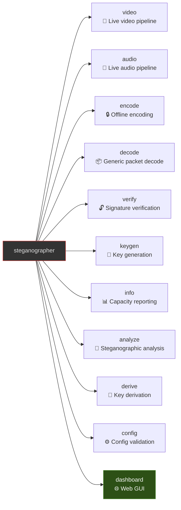

# CLI Reference

## Synopsis

```text
steganographer [OPTIONS] <COMMAND>
```


```mermaid
flowchart LR
    CLI["steganographer"] --> VIDEO["video\n🎥 Live video pipeline"]
    CLI --> AUDIO["audio\n🎵 Live audio pipeline"]
    CLI --> ENCODE["encode\n🔒 Offline encoding"]
    CLI --> DECODE["decode\n📦 Generic packet decode"]
    CLI --> VERIFY["verify\n🔓 Signature verification"]
    CLI --> KEYGEN["keygen\n🔑 Key generation"]
    CLI --> INFO["info\n📊 Capacity reporting"]
    CLI --> ANALYZE["analyze\n🔬 Steganographic analysis"]
    CLI --> DERIVE["derive\n🔑 Key derivation"]
    CLI --> CONFIG["config\n⚙️ Config validation"]
    CLI --> DASH["dashboard\n🌐 Web GUI"]
    style CLI fill:#333,stroke:#e53935,color:#e0e0e0
    style DASH fill:#2d5016,stroke:#4a8c2a,color:#fff
```

## Global Options

| Option | Short | Default | Description |
| --- | --- | --- | --- |
| `--config <PATH>` | `-c` | `config/example.toml` | Path to TOML configuration file |
| `--log-level <LEVEL>` | `-l` | `info` | Log verbosity: `trace`, `debug`, `info`, `warn`, `error` |
| `--quiet` | `-q` | `false` | Suppress all output except final result (for scripting) |
| `--help` | `-h` | — | Print help information |
| `--version` | `-V` | — | Print version |

---

## Commands

### `video` — Live Video Pipeline

Run a real-time video pipeline: capture frames from a source, apply steganography, and push to a sink.

```bash
steganographer video [OPTIONS]
```

| Option | Default | Description |
| --- | --- | --- |
| `--source <PIPELINE>` | From config | GStreamer source element string |
| `--sink <PIPELINE>` | From config | GStreamer sink element string |
| `--max-frames <N>` | Unlimited | Stop after processing N frames |

**Examples**:

```bash
# Test source → display window (macOS)
steganographer video --source "videotestsrc" --sink "osxvideosink"

# Webcam → virtual camera (Linux with v4l2loopback)
steganographer video \
    --source "v4l2src device=/dev/video0" \
    --sink "v4l2sink device=/dev/video42"

# Using config file
steganographer video --config config/example.toml

# Process exactly 100 frames
steganographer video --source "videotestsrc" --sink "autovideosink" --max-frames 100
```

---

### `audio` — Live Audio Pipeline

Run a real-time audio pipeline with LSB steganography.

```bash
steganographer audio [OPTIONS]
```

| Option | Default | Description |
| --- | --- | --- |
| `--source <PIPELINE>` | From config | GStreamer audio source element |
| `--sink <PIPELINE>` | From config | GStreamer audio sink element |
| `--max-buffers <N>` | Unlimited | Stop after processing N audio buffers |

**Examples**:

```bash
# Test tone → speakers
steganographer audio \
    --source "audiotestsrc wave=sine freq=440" \
    --sink "autoaudiosink"

# Microphone → PulseAudio output
steganographer audio \
    --source "pulsesrc" \
    --sink "pulsesink"
```

---

### `encode` — Offline File Encoding

Embed legacy signed-carrier attestations, or explicitly embed an opt-in generic
packet payload.

```bash
steganographer encode [OPTIONS]
```

| Option | Short | Default | Description |
| --- | --- | --- | --- |
| `--input <PATH>` | `-i` | Required | Input file path |
| `--output <PATH>` | `-o` | Required | Output file path |
| `--stego-type <TYPE>` | — | `lsb_video` | Algorithm: `lsb_video`, `lsb_audio`, `spread_spectrum_video`, `dct_video` |
| `--bits <N>` | — | `1` | LSB bits per sample/pixel (1–4) |
| `--format <FORMAT>` | — | `plain` | Output format: `plain` (human-readable) or `json` (machine-readable) |
| `--input-format <FORMAT>` | — | Auto | `raw_rgb`, `raw_s16le`, `png`/`image`, or `wav` |
| `--width <N>` / `--height <N>` | — | None | Required pair for dimension-dependent headerless RGB kernels such as DCT |
| `--signing-key <PATH>` | — | Ephemeral | Hex-encoded 32-byte Ed25519 signing-key file (legacy signature or generic packet payload) |
| `--embedding-key <HEX>` | — | Config/random | Keyed audio/spread placement key |
| `--embedding-key-file <PATH>` | — | Config/random | File containing the embedding key |
| `--encrypt` | — | `false` | Encrypt the payload (legacy signature or generic packet) with ChaCha20-Poly1305 |
| `--encryption-key <HEX>` | — | Random | ChaCha20-Poly1305 key |
| `--encryption-key-file <PATH>` | — | None | File containing the encryption key |
| `--ecc` | — | `false` | Apply bounded Reed-Solomon error correction (legacy signature or generic packet) |
| `--ecc-parity <N>` | — | `4` | Reed-Solomon parity symbols (maximum 16) |
| `--compress` | — | `false` | DEFLATE-compress a generic packet payload (recorded only if it shrinks) |
| `--payload-file <PATH>` | — | None | Opt into generic packet alpha with arbitrary file bytes |
| `--payload-text <TEXT>` | — | None | Opt into generic packet alpha with UTF-8 text |
| `--mime-type <TYPE>` | — | None | Public generic-packet MIME metadata |
| `--filename <NAME>` | — | Payload basename | Safe display filename; path components are rejected |

**Currently supported formats**:

- `lsb_video`: Raw RGB or lossless decoded PNG/image data
- `lsb_audio`: Raw S16LE PCM or 16-bit integer WAV, preserving WAV properties
- `spread_spectrum_video`: PN-sequence modulation for noise resistance
- `dct_video`: DCT-domain embedding for compression resistance

**Examples**:

```bash
# Encode video with 1-bit LSB
steganographer encode -i frame.rgb -o frame_signed.rgb --stego-type lsb_video --bits 1

# Encode audio with 2-bit LSB
steganographer encode -i audio.wav -o audio_signed.wav --stego-type lsb_audio \
  --bits 2 --embedding-key-file keys/audio.key

# Opt-in generic packet alpha
steganographer encode -i cover.png -o packed.png \
  --payload-file report.pdf --mime-type application/pdf --bits 2
```

Without `--payload-file` or `--payload-text`, encode preserves the legacy signed
carrier behavior and prints the public key needed by `verify`. The generic
packet path supports `lsb_video` (RGB/PNG) and `lsb_audio` (PCM S16 WAV / raw
S16LE) carriers, sequential or keyed placement (`--embedding-key`), and the
Ed25519 signing (`--signing-key`), DEFLATE (`--compress`), AEAD encryption
(`--encrypt`), and chunked Reed-Solomon (`--ecc`) transforms. Multi-frame
spreading remains unsupported for generic packets.

---

### `decode` — Generic Packet Decode

Decode and digest-check an opt-in generic packet. This does not imply carrier
provenance; use `verify` for legacy signed-carrier attestations.

```bash
steganographer decode --input packed.png --output recovered.pdf [OPTIONS]
```

| Option | Short | Default | Description |
| --- | --- | --- | --- |
| `--input <PATH>` | `-i` | Required | Encoded carrier |
| `--output <PATH>` | `-o` | Required | Decoded payload destination |
| `--stego-type <TYPE>` | — | `lsb_video` | Generic kernel: `lsb_video` or `lsb_audio` |
| `--bits <VALUE>` | — | `auto` | Probe 1–4, or require an exact strength |
| `--input-format <FORMAT>` | — | Auto | `raw_rgb`, `raw_s16le`, `png`/`image`, or `wav` |
| `--format <FORMAT>` | — | `plain` | `plain` or `json` report |
| `--force` | — | `false` | Replace an existing payload output |
| `--decrypt` | — | `false` | Decrypt an AEAD-encrypted generic packet payload |
| `--decryption-key <HEX>` | — | None | ChaCha20-Poly1305 decryption key (hex, 32 bytes) |
| `--decryption-key-file <PATH>` | — | None | File containing the decryption key |
| `--embedding-key <HEX>` | — | None | Embedding key (hex, 32 bytes) for keyed placement |
| `--embedding-key-file <PATH>` | — | None | File containing the embedding key |

```bash
steganographer decode -i packed.png -o recovered.pdf --bits auto --format json

# Encrypted packet requires the key
steganographer decode -i packed.png -o recovered.pdf --decrypt --decryption-key <hex>
```

Decode validates locator limits, envelope CRC32C, canonical metadata, declared
kernel parameters, payload length, and the content digest before writing. It
also reverses any recorded AEAD/ECC transforms (requiring `--decrypt` for
encrypted packets) and refuses to overwrite an existing output unless
`--force` is explicit.

---

### `verify` — Signature Verification

Extract and verify steganographic signatures from media files.

```bash
steganographer verify [OPTIONS]
```

| Option | Short | Default | Description |
| --- | --- | --- | --- |
| `--input <PATH>` | `-i` | Required | Input file path |
| `--stego-type <TYPE>` | — | `lsb_video` | Algorithm: `lsb_video`, `lsb_audio`, `spread_spectrum_video`, `dct_video` |
| `--public-key <HEX>` | — | None | Public key for signature verification |
| `--embedding-key <HEX>` | — | None | Embedding key (hex, 32 bytes) for audio/spread-spectrum extraction |
| `--embedding-key-file <PATH>` | — | Config | File containing the embedding key |
| `--bits <VALUE>` | — | `auto` | Auto-probe 1–4 LSBs or require an exact value |
| `--width <N>` / `--height <N>` | — | None | Explicit headerless raw RGB dimensions |
| `--format <FORMAT>` | — | `plain` | Output format: `plain` (human-readable) or `json` (machine-readable) |

**Examples**:

```bash
# Extract signature (no verification)
steganographer verify -i frame_signed.rgb --stego-type lsb_video

# Extract and verify with public key
steganographer verify -i frame_signed.rgb \
    --stego-type lsb_video \
    --public-key a1b2c3d4e5f6...

# Verify audio
steganographer verify -i audio_signed.raw \
    --stego-type lsb_audio \
    --public-key a1b2c3d4e5f6...

# Machine-readable JSON output
steganographer verify -i frame_signed.rgb \
    --stego-type lsb_video \
    --public-key a1b2c3d4e5f6... \
    --format json
```

**Output** (plain, default):

```text
=== Signature Found ===
  Frame index: 0
  Hash:        a1b2c3d4e5f6a7b8...
  Signature:   1234abcd5678ef90...
  Status:      ✅ VALID
```

**Output** (`--format json`):

```json
{
  "found": true,
  "stego_type": "lsb_video",
  "frame_index": 0,
  "hash": "a1b2c3d4e5f6a7b8...",
  "signature_preview": "1234abcd5678ef90...",
  "status": "valid",
  "message": "Signature is valid"
}
```

Without `--public-key`:

```text
  Status:      ⚠️  No public key provided (signature not verified)
```

If no signature found:

```text
No steganographic signature found in the file.
```

---

### `keygen` — Key Generation

Generate a new Ed25519 signing key pair.

```bash
steganographer keygen [OPTIONS]
```

| Option | Short | Default | Description |
| ------ | ----- | ------- | ----------- |
| `--output <PATH>` | `-o` | `steganographer` | Base path for key files |

**Output files**:

- `<path>.key` — Private signing key (64 hex characters = 32 bytes)
- `<path>.pub` — Public verifying key (64 hex characters = 32 bytes)

**Example**:

```bash
steganographer keygen --output keys/session-001
# Creates: keys/session-001.key
#          keys/session-001.pub
```

---

### `dashboard` — Live Verification Dashboard

Launch a web-based dashboard for real-time round-trip steganography verification.

```bash
steganographer dashboard [OPTIONS]
```

| Option | Short | Default | Description |
| ------ | ----- | ------- | ----------- |
| `--port <PORT>` | `-p` | `8080` | Port to serve the dashboard on |
| `--backend <BACKEND>` | — | `ed25519` | Signing backend: `ed25519` or `ethereum` |

**Examples**:

```bash
# Default: Ed25519 on port 8080
steganographer dashboard

# Ethereum backend on custom port
steganographer dashboard --port 3000 --backend ethereum

# Via run.sh (press 'd' for dashboard, 'a' for run-all)
./run.sh
```

The dashboard opens a web UI at `http://localhost:<port>` displaying:

- **Left panel**: Live encode feed with frame metrics
- **Right panel**: Real-time decode and verification results
- **Footer**: Backend, uptime, resolution, payload information

---

### `info` — Capacity Reporting

Report steganographic capacity of a media file.

```bash
steganographer info [OPTIONS]
```

| Option | Short | Default | Description |
| --- | --- | --- | --- |
| `--input <PATH>` | `-i` | Required | Input file path |
| `--stego-type <TYPE>` | — | `lsb_video` | Algorithm: `lsb_video`, `lsb_audio`, `spread_spectrum_video`, `dct_video` |
| `--bits <N>` | — | `1` | LSB bits per sample/pixel (1–4) |
| `--format <FORMAT>` | — | `plain` | Output format: `plain` or `json` |

**Example**:

```bash
steganographer info -i frame.rgb --stego-type lsb_video --bits 1
```

---

### `config` — Configuration Validation

Validate a TOML configuration file without running any pipeline.

```bash
steganographer config [ACTION]
```

| Argument | Default | Description |
| --- | --- | --- |
| `<ACTION>` | `check` | Config action to perform (currently only `check`) |

**Example**:

```bash
# Validate the default config file
steganographer config check

# Validate a specific config file
steganographer --config my-config.toml config check
```

**Output** (valid config):

```text
✓ Configuration valid: config/example.toml
  Sections: global, video, audio
  Hash algorithm: blake3
```

---

### `analyze` — Steganographic Analysis

Analyze a file for steganographic artifacts using statistical tests.

```bash
steganographer analyze [OPTIONS] --input <FILE>
```

| Option | Default | Description |
| --- | --- | --- |
| `--input <FILE>` | Required | Input file to analyze |
| `--analysis-type <TYPE>` | `chi_squared` | Analysis type: `chi_squared` |
| `--format <FORMAT>` | `plain` | Output format: `plain` or `json` |

**Examples**:

```bash
# Basic chi-squared analysis
steganographer analyze --input signed.rgb

# JSON output for CI integration
steganographer analyze --input signed.rgb --format json
```

---

### `derive` — Key Derivation

Derive signing, encryption, and embedding keys from **either** a high-entropy
master secret (BLAKE3 `derive_key`) **or** a human-chosen password (Argon2id).
The two modes are mutually exclusive — providing both fails.

```bash
steganographer derive [OPTIONS] --output <DIR>
```

| Option | Default | Description |
| --- | --- | --- |
| `--master-secret <HEX>` | — | Master secret (hex-encoded). **WARNING**: visible in shell history and `ps` output. |
| `--master-secret-file <PATH>` | — | Read master secret from a file (hex-encoded). Safer than `--master-secret`. |
| `--master-secret-stdin` | `false` | Read master secret from stdin (hex-encoded). |
| `--password <TEXT>` | — | Password for Argon2id stretching. **WARNING**: visible in shell history and `ps` output. |
| `--password-file <PATH>` | — | Read the password from a file (raw bytes, trailing newline trimmed). |
| `--password-stdin` | `false` | Read the password from stdin (raw bytes, trailing newline trimmed). |
| `--salt <HEX>` | random | Hex-encoded Argon2id salt (≥ 16 bytes). Generated and printed when omitted. |
| `--argon2-memory <KIB>` | `19456` | Argon2id memory cost in KiB (default 19 MiB). |
| `--argon2-iterations <N>` | `2` | Argon2id time cost. |
| `--argon2-parallelism <N>` | `1` | Argon2id lane count. |
| `--output <DIR>` | `keys` | Output directory for derived keys |

**Outputs**:
- `signing.key` / `signing.pub` — Ed25519 signing keypair
- `encryption.key` — ChaCha20-Poly1305 encryption key
- `embedding.key` — LSB PRNG embedding key

> **Security note:** BLAKE3 `derive_key` is a fast KDF, not a slow password
> hashing function. The master secret must be high-entropy random data (at
> least 32 bytes / 64 hex chars). A memorable passphrase will be
> brute-forceable at hash speed. For passwords, use `--password*` to stretch
> with Argon2id instead.
>
> **Argon2id note:** the salt (and parameters) must be saved to re-derive the
> same keys later. When `--salt` is omitted, a random salt is generated and
> printed. Parameters below the OWASP floor (19 MiB / 2 iterations) trigger a
> warning but are accepted.

**Examples**:

```bash
# From a file (recommended)
steganographer derive --master-secret-file secret.hex --output keys

# From stdin
echo "a1b2c3..." | steganographer derive --master-secret-stdin --output keys

# Direct argument (not recommended — visible in ps/history)
steganographer derive --master-secret a1b2c3... --output keys

# Password derivation (Argon2id) — save the printed salt for re-derivation
steganographer derive --password-file passphrase.txt --output keys

# Password derivation with an explicit, reproducible salt
steganographer derive --password-file passphrase.txt \
  --salt 000102030405060708090a0b0c0d0e0f --output keys
```

---

## Exit Codes

| Code | Meaning |
| ---- | ------- |
| 0    | Success |
| 1    | Runtime error (I/O, config parse, pipeline failure) |
| 2    | CLI argument error (missing required args, bad format) |

## Environment Variables

| Variable | Description |
| -------- | ----------- |
| `RUST_LOG` | Override log level (alternative to `--log-level`) |
| `GST_PLUGIN_PATH` | Additional GStreamer plugin search paths |
| `GST_DEBUG` | GStreamer debug level (e.g., `3` for warnings) |
| `PKG_CONFIG_PATH` | Path to GStreamer `.pc` files (build-time) |

## Configuration-Driven Defaults

The CLI and `run.sh` read pipeline parameters from `steganographer.toml`. All pipeline settings (resolution, framerate, opacity, LSB bits, overlay text, signing backend) are configurable:

```bash
# Uses resolution/framerate from [video.pipeline] in steganographer.toml
steganographer video

# Override source pipeline (config values still used for stego modules)
steganographer video --source "videotestsrc ! videoconvert ! video/x-raw,format=RGB,width=1280,height=720"

# Launch dashboard with config-driven signing backend
steganographer dashboard
```

See [Configuration](configuration.md) for full TOML schema including `[video.pipeline]` with resolution, framerate, opacity, payload, and signing backend settings.

## Further Reading

- [Getting Started](getting-started.md) — First-time setup and tutorial
- [Configuration](configuration.md) — Full TOML config schema
- [Algorithms](algorithms.md) — How the stego modules work
- [Cryptography](cryptography.md) — BLAKE3/SHA-256/SHA-3 + Ed25519 and Ethereum signing
- [Steganography Theory](steganography-theory.md) — Information hiding fundamentals
- [Security](security.md) — Threat models and deployment guidance
- [API Reference](api-reference.md) — Rust API, traits, and HTTP routes
