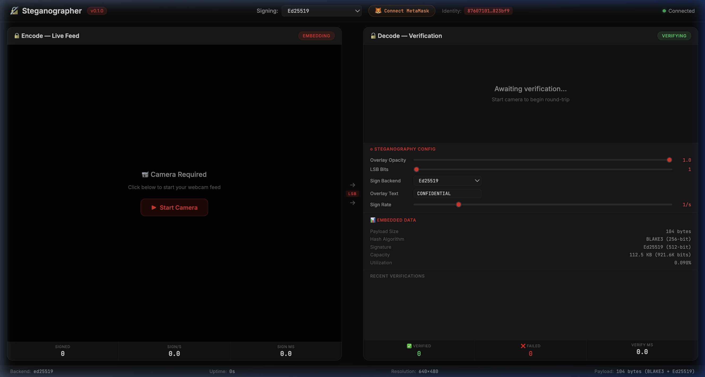

# Configuration

## Overview

Steganographer uses TOML configuration files to define pipeline behavior. The configuration is hierarchical with four main sections: `global`, `video` (with `pipeline`, `input`, `output`, `stego`), and `audio`.

The `run.sh` interactive menu reads these values to construct GStreamer pipelines, and the Rust CLI uses them for module configuration.

## File Location

- Default: `config/example.toml`
- Override with: `steganographer --config /path/to/config.toml`

---

## Schema

### `[global]`

| Key | Type | Default | Description |
| --- | --- | --- | --- |
| `log_level` | String | `"info"` | Logging verbosity: `trace`, `debug`, `info`, `warn`, `error` |

```toml
[global]
log_level = "info"
```

---

### `[video]`

Optional. Controls the video pipeline.

#### `[video.pipeline]`

Controls GStreamer pipeline parameters. These values are read by `run.sh` for live pipeline construction.

| Key | Type | Default | Description |
| --- | --- | --- | --- |
| `width` | u32 | 640 | Frame width in pixels |
| `height` | u32 | 480 | Frame height in pixels |
| `framerate` | u32 | 30 | Target framerate in fps |
| `opacity` | f64 | 1.0 | Overlay opacity / steganographic intensity (0.0–1.0) |

```toml
[video.pipeline]
width = 1280
height = 720
framerate = 30
opacity = 1.0
```

##### `[video.pipeline.payload]`

Cryptographic payload configuration.

| Key | Type | Default | Description |
| --- | --- | --- | --- |
| `type` | String | `"signature"` | Payload type: `"signature"` or `"custom"` |
| `size` | u32 | 104 | Payload size in bytes (8 frame_index + 32 BLAKE3 + 64 Ed25519) |

```toml
[video.pipeline.payload]
type = "signature"
size = 104
```

#### `[video.input]` / `[video.output]`

| Key | Type | Required | Description |
| --- | --- | --- | --- |
| `type` | String | ✅ | Endpoint type: `"device"`, `"file"`, `"network"` |
| `backend` | String | ❌ | Backend identifier (see table below) |
| `device` | String | ❌ | Device name or path |
| `path` | String | ❌ | File path (for file endpoints) |

**Backend options**:

| Platform | Input Backends | Output Backends |
| --- | --- | --- |
| Linux | `v4l2` | `v4l2loopback` |
| macOS | `avfoundation` | — (use `autovideosink`) |
| Test | (omit backend) | (omit backend) |

```toml
[video.input]
type = "device"
backend = "v4l2"
device = "/dev/video0"

[video.output]
type = "device"
backend = "v4l2loopback"
device = "/dev/video42"
```

#### `[video.stego]`

| Key | Type | Required | Description |
| --- | --- | --- | --- |
| `pipeline` | Array[String] | ✅ | Ordered list of stego module names |

Valid pipeline steps: `"lsb_signature"`, `"overlay"`, `"info_bar"`

```toml
[video.stego]
pipeline = ["lsb_signature", "overlay", "info_bar"]
```

#### `[video.stego.lsb_signature]`

Required if `"lsb_signature"` is in the pipeline.

| Key | Type | Range | Description |
| --- | --- | --- | --- |
| `bits` | u8 | 1–4 | Number of LSBs per pixel byte |
| `key` | String | 64 hex chars | 32-byte hex key for embedding |

```toml
[video.stego.lsb_signature]
bits = 1
key = "0123456789abcdef0123456789abcdef0123456789abcdef0123456789abcdef"
```

#### `[video.stego.overlay]`

Required if `"overlay"` is in the pipeline.

| Key | Type | Default | Description |
| --- | --- | --- | --- |
| `text` | String | `"STEGANOGRAPHER"` | Watermark text (supports template placeholders) |
| `position` | String | `"bottom-right"` | Position on frame |
| `font_size` | u32 | 16 | Font size in pixels (maps to `scale = font_size / 8`) |

**Position values**: `top-left`, `top-right`, `bottom-left`, `bottom-right`, `center`

**Template Placeholders** — dynamic values substituted at embed-time:

| Placeholder | Expands To | Example Output |
| --- | --- | --- |
| `{timestamp}` | UTC datetime | `2026-03-07 20:25:52` |
| `{frame_index}` | Frame number | `1042` |
| `{date}` | UTC date | `2026-03-07` |
| `{time}` | UTC time | `20:25:52` |

```toml
[video.stego.overlay]
text = "CONFIDENTIAL {timestamp} F{frame_index}"
position = "bottom-right"
font_size = 16
```

---

### `[audio]`

Optional. Controls the audio pipeline.

#### `[audio.input]` / `[audio.output]`

Same schema as video endpoints.

**Audio backend options**:

| Platform | Input Backends | Output Backends |
| --- | --- | --- |
| Linux | `pulseaudio`, `pipewire` | `pulseaudio`, `pipewire` |
| macOS | — (use default) | — (use default) |
| Test | (omit backend) | (omit backend) |

#### `[audio.stego]`

| Key | Type | Required | Description |
| --- | --- | --- | --- |
| `pipeline` | Array[String] | ✅ | Ordered stego module list |

Valid pipeline steps: `"lsb_signature"`

#### `[audio.stego.lsb_signature]`

| Key | Type | Range | Description |
| --- | --- | --- | --- |
| `bits` | u8 | 1–4 | LSBs per 16-bit sample |
| `key` | String | 64 hex chars | 32-byte hex key for pseudo-random index permutation |

---

## Complete Example

```toml
[global]
log_level = "debug"

# ─── Video ─────────────────────────
[video]

[video.input]
type = "device"
backend = "v4l2"
device = "/dev/video0"

[video.output]
type = "device"
backend = "v4l2loopback"
device = "/dev/video42"

[video.stego]
pipeline = ["lsb_signature", "overlay", "info_bar"]

[video.stego.lsb_signature]
bits = 1
key = "0123456789abcdef0123456789abcdef0123456789abcdef0123456789abcdef"

[video.stego.overlay]
text = "CONFIDENTIAL"
position = "bottom-right"
font_size = 16

# ─── Audio ─────────────────────────
[audio]

[audio.input]
type = "device"
backend = "pulseaudio"

[audio.output]
type = "device"
backend = "pulseaudio"

[audio.stego]
pipeline = ["lsb_signature"]

[audio.stego.lsb_signature]
bits = 1
key = "abcdef0123456789abcdef0123456789abcdef0123456789abcdef0123456789"
```

## Minimal Configs

### Video Only (Test Source)

```toml
[global]
log_level = "info"

[video]
[video.input]
type = "device"

[video.output]
type = "device"

[video.stego]
pipeline = ["lsb_signature"]

[video.stego.lsb_signature]
bits = 1
key = "0000000000000000000000000000000000000000000000000000000000000000"
```

### Audio Only

```toml
[global]

[audio]
[audio.input]
type = "device"

[audio.output]
type = "device"

[audio.stego]
pipeline = ["lsb_signature"]

[audio.stego.lsb_signature]
bits = 1
key = "0000000000000000000000000000000000000000000000000000000000000000"
```

---

## Key Generation

Generate a random 32-byte hex key for use in config:

```bash
# Using OpenSSL
openssl rand -hex 32

# Using steganographer's keygen (repurpose the output)
steganographer keygen --output /tmp/tmpkey && cat /tmp/tmpkey.key
```

---

## Dashboard Live Configuration

The web dashboard (`./run.sh` → `d`) provides real-time configuration controls that override TOML settings. Changes are immediate and synced to the server via `POST /api/config`.

### Live Controls

| Control | Range | Default | TOML Key |
| --- | --- | --- | --- |
| **Overlay Opacity** | 0.0–1.0 | 1.0 | `video.pipeline.opacity` |
| **LSB Bits** | 1–4 | 1 | `video.stego.lsb_signature.bits` |
| **Sign Backend** | ed25519 / ethereum | ed25519 | — |
| **Overlay Text** | Free text | CONFIDENTIAL | `video.stego.overlay.text` |
| **Sign Rate** | 0.2/s – 5/s | 1/s | — |
| **QR Scale** | 5% – 100% | 10% | — |
| **Resolution** | 320×240 – 1920×1080 | 640×480 | — |

### QR Data Matrix Overlay

The dashboard renders a QR-style data matrix on every video frame containing:

- Local frame counter (32-bit)
- Server-signed frame index (32-bit)
- BLAKE3 hash prefix (64-bit)
- Timestamp (16-bit seconds)
- Backend ID (8-bit: 0=ed25519, 1=ethereum)
- Verification status (8-bit: 0=unverified, 1=verified)

The Overlay Opacity slider controls this QR overlay's visibility from fully transparent to fully opaque.

### Stego Info Display

The dashboard dynamically calculates and displays:

| Metric | Example Value | Formula |
| --- | --- | --- |
| **Payload Size** | 104 bytes | 8 (frame_index) + 32 (BLAKE3) + 64 (Ed25519) |
| **Hash Algorithm** | BLAKE3 (256-bit) | Fixed |
| **Signature** | Ed25519 (512-bit) | Depends on backend |
| **Capacity** | 112.5 KB | width × height × 3 × lsb_bits / 8 |
| **Utilization** | 0.090% | payload_size / capacity × 100 |

### Audio Stego Info Display

The Audio tab also dynamically calculates and displays:

| Metric | Example Value | Formula |
| --- | --- | --- |
| **Payload Size** | 104 bytes | 8 (chunk_index) + 32 (BLAKE3) + 64 (Ed25519) |
| **Hash Algorithm** | BLAKE3 (256-bit) | Fixed |
| **Signature** | Ed25519 (512-bit) | Depends on backend |
| **Capacity** | 256 B (2048 bits) | buffer_size × channels × lsb_bits / 8 |
| **Utilization** | 40.6% | payload_size / capacity × 100 |
| **Channels** | 1 (mono) | From microphone config |

### Recording and Export

Both Video and Audio tabs include a **Record** button:

| Format | Container | Contents |
| --- | --- | --- |
| **Video** | WebM (VP9) | Canvas output with QR overlay, embedded LSB data |
| **Audio** | WAV (PCM16) | Signed PCM chunks with LSB-embedded integrity data |

Files are auto-downloaded with timestamped filenames (e.g., `steganographer-video-2024-01-15T14-30-00.webm`).


