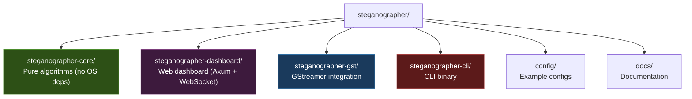

# Contributing

## Development Setup

```bash
git clone https://github.com/docxology/steganographer.git
cd steganographer

# Install Rust stable
rustup toolchain install stable

# Install GStreamer (macOS)
brew install gstreamer

# Build and test
cargo build --workspace
cargo test --workspace  # All 282 tests
```

---

## Project Structure



---

## Code Style

### Formatting

```bash
cargo fmt --all          # Format all code
cargo fmt --all --check  # Check formatting (CI)
```

### Linting

```bash
cargo clippy --workspace -- -D warnings
```

### Conventions

- **Error handling**: Use `anyhow::Result` for all fallible functions; use `anyhow::bail!` for early returns with descriptive messages
- **Logging**: Use `log::info!`, `log::debug!`, `log::warn!` — never `println!` in library code
- **Documentation**: All public items must have `///` doc comments
- **Tests**: Every module must have a `#[cfg(test)] mod tests` block
- **Naming**: Rust standard naming — `snake_case` for functions/variables, `CamelCase` for types, `SCREAMING_CASE` for constants
- **Dependencies**: No `unsafe` in workspace code; prefer `thiserror` for library errors, `anyhow` for application errors

---

## Adding a New Steganography Algorithm

### 1. Implement the Trait

Create a new file in `steganographer-core/src/` (e.g., `dct_video.rs`):

```rust
use crate::crypto::SignaturePayload;
use crate::video::{VideoFrame, VideoStegoModule};

pub struct DctVideo {
    // configuration...
}

impl VideoStegoModule for DctVideo {
    fn embed(&mut self, frame: &mut VideoFrame, sig: Option<&SignaturePayload>) -> anyhow::Result<()> {
        // Your embedding logic
        Ok(())
    }

    fn extract(&self, frame: &VideoFrame) -> anyhow::Result<Option<SignaturePayload>> {
        // Your extraction logic
        Ok(None)
    }
}
```

### 2. Register the Module

Add to `steganographer-core/src/lib.rs`:

```rust
pub mod dct_video;
```

### 3. Wire into the CLI

Add a new match arm in `cmd_video.rs`'s `build_video_stego_chain`:

```rust
"dct_signature" => {
    let dct = DctVideo::new(/* params */);
    modules.push(Box::new(dct));
}
```

### 4. Add Config Support

Add a new config struct in `config.rs` and a new table in the TOML schema.

### 5. Write Tests

Add comprehensive tests covering:

- Embed/extract round-trip
- Capacity error handling
- Edge cases (empty frame, minimum size)
- No-op when signature is `None`

---

## Testing

### Run All Workspace Tests

```bash
cargo test --workspace  # 282 tests across all crates
```

### Run Core Tests Only

```bash
cargo test -p steganographer-core  # 247 tests (171 unit + 76 integration)
```

### Test Structure

Each module follows this pattern:

```rust
#[cfg(test)]
mod tests {
    use super::*;

    #[test]
    fn test_roundtrip() {
        // Embed → extract → verify identical
    }

    #[test]
    fn test_capacity_error() {
        // Frame too small → error
    }

    #[test]
    fn test_noop() {
        // None signature → no modification
    }

    #[test]
    fn test_edge_cases() {
        // Empty frames, minimum sizes, etc.
    }
}
```

---

## Documentation

### Edit Docs

All documentation lives in `docs/`. Use standard Markdown with:

- Mermaid diagrams for architecture/flow visualization
- Tables for structured comparisons
- Code blocks with language annotations

### Generate rustdoc

```bash
cargo doc --workspace --no-deps --open
```

---

## Pull Request Checklist

- [ ] Code compiles: `cargo build --workspace`
- [ ] All tests pass: `cargo test --workspace`
- [ ] No warnings: `cargo clippy --workspace -- -D warnings`
- [ ] Formatted: `cargo fmt --all --check`
- [ ] New public items have doc comments
- [ ] New modules have unit tests
- [ ] Documentation updated if behavior changed
- [ ] AGENTS.md and README.md files updated at relevant folder levels
- [ ] If adding config fields: update `steganographer.toml`, `config.rs`, `configuration.md`, and `run.sh` if pipeline-related
- [ ] If adding dashboard features: update HTML, JS, and CSS, plus dashboard AGENTS.md

---

## Further Reading

- [Architecture](architecture.md) — System design and module interactions
- [API Reference](api-reference.md) — Complete Rust API
- [Configuration](configuration.md) — TOML config schema
- [Steganography Theory](steganography-theory.md) — Theoretical foundations
- [Security](security.md) — Threat models, use cases, and deployment guidance
- [Roadmap](roadmap.md) — Planned features and extension points
