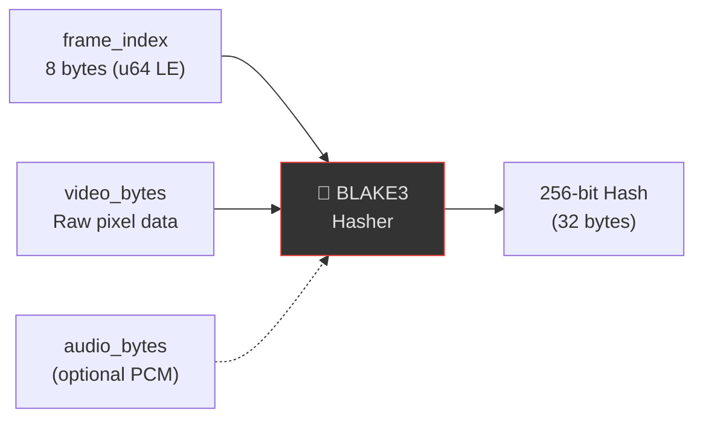
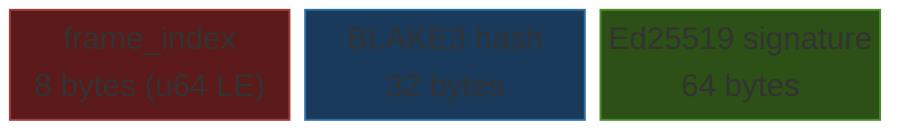
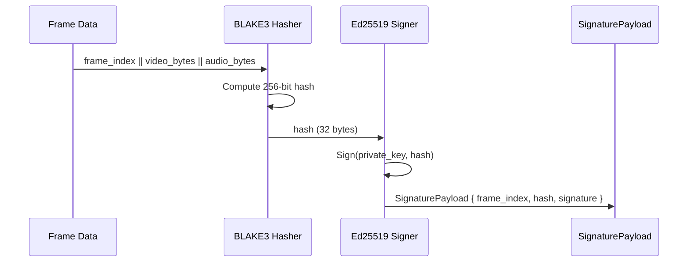
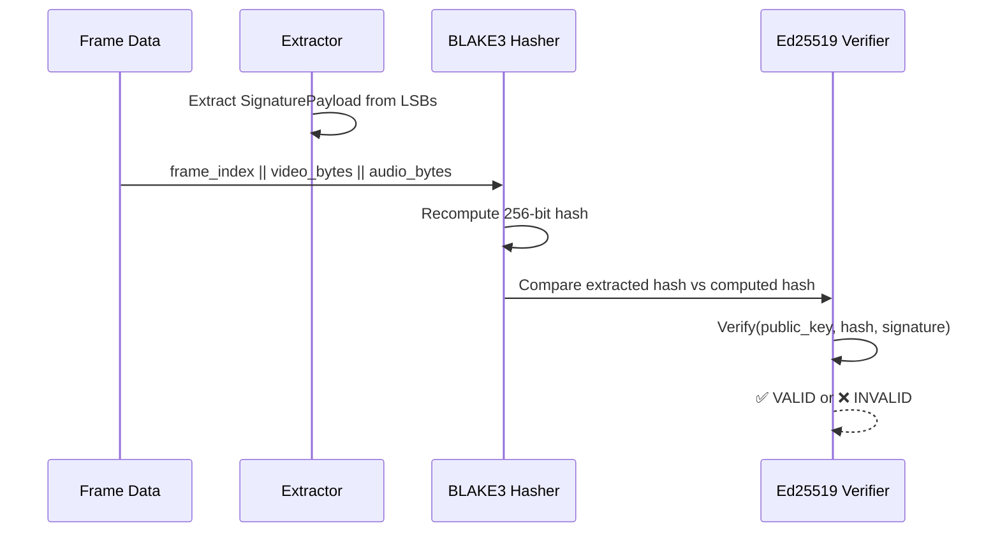

# Cryptography

## Overview

Steganographer uses a two-layer cryptographic scheme to produce tamper-evident signatures for each media frame:

1. **BLAKE3** — Fast, parallel hash function (256-bit output)
2. **Ed25519** — Elliptic curve digital signature scheme (RFC 8032)

The combination provides both **integrity** (hash detects any modification) and **authenticity** (signature proves the frame was signed by the holder of the private key).

> For the broader theoretical context of information hiding and its relationship to cryptography, see [Steganography Theory](steganography-theory.md).

---

## Foundational Principles

### Kerckhoffs' Principle

Auguste Kerckhoffs (1883) established that **a cryptographic system should be secure even if everything about the system, except the key, is public knowledge**. In Steganographer:

| Component | Public Knowledge | Secret |
| --- | --- | --- |
| LSB embedding algorithm | ✅ Known | — |
| BLAKE3 + Ed25519 scheme | ✅ Known | — |
| Payload format (104 bytes) | ✅ Known | — |
| Ed25519 signing key | — | ✅ Private key |
| Audio PRNG permutation key | — | ✅ 32-byte key |

Security relies entirely on key secrecy, never on algorithm secrecy.

### Composing Steganography and Cryptography

Steganography and cryptography serve complementary purposes:

| Layer | Purpose | Steganographer Component |
| --- | --- | --- |
| **Cryptographic signing** | Ensures authenticity and integrity | Ed25519 signature over BLAKE3 hash |
| **Steganographic embedding** | Hides the signed payload from observers | LSB embedding in pixel/sample data |
| **Exoteric overlay** | Provides visible, machine-readable proof | Info Bar with QR code and barcode |

The composition `Stego(Sign(Hash(frame)))` provides defense in depth:

1. Even if the steganographic layer is broken (data extracted), the payload is a cryptographic signature — meaningless without context
2. Even if the overlay is visible, the LSB layer provides a hidden backup channel
3. Even if the LSB data is destroyed (re-encoding), the overlay survives

---

## Hash Construction

### Input Domain

The BLAKE3 hash covers a deterministic concatenation of frame metadata and raw media bytes:



| Field | Size | Description |
| --- | --- | --- |
| `frame_index` | 8 bytes | Little-endian u64 frame counter |
| `video_bytes` | Variable | Raw pixel data (RGB8, BGRA8, or Y plane) |
| `audio_bytes` | Variable (optional) | Raw PCM samples, if present |

### Why BLAKE3?

| Property | BLAKE3 | SHA-256 | SHA-512 |
| --- | --- | --- | --- |
| Speed (single core) | ~6 GB/s | ~0.5 GB/s | ~0.8 GB/s |
| Parallelizable | ✅ (tree hash) | ❌ | ❌ |
| Output size | 256 bits | 256 bits | 512 bits |
| Security level | 128-bit | 128-bit | 256-bit |

For real-time video at 30 fps with 1080p frames (~6 MB/frame), BLAKE3 can hash a frame in **<1 ms**, making it viable for live pipelines.

### Implementation

```rust
fn compute_hash(frame_index: u64, video_bytes: &[u8], audio_bytes: Option<&[u8]>) -> [u8; 32] {
    let mut hasher = blake3::Hasher::new();
    hasher.update(&frame_index.to_le_bytes());
    hasher.update(video_bytes);
    if let Some(a) = audio_bytes {
        hasher.update(a);
    }
    *hasher.finalize().as_bytes()
}
```

---

## Signature Scheme

### Ed25519 Parameters

| Parameter | Value |
| --- | --- |
| Curve | Curve25519 (twisted Edwards form) |
| Key size | 256 bits (32 bytes) |
| Signature size | 512 bits (64 bytes) |
| Security level | ~128-bit |
| Standard | RFC 8032 |

### Key Types

| Type | Rust Type | Size | Purpose |
| --- | --- | --- | --- |
| Signing key | `SigningKey` | 32 bytes | Private key for producing signatures |
| Verifying key | `VerifyingKey` | 32 bytes | Public key for checking signatures |
| Signature | `Signature` | 64 bytes | The Ed25519 signature output |

### Key Generation

```rust
let signer = Signer::generate();           // Random keypair from OsRng
let pub_key = signer.verifying_key();       // Extract public key
let priv_bytes = signer.signing_key_bytes(); // Export private key
```

Keys are hex-encoded for storage:

```bash
steganographer keygen --output mykey
# Creates: mykey.key (64 hex chars = 32 bytes private key)
#          mykey.pub (64 hex chars = 32 bytes public key)
```

---

## Pluggable Signing Backends

Steganographer supports multiple signing backends via the `SignerBackend` trait, configurable through `steganographer.toml`:

```toml
[video.pipeline.payload]
signing_backend = "ed25519"   # default
# signing_backend = "ethereum"  # requires --features ethereum
```

### Backend Comparison

| Property              | Ed25519 (default)              | Ethereum (secp256k1)                    |
| --------------------- | ------------------------------ | --------------------------------------- |
| Curve                 | Curve25519 (twisted Edwards)   | secp256k1 (Koblitz)                     |
| Hash function         | BLAKE3 (for frame hash)        | Keccak-256 (EIP-191 personal_sign)      |
| Signature size        | 64 bytes                       | 64 bytes (r, s)                         |
| Signing speed         | ~50 μs                         | ~50 μs                                  |
| Key format            | 32-byte raw                    | 32-byte raw (SEC1)                      |
| Identity format       | Hex public key (64 chars)      | Ethereum address (0x + 40 hex chars)    |
| Standard              | RFC 8032                       | EIP-191 / SEC 2                         |
| Feature flag          | (default, always available)    | `--features ethereum`                   |

### Ethereum / EIP-191 Signing

The Ethereum backend implements the `personal_sign` message format used by MetaMask and other Ethereum wallets:

1. **Message prefix**: `"\x19Ethereum Signed Message:\n" + len(data)` is prepended
2. **Keccak-256 hash**: The prefixed message is hashed with Keccak-256 (32 bytes)
3. **secp256k1 ECDSA**: The hash is signed using `sign_prehash` to produce a 64-byte (r, s) signature

The Ethereum address is derived from the public key: `Keccak-256(uncompressed_pubkey[1..65])[12..32]`.

```rust
use steganographer_core::EthereumBackend;

let backend = EthereumBackend::generate();
let sig = backend.sign(frame_data);
assert!(backend.verify(frame_data, &sig));
println!("Address: {}", backend.ethereum_address()); // 0x...
```

---

## SignaturePayload Format

The `SignaturePayload` is the atomic unit of cryptographic data embedded into media frames.



**Total: 104 bytes**

### Serialization

```rust
// Serialize to 104-byte array
let bytes: [u8; 104] = payload.to_bytes();

// Deserialize from 104-byte array
let payload = SignaturePayload::from_bytes(&bytes)?;
```

All multi-byte fields use **little-endian** byte order.

---

## Signing Flow



## Verification Flow



---

## Threat Model

### What This Protects Against

| Threat | Protection |
| --- | --- |
| Frame content modification | BLAKE3 hash will mismatch |
| Frame index manipulation (replay/reorder) | Frame index is included in the hash domain |
| Signature forgery | Ed25519 requires the private key |
| Audio-video desynchronization | Combined hash covers both streams |

### What This Does NOT Protect Against

| Limitation | Notes |
| --- | --- |
| Side-channel attacks | No constant-time guarantees beyond what `ed25519-dalek` provides |
| Quantum adversaries | Ed25519 is not post-quantum (consider ML-DSA for future) |
| Key compromise | If the private key leaks, all signatures can be forged |
| Frame removal | Missing frames are detectable only by frame index gaps |
| Re-encoding attacks | Lossy transcoding destroys LSB-embedded data |

### Key Management Recommendations

1. **Generate keys per-session** — Each recording session should use a fresh keypair
2. **Store private keys securely** — Use OS keychain or encrypted storage
3. **Distribute public keys out-of-band** — Share verification keys through a trusted channel
4. **Rotate keys regularly** — Limit the blast radius of any key compromise

---

## Provable Security Model

### EUF-CMA Security

Steganographer's signature scheme provides **Existential Unforgeability under Chosen Message Attack (EUF-CMA)**:

- An adversary with access to a signing oracle (can request signatures on arbitrary frames) still cannot forge a valid signature on a *new* frame without the private key
- Ed25519 achieves EUF-CMA security under the Discrete Logarithm assumption on Curve25519

### Collision Resistance

BLAKE3 provides **128-bit collision resistance**: finding two distinct frame payloads with the same hash requires ~2^128 operations. This ensures:

- **Preimage resistance**: Given a hash, finding any frame that produces it is infeasible
- **Second preimage resistance**: Given a frame, finding another frame with the same hash is infeasible
- **Collision resistance**: Finding any two frames with the same hash is infeasible

---

## Post-Quantum Cryptography Considerations

### Current Vulnerability

Ed25519 relies on the hardness of the Elliptic Curve Discrete Logarithm Problem (ECDLP). Shor's algorithm on a sufficiently large quantum computer would solve ECDLP in polynomial time, breaking Ed25519.

### Migration Path

| Component | Current | Post-Quantum Replacement | Status |
| --- | --- | --- | --- |
| Signing | Ed25519 (64B sig) | ML-DSA-65 / Dilithium3 (3,309B sig) | FIPS 204 standardized |
| Hashing | BLAKE3 (32B) | BLAKE3 (unchanged) | Quantum-resistant (Grover: 128→64 bit, still safe) |
| Key generation | `OsRng` | `OsRng` (unchanged) | N/A |

**Impact on Steganography**: ML-DSA signatures are ~50× larger than Ed25519 (3,309 bytes vs 64 bytes). The payload would grow from 104 bytes to ~3,349 bytes, requiring ~26,792 pixel bytes at LSB-1 (still easily fits in a 640×480 frame with 921,600 bytes).

---

## Cryptographic Dependencies

| Crate | Version | Purpose | Audited |
| --- | --- | --- | --- |
| `blake3` | 1.5.x | Hashing | [Official audits](https://github.com/BLAKE3-team/BLAKE3) |
| `ed25519-dalek` | 2.x | Signing/verification | [Dalek audits](https://github.com/dalek-cryptography/ed25519-dalek) |
| `rand` | 0.8.x | Key generation (OsRng) | Widely reviewed |

All dependencies use the standard Ed25519 specification (SHA-512 internal prehash per RFC 8032). BLAKE3 is used **only** for hashing frame data, not as a replacement for Ed25519's internal hash.

---

## Further Reading

- [Steganography Theory](steganography-theory.md) — Information-theoretic foundations and steganalysis
- [Security](security.md) — Threat analysis and steganalysis resistance
- [Threat Model](threat-model.md) — Adversary types, attack scenarios, and residual risks
- [Algorithms](algorithms.md) — Implementation details of LSB embedding protocols
