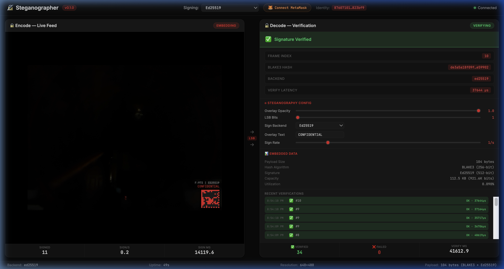

# Getting Started

## Prerequisites

### Rust Toolchain

Install Rust via [rustup](https://rustup.rs):

```bash
curl --proto '=https' --tlsv1.2 -sSf https://sh.rustup.rs | sh
rustup toolchain install stable
```

Required: **Rust 1.70+** (tested on 1.94.0)

### GStreamer (Optional)

GStreamer is required for live video/audio pipelines. The core crate and offline encode/verify commands work without it.

**macOS**:

```bash
brew install gstreamer
```

**Linux (Debian/Ubuntu)**:

```bash
sudo apt install libgstreamer1.0-dev libgstreamer-plugins-base1.0-dev \
                 gstreamer1.0-plugins-good gstreamer1.0-plugins-bad
```

**Linux (Fedora)**:

```bash
sudo dnf install gstreamer1-devel gstreamer1-plugins-base-devel
```

---

## Build

```bash
# Clone the repository
git clone https://github.com/docxology/steganographer.git
cd steganographer

# Build the entire workspace
cargo build --workspace

# Build only the core (no GStreamer needed)
cargo build -p steganographer-core

# Build in release mode
cargo build --workspace --release
```

---

## Run Tests

```bash
# All workspace tests (282 tests)
cargo test --workspace

# Core only (247 tests)
cargo test -p steganographer-core

# Dashboard only (23 tests)
cargo test -p steganographer-dashboard

# With verbose output
cargo test --workspace -- --nocapture
```

---

## Quick Tutorial

### 1. Generate a Key Pair

```bash
cargo run -p steganographer-cli -- keygen --output mykey
```

Output:

```text
  Private key: mykey.key
  Public key:  mykey.pub
  Public key (hex): a1b2c3d4...
```

### 2. Encode a Signature into a File

Create a test image (raw RGB):

```bash
# Generate 100×100 random RGB pixels
dd if=/dev/urandom of=test_frame.rgb bs=30000 count=1
```

Embed a signature:

```bash
cargo run -p steganographer-cli -- encode \
    --input test_frame.rgb \
    --output test_frame_signed.rgb \
    --stego-type lsb_video \
    --bits 1
```

Save the public key hex from the output.

### 3. Verify the Signature

```bash
cargo run -p steganographer-cli -- verify \
    --input test_frame_signed.rgb \
    --stego-type lsb_video \
    --public-key <paste_hex_here>
```

Output:

```text
  Frame index: 0
  Hash:        a1b2c3d4...
  Signature:   e5f6a7b8...
  Status:      ✅ VALID
```

### 4. Run a Live Video Pipeline (requires GStreamer)

```bash
# Using test source (no camera needed)
cargo run -p steganographer-cli -- video \
    --source "videotestsrc" \
    --sink "autovideosink" \
    --config config/example.toml
```

---

## Project Structure

```text
├── Cargo.toml                     # Workspace manifest
├── config/
│   └── example.toml               # Annotated config file
├── docs/                          # This documentation
├── steganographer-core/           # Pure algorithms (no OS deps)
│   └── src/
│       ├── lib.rs
│       ├── config.rs              # TOML config model
│       ├── crypto.rs              # BLAKE3 + Ed25519
│       ├── video.rs               # VideoFrame types
│       ├── audio.rs               # AudioBuffer types
│       ├── lsb_video.rs           # LSB video embed/extract
│       ├── lsb_audio.rs           # LSB audio embed/extract
│       ├── overlay.rs             # Text overlay
│       └── info_bar.rs            # Exoteric QR/barcode array
├── steganographer-dashboard/       # Web dashboard (Axum + WebSocket)
│   ├── src/
│   │   ├── lib.rs                 # LiveConfig, DashboardState, router
│   │   ├── ws_handler.rs          # WebSocket encode/decode handlers
│   │   └── static/
│   │       ├── index.html         # Dashboard UI
│   │       ├── app.js             # Client JS (webcam, QR overlay, config)
│   │       └── style.css          # Gray/black/red theme
│   └── tests/
│       └── dashboard_tests.rs     # 9 integration tests
├── steganographer-gst/            # GStreamer integration
│   └── src/
│       ├── lib.rs
│       ├── plugin.rs              # Plugin skeleton
│       ├── video_filter.rs        # Video AppSink/AppSrc
│       └── audio_filter.rs        # Audio AppSink/AppSrc
└── steganographer-cli/            # CLI binary
    └── src/
        ├── main.rs                # Clap subcommands (incl. dashboard)
        ├── cmd_video.rs           # Live video
        ├── cmd_audio.rs           # Live audio
        ├── cmd_encode.rs          # Offline encode + keygen
        └── cmd_verify.rs          # Verification
```

---

## Customizing Pipeline Parameters

Edit `steganographer.toml` to configure resolution, framerate, and steganographic intensity:

```toml
[video.pipeline]
width = 1280       # HD resolution
height = 720
framerate = 30
opacity = 1.0      # Full overlay intensity

[video.pipeline.payload]
type = "signature"
size = 104         # 8 + 32 + 64 bytes
```

When you run `./run.sh` and start a live pipeline, it reads these values automatically — no code changes needed.

### Adjusting LSB Depth

Lower bit depth is less detectable; higher provides more capacity:

```toml
[video.stego.lsb_signature]
bits = 1           # Imperceptible (default)
# bits = 2        # Barely visible, 2× capacity
# bits = 4        # Noticeable, 4× capacity
```

---

## Next Steps

- [CLI Reference](cli-reference.md) — All commands and options
- [Configuration](configuration.md) — Full TOML config schema with `[video.pipeline]` and live dashboard controls
- [Algorithms](algorithms.md) — How LSB, overlay, QR data matrix, and info bar work
- [Steganography Theory](steganography-theory.md) — Deep dive into information hiding
- [Cryptography](cryptography.md) — BLAKE3 + Ed25519 / Ethereum details
- [Architecture](architecture.md) — System design and module interactions
- [Platform Guide](platforms.md) — OS-specific setup

---

## Dashboard Quickstart

The web dashboard provides a live visual round-trip steganography demo.

### Launch

```bash
# Via run.sh
./run.sh   # Choose option 'd' (Dashboard) or 'a' (All including dashboard)

# Or directly via CLI
cargo run -p steganographer-cli -- --config steganographer.toml dashboard --port 8080 --backend ed25519
```

Then open [http://localhost:8080](http://localhost:8080).

### What You See

The dashboard has three tabs:

#### Video Tab

| Panel | Description |
| --- | --- |
| **Left** | Live webcam feed with QR data matrix overlay |
| **Right** | Verification data, config controls, stego info |
| **Bottom** | Metrics: signed frames, FPS, latency, verified/failed |
| **Header** | Backend selector, MetaMask connect, identity |

#### Audio Tab

| Panel | Description |
| --- | --- |
| **Left** | Live microphone waveform and spectrum visualization |
| **Right** | Audio config controls, verification data, embedded data info |
| **Bottom** | Metrics: signed chunks, sample rate, latency |

### Controls

All controls have detailed **mouseover tooltips** explaining their function, recommended values, and security trade-offs.

- **Overlay Opacity**: Drag slider to control QR overlay visibility
- **LSB Bits**: 1–4 bits per pixel/sample byte (1 = imperceptible)
- **Sign Backend**: Ed25519 or Ethereum (MetaMask)
- **Overlay Text**: Custom watermark text
- **Sign Rate**: How often frames/chunks are signed (0.2/s – 5/s)
- **QR Scale**: Size of QR overlay (5% corner to 100% full frame)
- **Resolution**: Video capture resolution (320×240 to 1920×1080)
- **Buffer Size** (Audio): PCM samples per chunk (1024–8192)
- **Sample Rate** (Audio): Capture rate (22050–48000 Hz)
- **Record**: Toggle to record signed video (WebM) or audio (WAV)


