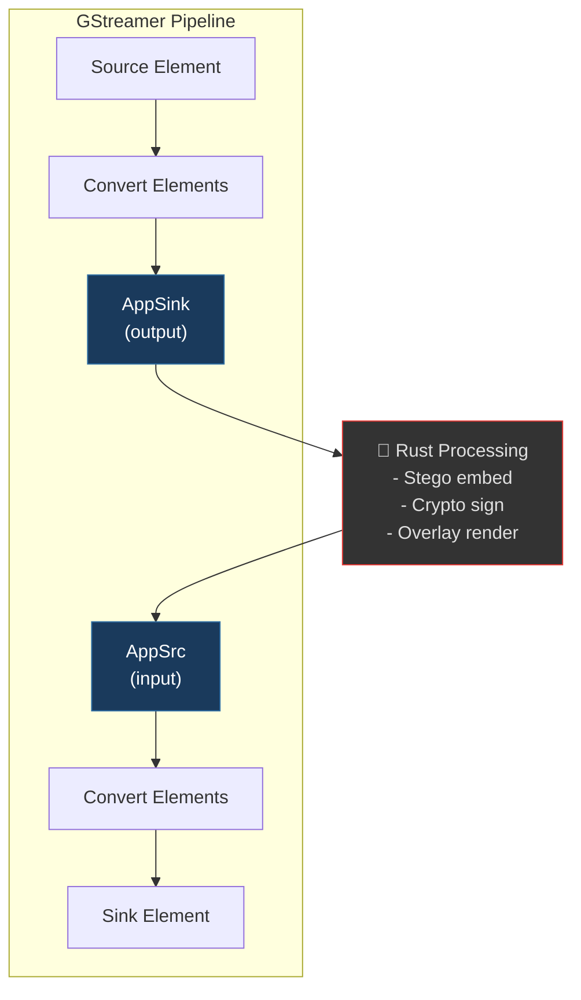

# GStreamer Integration

## Overview

The `steganographer-gst` crate provides the bridge between GStreamer's media handling and the core steganography algorithms. It uses the **AppSink/AppSrc** pattern for practical integration without requiring native GStreamer plugin compilation.

---

## Architecture

### AppSink/AppSrc Pattern



**Why AppSink/AppSrc?**

- No need to install compiled `.so`/`.dylib` plugin files
- Easier debugging — all processing happens in standard Rust code
- Full control over buffer lifecycle
- Simpler CI/CD — no `GST_PLUGIN_PATH` configuration needed

---

## Threading and macOS Integration

Bridging GStreamer with macOS native UI and AVFoundation frameworks (`avfvideosrc`, `osxvideosink`) introduces strict threading constraints:

1. **`NSRunLoop` Requirement**: macOS implicitly requires the main thread to run an active `NSRunLoop` for capturing camera frames and rendering windows. Without it, the pipeline immediately crashes or freezes.
2. **`gstreamer::macos_main`**: To solve the `NSRunLoop` constraint while still running the heavy steganography pipeline, we use `gstreamer::macos_main()`. This hijacks the main thread to call `[NSApp run]` (pumping the UI/AVFoundation events) and transparently spawns a GCD background thread to execute the Rust `appsink` processing closure.
3. **Queue Decoupling**: Because the camera capture (AVFoundation) and mathematical steganography run in different timing domains, `queue max-size-buffers=5` elements are synthetically injected into the GStreamer pipeline before the `appsink` and after the `appsrc`. This prevents AppSrc/AppSink blocking from stalling the entire camera.
4. **Hardware Pool Exhaustion and `AutoReleasePool`**: Apple's `AVCaptureSession` allocates a strict, fixed memory pool of ~35 `CVPixelBuffer` objects. When frames are pulled onto a GCD background thread and dropped after processing, Objective-C targets them for delayed garbage collection. Without an active `NSAutoreleasePool`, the memory leaks, completely draining the hardware pool exactly 1 second in (30 FPS), which permanently halts `avfvideosrc`. To prevent this, the Rust processing loop explicitly pushes and pops an Objective-C `AutoReleasePool` using a custom RAII `Drop` guard.

---

## Video Filter Pipeline

### Configuration

```rust
pub struct VideoFilterConfig {
    pub source_pipeline: String,  // e.g., "videotestsrc ! videoconvert ! video/x-raw,format=RGB"
    pub sink_pipeline: String,    // e.g., "videoconvert ! autovideosink"
}
```

### Processing Flow

1. **Pull** a `GstSample` from the AppSink (with a 5-second timeout and EOS detection)
2. **Extract** buffer info (width, height, stride) from the sample's caps
3. **Map** the `GstBuffer` as a writable `VideoFrame`
4. **Apply** the configured `CompositeVideoStego` chain (e.g. LSB → text overlay → InfoBar)
5. **Sign** the frame data if a `Signer` is provided
6. **Set** per-frame PTS timestamps (`buffer.set_pts`) and set caps on the AppSrc (first frame only)
7. **Push** the modified, timestamped buffer to the AppSrc

```rust
pub fn run_video_filter(
    config: &VideoFilterConfig,
    stego: &mut dyn VideoStegoModule,
    signer: Option<&Signer>,
    max_frames: Option<u64>,
) -> anyhow::Result<()>
```

### Frame Format Mapping

| GStreamer Format | Core Format | Bytes/Pixel |
| ------------------- | --------------- | ----------- |
| `video/x-raw,format=RGB` | `VideoFormat::Rgb8` | 3 |
| `video/x-raw,format=BGRA` | `VideoFormat::Bgra8` | 4 |

---

## Audio Filter Pipeline

### Configuration

```rust
pub struct AudioFilterConfig {
    pub source_pipeline: String,  // e.g., "audiotestsrc ! audioconvert ! audio/x-raw,format=S16LE"
    pub sink_pipeline: String,    // e.g., "audioconvert ! autoaudiosink"
}
```

### Processing Flow

1. **Pull** a `GstSample` from the AppSink
2. **Convert** raw buffer bytes to `&mut [i16]` samples
3. **Build** an `AudioBuffer` struct
4. **Apply** the `AudioStegoModule`
5. **Sign** the audio buffer if a Signer is provided
6. **Push** the modified buffer to the AppSrc

### Sample Format

Currently supports: **S16LE** (signed 16-bit little-endian), mono.

---

## GStreamer Pipeline Strings

### Video Sources

| Element | Platform | Description |
| ----------- | -------- | ----------- |
| `videotestsrc` | All | Test pattern generator |
| `v4l2src device=/dev/video0` | Linux | V4L2 camera capture |
| `avfvideosrc` | macOS | AVFoundation camera |
| `ksvideosrc` | Windows | Kernel Streaming |

### Video Sinks

| Element | Platform | Description |
| ----------- | -------- | ----------- |
| `autovideosink` | All | Auto-select best display sink |
| `osxvideosink` | macOS | Native macOS window for low-latency preview |
| `v4l2sink device=/dev/video42` | Linux | V4L2 loopback output (Virtual Camera) |
| `filesink location=out.raw` | All | Write to file |

### Audio Sources

| Element | Platform | Description |
| ----------- | -------- | ----------- |
| `audiotestsrc wave=sine freq=440` | All | Test tone generator |
| `pulsesrc` | Linux | PulseAudio capture |
| `pipewiresrc` | Linux | PipeWire capture |
| `osxaudiosrc` | macOS | macOS audio capture |

### Audio Sinks

| Element | Platform | Description |
| ----------- | -------- | ----------- |
| `autoaudiosink` | All | Auto-select best audio output |
| `pulsesink` | Linux | PulseAudio output |
| `pipewiresink` | Linux | PipeWire output |

---

## Pipeline Construction

The CLI constructs full pipelines by combining user/config source and sink strings with the AppSink/AppSrc bridge:

```text
Source String:  "v4l2src device=/dev/video0 ! videoconvert ! video/x-raw,format=RGB"
                                                                          │
                                                                    AppSink ──── Rust Processing ──── AppSrc
                                                                                                         │
Sink String:    "videoconvert ! v4l2sink device=/dev/video42"     ◀───────────────────────────────────────┘
```

---

## Plugin Skeleton

The `plugin.rs` module provides a registration skeleton for a native GStreamer plugin. This is a future extension point for when native plugin performance or integration is needed.

```rust
gst::plugin_define!(
    steganographer,
    env!("CARGO_PKG_DESCRIPTION"),
    plugin_init,
    concat!(env!("CARGO_PKG_VERSION")),
    "MIT",
    env!("CARGO_PKG_NAME"),
    env!("CARGO_PKG_NAME"),
    env!("CARGO_PKG_REPOSITORY"),
    env!("BUILD_REL_DATE")
);
```

To develop a full native plugin, you would:

1. Implement `gst_base::BaseTransform` or `gst::Element`
2. Register the element in `plugin_init`
3. Build as a `cdylib` and install to `GST_PLUGIN_PATH`

---

## Troubleshooting

### `gstreamer-1.0.pc` not found

GStreamer development files are not installed or `PKG_CONFIG_PATH` is not set.

```bash
# macOS (Homebrew)
brew install gstreamer

# Linux
sudo apt install libgstreamer1.0-dev libgstreamer-plugins-base1.0-dev
```

### `no element "avfvideosrc"`

The GStreamer installation doesn't include the AVFoundation plugin.

```bash
# macOS - ensure plugins-bad is included
brew install gstreamer  # Homebrew bundles all plugins
```

### Pipeline hangs or no output

1. Set `GST_DEBUG=3` to see GStreamer internal messages
2. Verify source/sink formats match with `gst-inspect-1.0 <element>`
3. Add `videoconvert` (video) or `audioconvert` (audio) between elements

---

## Config-Driven Pipeline Construction

Since v0.1.0, `run.sh` reads pipeline parameters from `steganographer.toml`:

```toml
[video.pipeline]
width = 1280
height = 720
framerate = 30
opacity = 1.0
```

These values are injected into GStreamer caps strings:

```bash
# Generated automatically by run.sh from config:
caps="video/x-raw,format=RGB,width=1280,height=720,framerate=30/1"
```

The Rust `VideoPipelineConfig` struct provides matching default values through `_or_default()` methods.

---

## Further Reading

- [Configuration](configuration.md) — Full TOML schema with `[video.pipeline]`
- [Architecture](architecture.md) — Crate structure and data flow
- [Platform Guide](platforms.md) — OS-specific GStreamer setup
- [Algorithms](algorithms.md) — What happens inside the processing loop
- [Steganography Theory](steganography-theory.md) — Theoretical foundations
