# Protocol and Compatibility Specification

## Objective

Define one bounded, versioned packet that carries arbitrary bytes, current
signed-frame attestations, or future typed payloads across spatial,
frequency-domain, audio, video, and document carriers.

This is an implemented alpha protocol, not yet a frozen wire standard.
`PKT-001`, `PKT-002`, `PKT-003`, and `PKT-006` now have Rust implementations;
immutable vectors and the security review remain prerequisites for declaring any
field stable.

### Implemented alpha profile (2026-07-28)

- Public magic: ASCII `STG3`.
- Protocol version: `1.0-alpha`.
- Integer byte order: big-endian.
- Locator size: 32 bytes.
- Envelope TLV header: 2-byte field identifier followed by a 4-byte value
  length; bit 15 of the identifier marks a critical field.
- Initial placement/kernel registry: sequential placement `1`, spatial LSB `1`.
- Default decode ceilings: 16 KiB envelope, 16 MiB body, 128 fields, 16
  transforms, and 64 extensions.
- The opt-in CLI vertical slice supports untransformed text/file bytes in
  PNG or raw RGB carriers at one through four LSBs.

These values may change before alpha vectors are frozen. Legacy signed-frame
encoding remains the default CLI behavior.

## Terms

- **Logical payload**: caller-provided bytes and private metadata.
- **Attestation**: a signature binding content or a carrier frame to an identity.
- **Envelope**: canonical metadata describing the logical payload and transforms.
- **Body**: transformed logical payload bytes.
- **Locator**: minimal bootstrap data needed to discover and parse the envelope.
- **Carrier slot**: an addressable bit/symbol/coefficient usable by a kernel.
- **Placement schedule**: deterministic ordering of eligible carrier slots.
- **Kernel**: operation that maps packet symbols to carrier changes.
- **Legacy v2**: the existing 109-byte `SignaturePayload`.

## Required semantics

The protocol must distinguish two signature meanings:

1. **Payload authenticity** signs the canonical logical metadata and the digest
   of the original payload.
2. **Carrier provenance** signs a normalized frame/media digest and retains the
   existing `SignaturePayload` behavior.

They are not interchangeable. A valid payload signature does not prove an image
or document was unmodified, and a valid frame signature does not authenticate an
arbitrary attached file unless that file digest is included.

## Encoding pipeline

```mermaid
flowchart LR
    INPUT["Payload + metadata"] --> DIGEST["Digest + optional signature"]
    DIGEST --> COMPRESS["Optional compression"]
    COMPRESS --> ENCRYPT["Optional AEAD encryption"]
    ENCRYPT --> ECC["Optional ECC"]
    ECC --> FRAME["Locator + envelope + body"]
    FRAME --> PLACE["Placement schedule"]
    PLACE --> KERNEL["Embedding kernel"]
```



Decode reverses ECC, encryption, and compression before checking the original
length, digest, and optional payload signature.

Compression must precede encryption. ECC must protect the ciphertext and AEAD
tag so corruption can be repaired before authentication. No partially decrypted
or unauthenticated bytes are returned.

## Locator draft

The public locator is a fixed 32-byte bootstrap:

| Offset | Size | Field | Notes |
| ---: | ---: | --- | --- |
| 0 | 4 | magic | Alpha uses `STG3`, distinct from legacy `STEG` |
| 4 | 1 | protocol major | Breaking wire changes |
| 5 | 1 | protocol minor | Backward-compatible additions |
| 6 | 2 | flags | Discovery, envelope, and transform hints |
| 8 | 4 | envelope length | Checked before allocation |
| 12 | 8 | encoded body length | Checked before allocation/capacity math |
| 20 | 4 | envelope CRC32C | Corruption filter, not authentication |
| 24 | 8 | locator nonce | Placement/KDF context and packet uniqueness |

Rules:

- Integers use big-endian byte order across every target.
- Reserved flag bits must be zero when encoding and ignored or rejected according
  to protocol-major policy when decoding.
- Lengths are validated against carrier capacity and configured limits before
  allocating.
- CRC only rejects accidental corruption and false magic matches. AEAD and
  signatures provide security.
- `STG3` is the alpha magic. It is not stable until immutable vectors and
  collision checks are complete; it does not overload legacy `STEG` version 2.

### Keyed locator mode

Private-profile packets may derive locator positions and a short recognition tag
from the embedding key and carrier context. The public 32-byte layout remains the
decoded logical locator, but it need not appear in the default public slots.

The key hierarchy derives separate subkeys for:

- locator placement,
- body placement,
- payload encryption,
- any keyed integrity tag.

Domain labels are stable protocol constants. One key is never reused directly
for multiple purposes.

### Discovery order

1. Explicit caller configuration.
2. Public locator at the carrier's canonical bootstrap slots.
3. Keyed locator when a key is supplied.
4. Legacy v2 probe.
5. Bounded forensic scan when `--auto` or `scan` explicitly requests it.

Brute-force scanning is a recovery feature, not the primary decode protocol.

## Canonical envelope

Use a compact, length-delimited canonical TLV representation with:

- ascending numeric field identifiers,
- shortest legal integer encodings,
- explicit byte/string lengths,
- deterministic ordering for repeated transforms,
- rejection of duplicate singleton fields,
- preservation rules for unknown optional fields,
- hard rejection of unknown critical fields.

A manually specified TLV keeps the wire contract independent from a serializer's
implementation details. Serde-friendly Rust types may sit above it.

The alpha TLV header is `raw_id: u16 || value_len: u32`, both big-endian.
`raw_id & 0x8000` is the critical bit and `raw_id & 0x7fff` is the field
identifier. Required singleton fields use identifiers 1–8, optional MIME type,
filename, and creation time use 16–18, and application extensions begin at 128.
The decoder rejects zero identifiers, descending order, duplicate singleton
fields, unknown critical fields, overlong fields, and non-minimal integers.

### Required fields

| Field | Purpose |
| --- | --- |
| packet identifier | 128-bit random identifier for correlation and nesting |
| payload kind | bytes, text, file, frame attestation, manifest, or extension |
| original length | length before compression/encryption/ECC |
| content digest | algorithm identifier plus digest |
| transform list | ordered transform identifiers and bounded parameters |
| placement descriptor | strategy, slot policy, and required public parameters |
| kernel descriptor | algorithm and decoding parameters |
| created protocol version | compatibility and reporting |

### Optional public fields

- MIME type.
- Safe display filename.
- Creation timestamp.
- Public signer identifier or certificate fingerprint.
- Parent packet identifier.
- Chunk or sequence information.
- Application extension namespace.

Sensitive filenames and application metadata belong inside the encrypted body,
not the public envelope.

Payload-attestation signature bytes may be stored in a public envelope extension
or in the protected body according to profile. The canonical signed input is the
required logical metadata plus original-content digest and excludes the
signature field itself. The selected visibility is recorded so verifiers do not
guess.

### Transform descriptors

Each transform descriptor includes:

- stable numeric algorithm identifier,
- transform version,
- parameter length and canonical parameters,
- critical/optional flag.

Initial identifiers:

- compression: none, deflate or zstd after dependency review;
- encryption: none, ChaCha20-Poly1305;
- password KDF: Argon2id;
- ECC: none, current Reed-Solomon profile;
- digest: BLAKE3, SHA-256, SHA3-256;
- signature: none, Ed25519, secp256k1/EIP-191 where applicable.

Only sequential placement (`1`) and spatial LSB (`1`) are active in the current
generic-packet carrier path. Transform registry entries remain reserved until
their full encode/decode pipelines and failure semantics are implemented.

Algorithm names used by CLI/config map to numeric IDs; names never appear as
wire-critical free-form strings.

The generic packet may advertise only correction capabilities proven by active
tests. The current evaluation-form Reed-Solomon implementation uses a primitive
255-order field element and bounded Berlekamp-Welch decoding, with active
zero-, one-, two-, and four-symbol correction tests. A packet profile still
records its exact ECC parameters and must reject uncorrectable data.

## Rust contracts

The first refactor introduces byte-oriented contracts without deleting the
legacy traits:

```rust
pub trait PacketCodec {
    type Value;

    fn encoded_len(&self, value: &Self::Value) -> Result<usize, PacketError>;
    fn encode(&self, value: &Self::Value, out: &mut Vec<u8>)
        -> Result<(), PacketError>;
    fn decode(&self, input: &[u8], limits: &DecodeLimits)
        -> Result<Self::Value, PacketError>;
}

pub trait CarrierEmbedder {
    fn capacity(
        &self,
        carrier: &CarrierDescriptor,
        config: &EmbeddingConfig,
    ) -> Result<CapacityReport, CarrierError>;

    fn embed_packet(
        &mut self,
        carrier: &mut CarrierViewMut<'_>,
        packet: &[u8],
        config: &EmbeddingConfig,
    ) -> Result<EmbedReport, CarrierError>;
}

pub trait CarrierExtractor {
    fn extract_packet(
        &self,
        carrier: &CarrierView<'_>,
        request: &ExtractionRequest,
        limits: &DecodeLimits,
    ) -> Result<ExtractReport, CarrierError>;
}
```

Names may change during implementation, but these separations may not collapse:

- packet serialization does not know image/audio file formats;
- placement does not own encryption or compression;
- kernels do not parse arbitrary metadata;
- extraction receives the same typed configuration used by embedding.

### Legacy adapter

`SignaturePayloadCodec` maps the current 109-byte representation to and from a
typed packet payload. Existing `VideoStegoModule` and `AudioStegoModule` remain
available through v0.x and delegate to the byte-oriented implementation where
possible.

No existing media fixture is rewritten. A verifier reports:

- detected protocol,
- payload/attestation kind,
- legacy status,
- extraction configuration source,
- verification result.

## Configuration ownership

`EmbeddingConfig` is the canonical shared type for embed, extract, capacity, and
reporting. It contains:

- kernel and version;
- bits/symbol strength;
- component/channel/plane policy;
- placement strategy and public seed/stride;
- discovery profile;
- ECC profile;
- expected carrier domain;
- explicit unsafe allowances.

Secrets are references or secret-bearing runtime values, not printable config
fields. Debug and JSON serialization redact them.

## Resource limits

Safe defaults:

| Limit | Native default | Browser default |
| --- | ---: | ---: |
| Public envelope | 64 KiB | 16 KiB |
| Logical payload | 64 MiB | 16 MiB |
| Aggregate nested decode | 256 MiB | 64 MiB |
| Nesting depth | 3 | 2 |
| Transform stages | 8 | 8 |
| Compression expansion | 100:1 | 50:1 |
| Filename bytes | 255 | 255 |
| MIME bytes | 127 | 127 |

Applications may lower limits. Raising hard ceilings requires an explicit API,
CLI flag, and warning. All multiplication/addition uses checked arithmetic.

## Error taxonomy

Errors are typed and machine-stable:

- `not_found`
- `unsupported_protocol`
- `unsupported_algorithm`
- `invalid_locator`
- `invalid_envelope`
- `capacity_exceeded`
- `resource_limit`
- `key_required`
- `authentication_failed`
- `signature_invalid`
- `uncorrectable_ecc`
- `carrier_incompatible`
- `destructive_output`
- `legacy_configuration_required`
- `internal`

Messages may improve without changing codes. Authentication failures do not
reveal partial plaintext or unnecessarily distinguish tag failure causes.

## Compatibility and versioning

- Protocol major changes only for incompatible parsing or semantic changes.
- Minor additions use optional fields or newly assigned algorithm identifiers.
- Decoder support is at least current major plus legacy v2 for v1.0.
- Encoder defaults remain legacy v2 until the generic vertical slice passes all
  release gates; then the CLI requires an explicit payload/profile choice during
  the transition.
- Golden vectors include locator, envelope, full transformed packet, placement
  slot sequence, and final carrier output.
- Stable vectors are append-only. A changed vector requires a new version.

## Work packages

| ID | Scope | Depends on | Acceptance |
| --- | --- | --- | --- |
| `PKT-001` | Define types, limits, and typed errors | `COR-001` | No allocation before limit checks; unit/property tests |
| `PKT-002` | Canonical TLV encoder/decoder | `PKT-001` | Canonicality, unknown-field, malformed, and fuzz tests |
| `PKT-003` | Public locator | `PKT-002` | False-match/corruption fixtures and cross-target vector |
| `PKT-004` | Transform pipeline | `PKT-002` | Reverse-order decode, AEAD failure, ECC, bomb limits |
| `PKT-005` | Payload signatures | `PKT-002` | Domain-separated signed bytes and tamper tests |
| `PKT-006` | Legacy v2 codec/adapter | `PKT-001` | Existing fixtures decode byte-for-byte |
| `PKT-007` | Key hierarchy and Argon2id | `PKT-003` | Parameter serialization, zeroization review, vectors |
| `PKT-008` | Keyed locator | `PKT-003`, `PKT-007`, placement | Wrong-key indistinguishability tests and bounded lookup |
| `PKT-009` | Explicit nested packet/chunk semantics | `PKT-002`, `PKT-004` | Depth/aggregate limits, parent IDs, cycle and bomb tests |

## Exit criteria

- Protocol document, field registry, and checked-in vectors agree.
- Encode/decode is deterministic given fixed keys, nonces, config, and carrier.
- Rust and WASM decode the same vectors.
- Legacy v2 behavior remains covered.
- Malformed input cannot trigger unbounded allocation, panic, partial plaintext,
  or uncontrolled detector fallback.
- A security review approves signature semantics, key separation, transform
  ordering, and downgrade behavior.
