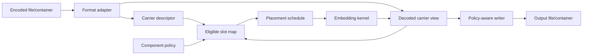

# Carriers, Placement, and Format I/O

## Objective

Make carrier capacity and mutation explicit, format-aware, reproducible, and
independent from packet framing. This replaces raw-file-size approximations and
algorithm-specific placement code with a shared model.

## Separation of concerns



- The **format adapter** owns decoding, encoding, and source metadata.
- The **slot map** exposes legal locations in a carrier domain.
- The **placement schedule** orders or selects slots.
- The **kernel** reads/writes symbols at slots.
- The **writer policy** decides whether the chosen output preserves the packet.

## Carrier descriptor

Every decoded input produces a typed descriptor:

```text
CarrierDescriptor
  kind: image | audio | video_frame | document_part | coefficient_grid
  encoded_format: png | jpeg | wav | raw | ...
  domain: spatial_bytes | pcm_samples | dct | mdct | text_tokens | container_parts
  dimensions/rate/channels
  component layout and strides
  sample/coefficient representation
  metadata preservation capabilities
  transform history when known
```

Descriptors are immutable facts. User choices live in `EmbeddingConfig`.

### Video/image layouts

Initial packed and planar layouts:

- RGB8 and RGBA8.
- BGR8 and BGRA8.
- Gray8.
- YUV420 with explicit Y, U, and V plane spans/strides.

Do not treat row padding, alpha, or chroma planes as ordinary RGB payload bytes.
Slot mapping uses width, height, plane boundaries, and stride.

Default component policies:

- RGB/BGR: color components eligible; row padding ineligible.
- RGBA/BGRA: alpha ineligible unless explicitly selected.
- YUV: luma eligible; chroma opt-in because distortion and subsampling differ.
- Gray: sample bytes eligible.

### Audio layouts

Initial audio descriptor:

- PCM integer representation and bit depth.
- sample rate;
- channel count and channel labels when available;
- interleaving;
- total frames and samples;
- source container metadata.

The first supported lossless vertical slice is PCM S16 WAV. Later adapters may
add S24/S32/float and AIFF/FLAC after kernel compatibility is explicit.

### Frequency-domain layouts

DCT and MDCT operate on coefficient slots rather than byte offsets. A coefficient
slot includes:

- block/frame identifier;
- coefficient index or frequency bin;
- component/channel;
- quantization or magnitude information;
- eligibility/cost;
- stable logical slot identifier.

This lets placement remain generic without pretending every kernel mutates an
LSB byte.

## Slot model

A logical slot contains:

```text
slot_id
domain
component
plane/channel
logical coordinate
physical span or coefficient address
available symbol width
embedding cost
flags: bootstrap-safe, fragile, reserved, metadata
```

`slot_id` is stable for a descriptor and policy, independent of traversal
implementation. It is the input to keyed placement and golden vectors.

The map must exclude:

- row padding and uninitialized bytes;
- file headers and encoded container bytes unless a container kernel owns them;
- alpha by default;
- coefficients rejected by a kernel's robustness rules;
- overlapping bootstrap/body regions;
- format-specific reserved locations.

## Capacity reporting

Capacity is a structured report, not one number:

```text
eligible_slots
raw_symbol_bits
locator_bits
envelope_bits
body_bits
ecc_overhead
placement_reserve
usable_payload_bytes
utilization
estimated_distortion
format_survival
binding constraints and warnings
```

Capacity uses the exact packet, transforms, component policy, placement, and
kernel. It must not infer decoded pixel/sample capacity from compressed file
length.

`info` supports:

- prospective capacity without a payload;
- exact capacity for a proposed packet/config;
- legacy v2 capacity;
- per-plane/per-channel breakdown;
- output-format compatibility.

## Placement schedules

All schedules are deterministic given descriptor, policy, configuration, and
keys.

### Sequential

Uses eligible slots in stable order. Retained for legacy compatibility,
debugging, and public provenance profiles.

### Interleaved/even spread

Distributes symbols over the carrier using a coprime stride or deterministic
round-robin by region. It avoids concentrating all modifications at the start.

The implementation must prove full intended coverage and avoid accidental short
cycles.

### Keyed pseudorandom

Uses a domain-separated placement key. Avoid allocating and shuffling a vector
proportional to a very large carrier where possible. Evaluate:

- keyed Feistel permutation with cycle walking;
- a small-memory permutation iterator;
- bounded Fisher-Yates for small carriers.

The chosen construction needs distribution tests, no repeated slots, known-answer
vectors, and explicit complexity bounds. A public seed is not a secret key.

### Content-adaptive

Build on the existing variance/cost analysis:

- cost calculation is independent from packet bits;
- deterministic tie-breaking preserves reproducibility;
- bootstrap slots remain discoverable;
- adaptive maps can be recomputed during extraction or encoded compactly;
- memory and time are bounded for large frames.

Adaptive scoring should eventually support coefficient magnitude, texture,
edges, psychoacoustic masking, and document-specific cost models.

### Chunked/streaming

Long media uses a bounded schedule per frame/buffer/segment and sequence metadata
in the packet. It does not build a whole-file permutation in memory.

## Kernel contract

Each kernel declares:

- supported carrier domains and component/sample types;
- required public and secret parameters;
- bits/symbol range;
- bootstrap compatibility;
- expected robustness class;
- distortion estimator;
- whether it supports in-place streaming;
- whether output encoding is lossless for the mutation;
- maximum packet size or chunking rules.

Initial kernel registry:

| Kernel | Status | Direction |
| --- | --- | --- |
| video spatial LSB | existing/refactor | Stable provenance and generic packet |
| audio PCM LSB | existing/refactor | Preserve keyed behavior |
| video DCT | existing/bridge | Finish CLI and generic packet |
| audio MDCT | existing/bridge | Expose through shared contracts |
| video/audio spread spectrum | existing/bridge | Expose through shared contracts |
| content-adaptive spatial | existing/bridge | Reuse local implementation |
| JPEG F5/matrix encoding | future | Clean Rust/permissive-source review |
| PVD/chroma/palette/text | experimental | Lab profile and defensive fixtures |

Experimental kernels never become the provenance default merely because they
exist.

## Format adapters

### Initial support matrix

| Format | Read | Write | Metadata goal | Spatial LSB policy |
| --- | --- | --- | --- | --- |
| raw RGB/BGRA | yes | yes | caller-owned descriptor | allowed |
| raw S16LE | yes | yes | caller-owned descriptor | allowed |
| PNG | yes | yes | dimensions/color/alpha; preserve safe metadata where possible | allowed |
| WAV PCM S16 | yes | yes | channels/rate/bit depth and safe chunks | allowed |
| JPEG | yes | yes | orientation/ICC/EXIF where safe | spatial LSB rejected; DCT/F5 only |
| BMP | planned | planned | palette/layout | format-specific |
| AIFF/FLAC | planned | planned | audio descriptor | only compatible lossless kernels |
| GIF/WebP | planned | planned | frames/palette/animation | explicit per-mode policy |
| MP4/MKV | planned | planned | streams/timestamps/container metadata | decoded-frame or codec-domain policy |

### Preservation policy

Each adapter reports metadata as:

- preserved by default;
- normalized with an explicit report;
- dropped for security;
- unsupported.

Potentially dangerous metadata, external references, scripts, and malformed
chunks are not copied blindly. Preservation is safe and explicit, not byte-for-byte
at any cost.

### Output compatibility

The writer compares kernel domain to output transform:

- spatial LSB to lossy JPEG: reject;
- spatial PCM LSB to lossy audio codec: reject;
- DCT packet to incompatible re-encode settings: reject or require a robustness
  test-backed profile;
- lossless PNG/WAV output: allow after round-trip verification.

An unsafe override:

- is available only in the lab profile;
- produces a prominent warning and JSON flag;
- never claims the packet survived unless post-write extraction verifies it.

### Post-write verification

Offline encode defaults to reopening the written output and extracting the
packet. Reports include:

- write succeeded;
- packet re-extracted;
- digest/signature verified;
- metadata changes;
- output warnings.

Atomic output uses a temporary file in the destination directory, verifies it,
then renames it. Existing destinations follow explicit overwrite policy.

## Format crate API

The format crate should expose narrow traits:

```rust
pub trait CarrierReader {
    fn probe(&self, input: &mut dyn ReadSeek, limits: &IoLimits)
        -> Result<Probe, FormatError>;
    fn decode(&self, input: &mut dyn ReadSeek, limits: &IoLimits)
        -> Result<DecodedCarrier, FormatError>;
}

pub trait CarrierWriter {
    fn compatibility(
        &self,
        descriptor: &CarrierDescriptor,
        kernel: &KernelDescriptor,
    ) -> CompatibilityReport;

    fn encode(
        &self,
        carrier: &DecodedCarrier,
        metadata: &MetadataPolicy,
        output: &mut dyn WriteSeek,
    ) -> Result<WriteReport, FormatError>;
}
```

Seekless streaming receives a separate interface; do not weaken bounds or buffer
an entire stream behind a misleading `Read` abstraction.

## Work packages

| ID | Scope | Depends on | Acceptance |
| --- | --- | --- | --- |
| `FMT-001` | Carrier descriptors and checked capacity report | `COR-005` | Packed/planar/audio tests and overflow properties |
| `FMT-002` | Slot map and component policies | `FMT-001` | Padding/alpha/YUV/channel exclusion fixtures |
| `PLC-001` | Sequential/even schedules | `FMT-002` | Full coverage/no duplicate known-answer tests |
| `PLC-002` | Keyed bounded-memory schedule | `FMT-002`, key hierarchy | Distribution, uniqueness, vector, complexity tests |
| `PLC-003` | Adaptive schedule bridge | `FMT-002` | Existing adaptive behavior preserved and deterministic |
| `KER-001` | Generic spatial LSB kernel | packet, `FMT-002` | Legacy and generic round-trips at one through four bits |
| `KER-002` | DCT/MDCT/spread bridges | packet | Core-to-CLI end-to-end fixtures |
| `FMT-003` | PNG safe adapter | `FMT-001` | RGB/RGBA/stride/metadata/post-write tests |
| `FMT-004` | WAV S16 safe adapter | `FMT-001` | Mono/stereo/rate/chunk/post-write tests |
| `FMT-005` | Output compatibility policy | `FMT-003`, `FMT-004` | Destructive output rejected and machine-reported |
| `FMT-006` | Container media adapter | vertical slices stable | Timestamp/stream metadata and bounded streaming tests |

## Exit criteria

- Embed, extract, `info`, and post-write verification use the same descriptor,
  configuration, slot map, and capacity math.
- PNG and WAV preserve required source properties.
- Spatial LSB cannot silently pass through a lossy writer.
- Schedules have stable vectors and no duplicate or out-of-range slots.
- Large carriers do not require unbounded schedule memory.
- Existing live GStreamer behavior remains available while migrating to shared
  kernel contracts.

