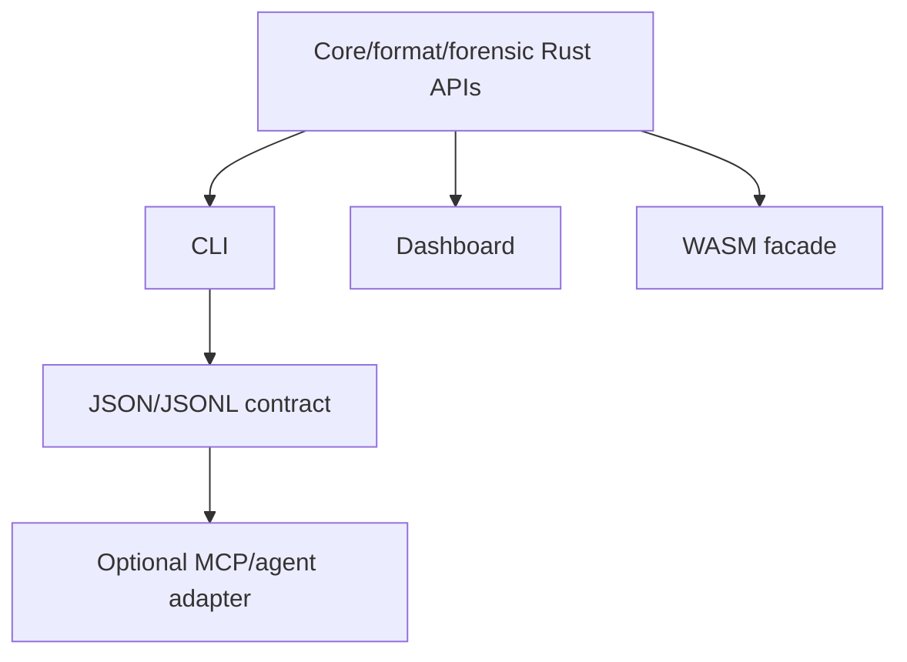

# Product Surfaces: CLI, JSON, Dashboard, WASM, and Agents

## Objective

Expose one underlying packet, carrier, and scan model consistently across
interactive and automated surfaces. No surface should implement its own wire
format, capacity calculation, detector, transform ordering, or algorithm
defaults.

## Surface hierarchy



The optional agent adapter consumes the stable machine contract. It does not
create a second implementation.

## Command model

Preserve existing commands and introduce capabilities deliberately:

| Command | Responsibility |
| --- | --- |
| `encode` | Embed an attestation or generic payload |
| `decode` | Discover and decode a packet without implying authenticity |
| `verify` | Validate a decoded attestation/signature/digest |
| `info` | Probe format and report exact prospective capacity/compatibility |
| `scan` | Run registered forensic detectors |
| `extract` | Write a validated decoded payload to an explicit destination |
| `video` / `audio` | Existing live provenance pipelines |
| `keygen` / `derive` / `revoke` | Existing key lifecycle, extended for packet keys |
| `config check` | Validate profiles, compatibility, limits, and feature support |
| `dashboard` | Local interactive application |

`analyze` remains as a compatibility alias for `scan` through one deprecation
cycle.

## Common options

Offline commands use these options where applicable:

- `--output-format plain|json|jsonl`;
- `--profile provenance|private|robust|forensic|lab` for product behavior;
- `--scan-profile quick|standard|deep|custom` for detector depth;
- `--limits <file>` or explicit safe limit flags;
- `--input-format` only when probing is ambiguous;
- `--no-color`;
- `--quiet`;
- `--schema-version` for machine output negotiation where useful.

Configuration precedence:

1. explicit CLI flags;
2. named profile in config;
3. command config;
4. safe built-in defaults.

The resolved configuration is included in reports with secrets redacted.

## Encode

Proposed shape:

```text
steganographer encode
  --input carrier.png
  --output encoded.png
  --payload-file evidence.json
  --payload-kind file
  --mime application/json
  --kernel lsb
  --bits 1
  --components rgb
  --placement keyed
  --embedding-key-file key
  --compress
  --encrypt
  --password-stdin
  --ecc rs
```

Payload inputs are mutually exclusive:

- `--payload-file`;
- `--payload-text`;
- `--attest-carrier` for current provenance behavior;
- stdin with an explicit maximum.

Encode reports:

- source/output descriptors;
- packet/protocol/profile;
- logical/transformed/embedded sizes;
- exact capacity and utilization;
- placement/kernel configuration;
- metadata preservation/drops;
- post-write verification;
- warnings and unsafe overrides;
- public verification material where applicable.

Defaults:

- existing live commands continue to create frame attestations;
- generic file encode requires explicit payload intent;
- no password appears in arguments unless the caller explicitly accepts the
  shell-history warning;
- existing output requires `--overwrite`;
- destructive output is rejected outside the lab profile.

## Decode, verify, and extract

These operations remain separate:

- `decode` answers “what bytes/metadata can be recovered?”
- `verify` answers “are the relevant digest/signature claims valid?”
- `extract` writes validated decoded content to disk.

`decode --auto` follows the bounded discovery order from the protocol plan.
It reports every attempted path only in verbose diagnostics; normal output
reports the selected path and skipped/limited work.

`verify` accepts:

- explicit public key/certificate;
- embedded signer identifier resolved by a caller-provided trust store;
- key revocation list;
- expected payload digest;
- expected protocol/profile.

Cryptographic validity and trust are distinct fields:

```text
signature_valid: true
signer_trusted: false
revoked: false
carrier_binding_valid: true
```

`extract`:

- requires an explicit output path or directory;
- sanitizes metadata-derived filenames;
- refuses overwrite by default;
- writes atomically;
- reports the saved digest;
- never recursively expands nested packets without another explicit command.

## Info

`info` performs format-aware probing and supports:

```text
steganographer info carrier.png
steganographer info carrier.png --kernel lsb --bits 2 --components rgb
steganographer info carrier.png --payload-file data.bin --profile private
```

It reports per-component capacity, overhead, output compatibility, robustness
class, and warnings. It does not mutate or fully deep-scan the input.

## Scan

```text
steganographer scan input.docx --scan-profile standard
steganographer scan input.pdf --scan-profile deep --max-seconds 30
steganographer scan samples/ --recursive --output-format jsonl
steganographer scan image.png --detector lsb.rs --detector packet.locator
```

Features:

- `--detector` allowlist and `--skip-detector`;
- `--scan-profile quick|standard|deep|custom`;
- directory recursion with file and aggregate budgets;
- stable finding IDs;
- optional bounded decoded previews;
- no file extraction by default;
- exit status policy selectable for CI.

## JSON v1

Every command emits a common envelope:

```json
{
  "schema": "steganographer.cli/v1",
  "command": "scan",
  "status": "success",
  "result": {},
  "warnings": [],
  "errors": [],
  "timing": {},
  "tool": {
    "name": "steganographer",
    "version": "0.8.0"
  }
}
```

Rules:

- stdout contains only the requested machine payload;
- logs and progress go to stderr;
- error `code` values are stable;
- fields are additive within v1;
- incompatible changes require `/v2`;
- large batch scans use JSONL with one file result per line and a final summary;
- byte previews are length-tagged base64 or escaped text, never ambiguous strings;
- secret/key/password values are never serialized;
- paths are represented consistently and invalid UTF-8 has a defined encoding.

Schema files and representative snapshots are versioned in the repository.

## Exit codes

Proposed stable classes:

| Code | Meaning |
| ---: | --- |
| 0 | Operation completed; verification valid or scan policy passed |
| 1 | User/configuration/format error |
| 2 | Packet not found or decode unavailable |
| 3 | Authentication/signature verification failed |
| 4 | Findings meet caller-selected failure threshold |
| 5 | Resource limit caused an inconclusive result |
| 6 | Internal error |

Exact mapping must be finalized before JSON v1. Batch output records per-file
status while the process exit code summarizes configured policy.

## Configuration evolution

Introduce explicit sections:

```toml
[profiles.private]
discovery = "keyed"
kernel = "lsb"
placement = "keyed"

[profiles.private.components]
include = ["r", "g", "b"]
exclude = ["alpha", "padding"]

[profiles.private.packet]
compression = "zstd"
encryption = "chacha20-poly1305"
ecc = "reed-solomon"

[limits]
max_payload_bytes = 67108864
max_nested_depth = 3
max_expanded_bytes = 268435456

[scan.standard]
detectors = ["packet", "statistics", "structure", "unicode", "documents"]
```

Legacy config remains readable. `config check` reports deprecated fields and the
resolved modern equivalent.

## Rust API

Public APIs expose:

- builders with validation;
- typed enums rather than free-form strings;
- borrowed/streaming input where feasible;
- caller-supplied limits;
- structured reports;
- no hidden filesystem or network access in core operations;
- sync primitives in core, with async orchestration only at surfaces that need
  it.

Public types are marked stable only with documentation, tests, and semver review.

## WASM

The WASM crate is a narrow, browser-safe facade:

- packet encode/decode;
- PNG and bounded PCM/WAV support initially;
- supported detector subset;
- capacity and compatibility reports;
- no GStreamer, native filesystem, process, or socket dependencies;
- no secret persistence;
- cancellation/progress for long scans;
- transferable buffers and Web Workers to avoid blocking the UI.

Initial JS API:

```text
probe(bytes, options)
capacity(bytes, config)
encode(carrierBytes, payloadBytes, config)
decode(carrierBytes, request)
verify(carrierBytes, request)
scan(bytes, scanOptions)
```

Each returns JSON-compatible metadata plus explicit binary buffers. Rust and WASM
share fixtures and schema snapshots.

Browser limits are lower than native defaults. APIs reject oversized input
before copying where possible.

## Dashboard

Add capabilities incrementally:

1. Show exact resolved carrier/config/capacity.
2. Add local file encode/decode using WASM.
3. Add scan findings with location/evidence.
4. Add OOXML/PDF inspection after bounded browser adapters are ready.
5. Keep live provenance controls separate from the forensic laboratory.

Security:

- local processing by default;
- no implicit upload;
- explicit user gesture for file save;
- content security policy compatible with WASM workers;
- decoded HTML/text rendered inert;
- object URLs revoked;
- no external AI request without a separately designed opt-in boundary.

## Optional MCP/agent adapter

Do not implement until JSON v1 and non-interactive CLI behavior are stable.

If a consumer exists, expose narrow tools:

- `stego_probe`;
- `stego_capacity`;
- `stego_scan`;
- `stego_decode`;
- `stego_verify`;
- `stego_encode` with explicit destination and overwrite policy.

The adapter:

- shells out to a pinned CLI or calls the Rust library;
- passes limits explicitly;
- returns the common schema;
- never invents broader filesystem access;
- requires explicit authorization for writes;
- does not expose key material in results/logs.

## Work packages

| ID | Scope | Depends on | Acceptance |
| --- | --- | --- | --- |
| `SUR-001` | Shared reports/error codes | packet, formats | CLI snapshot compatibility |
| `SUR-002` | Encode/decode/verify separation | generic vertical slice | legacy aliases and end-to-end tests |
| `SUR-003` | Uniform JSON v1/JSONL | `SUR-001` | schemas, snapshots, stdout/stderr tests |
| `SUR-004` | `info` exact capacity | formats | matches actual maximum payload fixtures |
| `SUR-005` | Registry-backed `scan` | forensics | profiles, budgets, exit policy tests |
| `SUR-006` | Config profiles/migration | core contracts | legacy config fixtures and redaction |
| `WASM-001` | Core packet bindings | stable vectors | Rust/WASM differential tests |
| `WASM-002` | PNG/WAV/scan workers | formats/forensics | limits, cancellation, browser integration |
| `DASH-001` | Local file lab | `WASM-002` | no-upload E2E and accessibility checks |
| `AGT-001` | Optional adapter | JSON v1 consumer | read/write scope, approval, schema tests |

## Exit criteria

- Equivalent configuration produces equivalent reports and results across Rust,
  CLI, dashboard, and WASM.
- Automation never parses human output.
- Decode, verify, scan, and extract semantics are unambiguous.
- Secrets are redacted from errors, JSON, logs, and debug output.
- Legacy commands/config have tested migration behavior.
- The browser works locally without external services.
