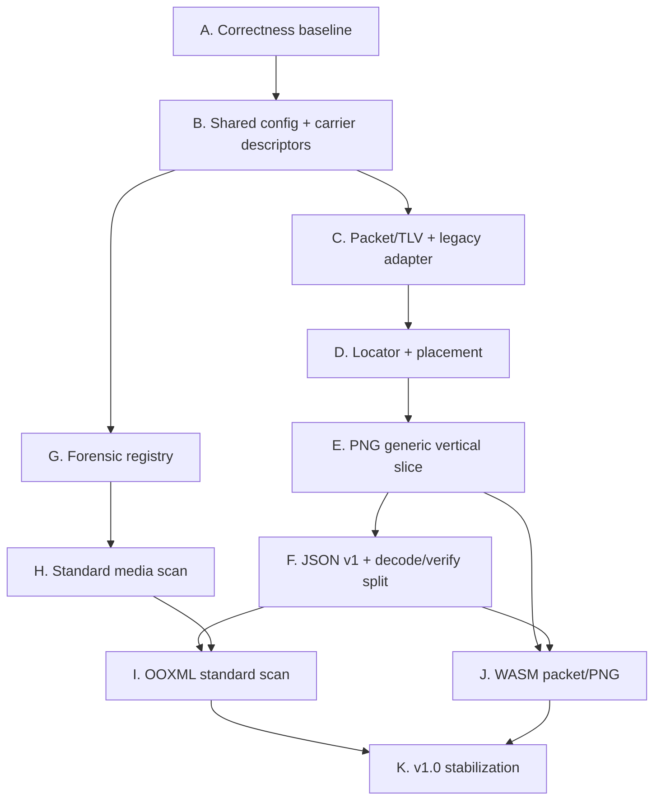

# Delivery, Migration, and Execution Plan

## Objective

Deliver the platform as independently reviewable vertical slices. Every slice
must leave the workspace usable, keep legacy behavior covered, and include its
own tests, limits, documentation, and migration notes.

## Sizing convention

Sizes estimate engineering/review breadth, not elapsed calendar time:

- **S**: localized change, normally one reviewable pull request.
- **M**: several modules or a new narrow crate, usually split into two or three
  pull requests.
- **L**: cross-crate vertical slice requiring design, corpus, and multiple pull
  requests.
- **XL**: program increment; must be decomposed before implementation.

No implementation issue should remain XL.

## Critical path



WAV/audio can proceed alongside PNG after shared descriptors. Advanced kernels
are deliberately off the v1.0 critical path unless product requirements change.

## Increment A: correctness baseline

Target: v0.6.1  
Goal: remove current asymmetries without changing the wire protocol.

Implementation status: complete on 2026-07-28; release packaging remains.

| Order | ID | Size | Change | Acceptance |
| ---: | --- | --- | --- | --- |
| 1 | `COR-001` | S | Add verify bits/config parity and bounded auto-probe | 1–4 bit encode/verify matrix passes for image/audio |
| 2 | `COR-003`/`COR-004` | M | Preserve decoded image/audio descriptors and reject destructive output | JPEG spatial output rejected; WAV properties preserved |
| 3 | `COR-005` | S | Replace raw-file-size capacity reporting | `info` matches successful maximum payload fixtures |
| 4 | `COR-006` | S | Route CLI analyze through core combined analysis | CLI/core result equivalence snapshots |
| 5 | `COR-002` | M | Bridge DCT CLI to canonical existing payload | encode/write/reopen/extract/verify fixture |
| 6 | `COR-007`/`COR-008` | S | Toolchain/lockfile/license hygiene | clean checkout builds on declared toolchain and license gate |

Recommended PR boundaries:

1. Bits parity plus CLI tests.
2. Descriptor-preserving PNG/WAV I/O and output policy.
3. Capacity/report correction.
4. Analysis routing.
5. DCT end-to-end.
6. Repository/release hygiene.

Do not combine these into the generic protocol refactor.

## Increment B: protocol foundation

Target: early v0.7.0  
Goal: build packet functionality behind an opt-in feature/profile.

Implementation status: `PKT-001`, the initial `PKT-002` canonical TLV,
`PKT-003` public locator, `PKT-006` legacy codec, shared checked carrier
capacity, sequential spatial LSB, and the PNG/raw CLI vertical slice are
implemented as an alpha. Its bounded packet parser also has an unsuppressed
weekly fuzz gate. Golden-vector freeze, broader fuzz campaigns, transforms,
keyed placement/discovery, WAV, and security review remain.

### B1 — Core types

| ID | Size | Scope |
| --- | --- | --- |
| `PKT-001` | M | Limits, typed errors, packet/envelope/config/report types |
| `QUA-001` | M | Fixture manifest and deterministic generator harness |
| `QUA-002` | S | Immutable legacy v2 fixtures |

Review gate: types express all limits and semantics without filesystem or format
dependencies.

### B2 — Canonical encoding

| ID | Size | Scope |
| --- | --- | --- |
| `PKT-002` | M | Canonical TLV encoder/decoder |
| `PKT-006` | M | `SignaturePayloadCodec` and legacy adapters |
| `QUA-003` | S | Packet vectors and drift gate |

Review gate: malformed/property/fuzz tests; existing traits still compile.

### B3 — Transform pipeline

| ID | Size | Scope |
| --- | --- | --- |
| `PKT-004` | L | digest/sign, compression, AEAD, ECC orchestration |
| `PKT-005` | M | payload-signature semantics and verification |
| `PKT-007` | M | password/high-entropy key APIs and Argon2id |
| `PKT-009` | M | explicit nested packet and chunk semantics with aggregate limits |
| `SEC-001` | M | focused protocol/key review |

Review gate: no plaintext on authentication failure, no transform downgrade,
stable key-separation vectors.

### B4 — Discovery

| ID | Size | Scope |
| --- | --- | --- |
| `PKT-003` | M | fixed public locator |
| `PLC-001` | M | sequential/even placement schedules |
| `PLC-002` | L | bounded-memory keyed schedule |
| `PKT-008` | M | keyed locator |

Review gate: explicit/public/keyed/legacy discovery order is deterministic and
bounded.

## Increment C: safe format vertical slices

Target: late v0.7.0 to v0.8.0  
Goal: prove the architecture end-to-end before adding breadth.

### C1 — Shared carriers

| ID | Size | Scope |
| --- | --- | --- |
| `FMT-001` | M | Carrier descriptors and exact capacity reports |
| `FMT-002` | L | Slot map and component policies |
| `KER-001` | L | Generic spatial LSB kernel and legacy bridge |
| `PLC-003` | M | Existing adaptive implementation through shared placement |

Review gate: raw legacy and generic packets use shared slot/capacity math.

### C2 — PNG

| ID | Size | Scope |
| --- | --- | --- |
| `FMT-003` | L | PNG reader/writer, metadata policy, RGB/RGBA |
| `FMT-005` | M | Compatibility and post-write verification |
| `SUR-004` | S | Exact `info` report |

Review gate: PNG generic file payload survives write/reopen with exact metadata
change report.

### C3 — WAV

| ID | Size | Scope |
| --- | --- | --- |
| `FMT-004` | L | PCM S16 WAV reader/writer with source properties |
| audio `KER-001` slice | M | Generic packet over keyed audio LSB |
| `KER-002` audio slice | M | MDCT/spread bridge |

Review gate: mono/stereo, multiple rates, safe chunk policy, wrong-key behavior,
post-write verification.

### C4 — Existing advanced algorithms

| ID | Size | Scope |
| --- | --- | --- |
| `KER-002` video slice | L | DCT/spread through packet/carrier contracts |
| streaming adapter slice | L | Bounded per-frame packet/chunk sequencing |

Review gate: no regression to GStreamer latency or current signed provenance.

## Increment D: stable automation and scan

Target: v0.8.0  
Goal: publish stable non-interactive contracts and initial forensic capability.

### D1 — Surface contracts

| ID | Size | Scope |
| --- | --- | --- |
| `SUR-001` | M | Shared reports, typed error mapping, exit policy |
| `SUR-002` | L | Encode/decode/verify/extract separation |
| `SUR-003` | M | JSON v1, JSONL, schema snapshots |
| `SUR-006` | M | Profiles and legacy config migration |

Review gate: stdout/stderr and exit codes are deterministic; secrets are
redacted; old command/config fixtures pass or produce documented diagnostics.

### D2 — Forensic registry

| ID | Size | Scope |
| --- | --- | --- |
| `FOR-001` | L | Registry, results, budgets, orchestration |
| `FOR-002` | M | Existing chi-square/SPA/RS/combined adapters |
| `FOR-003` | M | Magic, entropy, embedded signatures |
| `SUR-005` | M | `scan`, profiles, directory JSONL |
| `QUA-005` | L | Calibration harness and clean/stego corpus |

Review gate: stable finding evidence, explicit truncation, measured negative
corpus.

### D3 — Media/container breadth

| ID | Size | Scope |
| --- | --- | --- |
| `FOR-004` | L | PNG/JPEG/audio structural detectors |
| `FOR-005` | L | Unicode/text detector family |
| `FOR-006` | L | Safe recursive scanning |
| `SEC-002` slice | M | hostile parser/resource review |

Review gate: no execution/network/extraction, bounded recursion, calibrated
standard scan.

## Increment E: document specialization

Target: v0.9.0  
Goal: make the platform natively useful to Docxology.

### E1 — OOXML

| ID | Size | Scope |
| --- | --- | --- |
| `DOC-001` | L | ZIP inventory, topology, relationships, limits |
| `DOC-002` | L | WordprocessingML concealment and text channels |
| `DOC-003` | M | Embedded media recursion and parent-linked findings |

Suggested PR sequence:

1. Pure package inventory with no semantic findings.
2. Relationship/content-type validation.
3. Logical Word text extraction with precise source mapping.
4. Unicode/visibility/style detectors.
5. Embedded media recursion.
6. Calibration across Office, LibreOffice, and Google Docs exports.

Review gate: representative clean authoring-tool corpus, malicious ZIP/XML
fixtures, no external relationship retrieval.

### E2 — PDF

| ID | Size | Scope |
| --- | --- | --- |
| `DOC-004` | XL before decomposition | PDF structure, revisions, attachments, text/media |

Decompose after parser dependency evaluation:

- parser isolation and resource contract;
- xref/trailer/revision detector;
- attachment/action detector;
- invisible text detector;
- media recursion;
- corpus/calibration.

PDF does not block the first OOXML release.

### E3 — SpreadsheetML and PresentationML

| ID | Size | Scope |
| --- | --- | --- |
| `DOC-005` | L | Hidden content, relationships, logical text, styles, and embedded media for Excel/PowerPoint packages |

This begins only after package topology and Word source mapping are stable.

### E4 — Optional detector breadth

`FOR-008` tracks individually feature-gated SVG, archive, SQLite, code/text,
symbol-channel, PCAP, and binary-polyglot detectors. Each detector family must be
split into its own issue with parser, limit, corpus, and calibration acceptance;
`FOR-008` is a program bucket, not an implementation-sized task.

## Increment F: browser-local operation

Target: v0.9.0 beta  
Goal: reuse stable contracts in-browser without external processing.

| ID | Size | Scope |
| --- | --- | --- |
| `WASM-001` | L | Packet, config, reports, vectors |
| `WASM-002` | L | PNG/WAV and supported detectors in workers |
| `DASH-001` | L | Local file lab with inert result rendering |
| `CI-001` slice | M | WASM build and headless browser matrix |

Review gate: same fixtures/results as native, cancellation and browser limits,
no implicit upload or key persistence.

## Increment G: v1.0 stabilization

Target: v1.0.0

Required:

- freeze packet major v1 and JSON v1;
- complete compatibility/deprecation matrix;
- close protocol/parser security reviews;
- publish detector calibration and robustness reports;
- enforce vector/schema/corpus drift gates;
- establish supported Rust/platform/feature matrix;
- validate release/package installation;
- update all user, architecture, threat, cryptography, API, configuration, CLI,
  roadmap, and contributing documentation;
- record residual risks and unsupported format/transform combinations.

No capability becomes stable solely because its code is complete.

## Post-v1 experimental program

These are independent research tracks:

| Track | Prerequisites | Gate |
| --- | --- | --- |
| JPEG F5/matrix encoding | stable DCT carrier model; license review | permissive provenance, JPEG corpus, compatibility vectors |
| PVD/chroma/palette | shared carrier/slot API | distortion/detection evidence; lab profile |
| Text/document embedding | stable document detector/location model | ethical/product decision and high false-positive discipline |
| Learned watermarking | attack harness and model runtime decision | reproducible model/license/data card |
| Optional agent/MCP | real consumer plus JSON v1 | thin adapter, explicit write authority |

## Migration matrix

| Existing behavior | Transition |
| --- | --- |
| `SignaturePayload` v2 | Supported indefinitely through a codec/legacy profile |
| `VideoStegoModule` / `AudioStegoModule` | Deprecated only after adapters cover live and offline paths |
| `encode` signed carrier default | Preserved; generic payload requires explicit option/profile |
| `verify --stego-type ...` | Continue; shared config adds `--bits auto` and discovery reporting |
| `analyze` | Alias to `scan` for one minor release, then documented deprecation |
| current TOML | Parsed and normalized; `config check` emits migration guidance |
| human output | May improve; machine consumers move to JSON v1 |
| existing raw formats | Remain supported through descriptors |

Deprecation requirements:

- warning identifies replacement and earliest removal version;
- machine output includes a structured warning;
- documentation and examples migrate first;
- removal requires at least one documented compatibility window.

## Issue template

Every implementation issue should include:

```text
Planning ID:
Vertical slice:
User-visible result:
In scope:
Out of scope:
Dependencies:
Public/wire/schema impact:
Threat/resource limits:
Fixtures and tests:
Performance expectation:
Documentation updates:
Acceptance criteria:
Rollback/compatibility:
```

An issue is not ready if required format, protocol, security, or corpus decisions
remain implicit.

## Pull request rules

- Prefer one contract or one vertical behavior per PR.
- Add tests/vectors with the behavior, not in a later quality PR.
- Avoid repository-wide trait replacement in one change.
- Preserve a compiling adapter path while consumers migrate.
- Feature-gate incomplete new crates/capabilities.
- Do not update stable vectors to make a regression pass.
- Include before/after capacity, output, or performance evidence when relevant.
- Link the planning IDs implemented and list deferred IDs explicitly.

## Risk register

| Risk | Likelihood | Impact | Mitigation |
| --- | --- | --- | --- |
| Trait refactor breaks live pipelines | Medium | High | Legacy adapters; live fixtures; split consumer migrations |
| Locator increases detectability | High by design | Medium | Public/keyed profiles and explicit documentation |
| Auto-detection becomes a CPU oracle | Medium | High | Locator-first order, combination/time budgets |
| Generic payload creates memory/bomb paths | Medium | High | hard limits, checked arithmetic, streaming, fuzzing |
| Format writers destroy payloads | High without policy | High | compatibility matrix and post-write extraction |
| OOXML heuristics overwhelm users | Medium | Medium | clean corpus calibration and evidence locations |
| Parser dependency adds vulnerabilities/licenses | Medium | High | isolation, audit/deny, minimal features, fuzzing |
| Crate proliferation slows development | Medium | Medium | add crates only with first vertical slice |
| JSON/wire contracts freeze mistakes | Medium | High | alpha vectors, schema review, opt-in period |
| ST3GG-derived work creates license ambiguity | Low if controlled | High | clean-room code, provenance notes, no AGPL copying |
| WASM memory copies exceed browser limits | Medium | Medium | lower limits, transferable buffers, workers |
| Documentation drifts from implementation | High historically | Medium | schema/vector generation and doc release checklist |

## Staffing and parallelism

After the correctness baseline, independent lanes are:

- protocol/key work;
- carrier/format work;
- corpus/CI work.

After the registry and formats stabilize:

- document analysis;
- WASM/dashboard;
- media detector calibration.

Keep protocol wire review and security review independent from the primary
implementer when possible. Detector calibration benefits from reviewers who did
not author the heuristic.

## Program completion checklist

- [ ] Correctness baseline released.
- [ ] Legacy v2 fixtures immutable and passing.
- [ ] Generic packet and locator vectors stable.
- [ ] PNG and WAV safe vertical slices released.
- [ ] JSON v1 and exit codes stable.
- [ ] Standard scan calibrated and bounded.
- [ ] OOXML standard scan released.
- [ ] WASM supported subset passes differential fixtures.
- [ ] Security, parser, supply-chain, and licensing reviews closed.
- [ ] Performance/robustness/detectability reports published.
- [ ] All public docs and examples migrated.
- [ ] v1.0 support/deprecation policy published.
