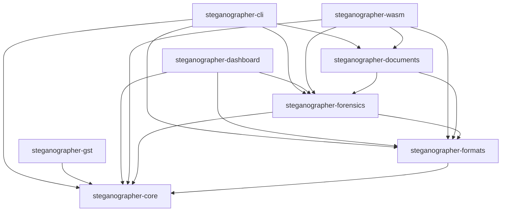
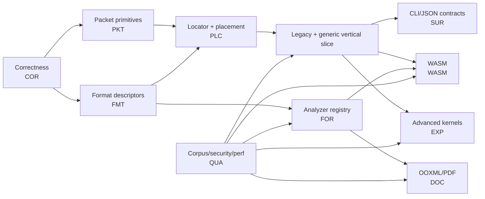

# Steganography Platform Expansion Plan

Status: implementation in progress  
Target line: v0.6.x through v1.0  
Scope owner: repository maintainers  
Last scoped: 2026-07-28

## Purpose

This plan evolves Steganographer from a signed video/audio watermarking toolkit
into a composable steganography platform without weakening its existing
streaming, cryptographic, or security properties.

The expansion is inspired by the useful breadth in ST3GG—generic payloads,
configurable placement, smart scanning, document/container analysis, nesting,
and browser-local operation—but is a clean-room Rust design. No ST3GG code is
to be copied into this MIT workspace.

The reference assessment used ST3GG commit
[`35f8b2b`](https://github.com/elder-plinius/ST3GG/commit/35f8b2b8529a74091c97ce622ee0cbf1ae3bd260).
That pin records the behavioral input to planning; it is not a source-code
dependency.

This directory is the implementation planning source of truth. The project
roadmap remains the release-level summary and `TODO.md` remains the short list
of active maintenance work.

## Outcomes

The completed platform will:

1. Embed and extract arbitrary bounded byte payloads as well as the existing
   signed frame attestation.
2. Separate packet framing, carrier mapping, placement, embedding kernels, file
   formats, and detection behind stable interfaces.
3. Preserve and auto-detect legacy 109-byte `SignaturePayload` media.
4. Provide format-aware, loss-aware image/audio/video I/O.
5. Scan media, containers, text, OOXML, and PDF using a common evidence model.
6. Provide consistent CLI, JSON, Rust, dashboard, and WASM surfaces.
7. Ship calibrated tests, hostile-input limits, fuzz targets, golden fixtures,
   benchmarks, and licensing gates with each capability.

## Non-goals

- Replacing the current DCT, MDCT, spread-spectrum, adaptive, ECC, signing,
  hash-chain, or GStreamer implementations with browser reference code.
- Promising that spatial LSB survives lossy transcoding.
- Treating encryption, random placement, or decoy noise as undetectability.
- Adding covert network injection, exfiltration, exploit, or polyglot-generation
  functionality to the primary product.
- Making an external AI service part of decode correctness.
- Copying AGPL source or adding dependencies rejected by `deny.toml`.
- Breaking the v2 signed-frame packet or changing default live-pipeline
  behavior during the migration.

## Architectural invariants

These are release-blocking constraints:

- `steganographer-core` remains independent of GStreamer, OS capture APIs,
  network services, and filesystem format policy.
- Untrusted lengths, offsets, recursion, allocation, decompression, and detector
  work are bounded before use.
- Embed and extract consume one shared configuration type; the CLI cannot
  silently choose different bits, keys, channels, strategies, or transforms.
- Lossy output that invalidates the selected kernel is rejected unless the user
  gives an explicit unsafe override.
- A detector reports evidence and calibrated confidence; it does not label
  heuristic output as proof.
- Cryptographic confidentiality uses AEAD. There is no XOR or unauthenticated
  encryption fallback.
- Passwords use a password-hard KDF. Existing BLAKE3 domain-separated key
  derivation remains for high-entropy master keys only.
- Public auto-discovery and keyed stealth are explicit, different profiles.
- Every on-wire version has immutable golden vectors before it is declared
  stable.
- New carriers and detectors are independently feature-gated where dependency
  weight or platform availability warrants it.

## Current baseline

### Preserve

- The `SignaturePayload` v2 layout and `STEG` magic.
- BLAKE3/SHA-2/SHA-3 hashing and Ed25519/secp256k1 signing.
- ChaCha20-Poly1305 encryption and domain-separated key derivation.
- Reed-Solomon, multi-frame spreading, hash chains, metrics, and key lifecycle.
- Video/audio LSB, keyed audio placement, DCT, MDCT, spread spectrum, and
  content-adaptive embedding.
- GStreamer live pipelines and the local dashboard security posture.

### Correctness baseline

| ID | Gap | Required result |
| --- | --- | --- |
| `COR-001` | Verify hard-codes one LSB while encode permits one through four | Shared `EmbeddingConfig`; explicit or auto-discovered bits round-trip |
| `COR-002` | DCT raw-byte CLI path rejects encode and verify | One canonical packet path supports DCT end-to-end |
| `COR-003` | Image output may re-encode spatial LSB as JPEG | Kernel/format compatibility policy blocks destructive output |
| `COR-004` | WAV output loses source channel/rate metadata | Decoded carrier descriptors are preserved by default |
| `COR-005` | `info` uses compressed file size for capacity | Capacity derives from usable decoded carrier slots |
| `COR-006` | CLI analysis bypasses combined core analysis | Registry-backed scan invokes canonical detectors |
| `COR-007` | Workspace/toolchain and lockfile versions drift | Supported MSRV/stable policy and reproducible lockfile are explicit |
| `COR-008` | README references a missing license file | Add and verify the repository license artifact before release |

All `COR-001` through `COR-008` items were implemented on 2026-07-28. The
current opt-in alpha also implements the first bounded packet, canonical TLV,
public locator, legacy codec, shared carrier-capacity contract, and sequential
spatial-LSB PNG/raw vertical slice. Remaining work-package rows continue to
describe the required review and stabilization gates; implementation does not
make the alpha wire format stable.

## Target workspace

New crates should be introduced only when their first vertical slice is ready:

- `steganographer-formats`: decoded carriers, file metadata, format policy, and
  safe read/write adapters.
- `steganographer-forensics`: detector registry, scan orchestration, evidence,
  budgets, and general media/container/text detectors.
- `steganographer-documents`: OOXML and PDF part traversal plus document-specific
  detectors.
- `steganographer-wasm`: narrow `wasm-bindgen` facade over supported core,
  format, and scanning operations.

During early protocol work, packet and placement modules remain in
`steganographer-core`; a speculative micro-crate split is not required.

## Workstreams

| Workstream | Specification | Primary deliverable |
| --- | --- | --- |
| Protocol and compatibility | [Protocol](01-protocol-and-compatibility.md) | Versioned generic packet plus v2 adapter |
| Carriers, placement, and formats | [Carriers](02-carriers-placement-formats.md) | Shared slot model and safe format I/O |
| Forensics and documents | [Forensics](03-forensics-and-documents.md) | Evidence registry and bounded document scan |
| Product surfaces | [Surfaces](04-product-surfaces.md) | Consistent CLI/JSON/WASM/dashboard contracts |
| Quality and security | [Validation](05-validation-security-corpus.md) | Corpus, attack matrix, fuzzing, performance gates |
| Delivery and migration | [Delivery](06-delivery-and-migration.md) | Issue-sized work packages and release gates |

## Dependency graph

Quality work begins with the protocol and continues in every slice; it is not a
final hardening phase.

## Release sequence

| Release | Theme | Exit condition |
| --- | --- | --- |
| v0.6.1 | Correctness baseline | `COR-001` through `COR-008`; no protocol change |
| v0.7.0 | Packet and placement alpha | Generic packet opt-in; v2 remains default; immutable alpha vectors |
| v0.8.0 | Safe formats and scanning | PNG/WAV vertical slices, shared `scan`, stable JSON v1 |
| v0.9.0 | Document and browser beta | OOXML standard scan and browser-local supported subset |
| v1.0.0 | Stable platform contracts | Wire v1, JSON v1, compatibility, security, corpus, and performance gates |
| Post-v1 | Advanced experimental carriers | F5/matrix encoding, PVD, palette, chroma, research profiles |

Release numbers describe sequencing, not calendar commitments.

## Cross-cutting profiles

Profiles make trade-offs explicit:

| Profile | Discovery | Kernels | Intended use |
| --- | --- | --- | --- |
| `provenance` | Public locator | Current signed-frame algorithms | Verifiable capture and streaming |
| `private` | Keyed locator | Keyed/adaptive media algorithms | Confidential bounded payloads |
| `robust` | Public or keyed | DCT/MDCT/spread/ECC | Transform-resilient payloads |
| `forensic` | Read-only scanning | No embedding | Triage and evidence collection |
| `lab` | Explicit unsafe options | Experimental/high-distortion algorithms | Research and fixtures only |

Defaults must never silently switch profiles.

## Program-level definition of done

The expansion is complete only when:

- The same packet fixture decodes through Rust, CLI, and WASM.
- Legacy v2 fixtures still encode, extract, and verify.
- Every supported format has metadata-preservation and destructive-output tests.
- Every scanner has positive, negative, malformed, and resource-limit fixtures.
- JSON schema changes are versioned and covered by snapshots.
- Fuzzers cover locator, envelope, recursive containers, and representative
  detectors.
- CI enforces formatting, clippy, tests, audit, license policy, secret scanning,
  fixture manifests, and wire-vector immutability.
- Documentation distinguishes authentication, confidentiality, robustness,
  discoverability, and forensic suspicion.
- No default feature adds AGPL or an external network dependency.

## Planning decisions

| Decision | Resolution |
| --- | --- |
| Generic payload versus signature-only traits | Add generic byte packet traits; adapt `SignaturePayload` |
| Locator | Support public and keyed modes; do not depend only on brute-force scan |
| Serialization | Small fixed locator plus canonical, length-delimited envelope |
| Transform order | Sign logical content; compress; AEAD encrypt; ECC; embed |
| Nested packets | Supported only through explicit bounded packet recursion |
| Document support | Detection-first; embedding remains experimental |
| Browser architecture | Rust/WASM modules and workers, not a single-file rewrite |
| MCP/agent support | Thin optional adapter after CLI/JSON stability |
| ST3GG licensing | Ideas and behavior only; clean-room implementation |
| C2PA | Preserve the existing deferred decision; packet design must not prevent export |

## Change control

Before code merges:

1. Changes to locator or packet bytes require an architecture decision entry,
   updated vectors, and compatibility review.
2. Changes to detector confidence require corpus evidence.
3. Changes to default capacity, distortion, or output policy require security
   and UX review.
4. New format parsers require hostile-input limits and fuzz coverage.
5. New dependencies require `cargo deny check`, source/license review, and
   WASM/MSRV impact assessment.
