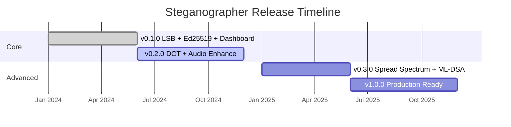

# Roadmap

## Current State (v0.1.0)

### ✅ Implemented

- **LSB Video Steganography** — Sequential embedding with 1–4 bits, length prefix, round-trip extraction
- **LSB Audio Steganography** — Keyed PRNG permutation, 1–4 bits, length prefix extraction
- **Text Overlay** — Built-in 8×8 bitmap font, configurable position/color/scale
- **Info Bar** — Exoteric QR code, Code-128 barcode, and metadata overlay
- **BLAKE3 + Ed25519** — Per-frame hashing and signing with 104-byte payload
- **GStreamer Integration** — AppSink/AppSrc video/audio pipelines
- **CLI** — 6 subcommands (video, audio, encode, verify, keygen, dashboard)
- **Configuration** — Full TOML config with modular pipeline chains
- **Config-Driven Pipelines** — `[video.pipeline]` section for resolution, framerate, opacity, payload (NEW)
- **Comprehensive Theory Docs** — Steganography theory, deep cryptography, steganalysis resistance (NEW)
- **Web Dashboard** — Live round-trip steganography verification GUI (Axum + WebSocket) (NEW)
- **QR Data Matrix Overlay** — Client-side 13×13 binary grid encoding metadata per frame (NEW)
- **Live Config API** — Real-time opacity, LSB bits, overlay text, sign rate controls via `POST /api/config` (NEW)
- **MetaMask / Ethereum** — Browser-based `personal_sign` via EIP-1193 (NEW)
- **Pluggable Signing Backends** — Ed25519 and Ethereum/secp256k1 (NEW)
- **Documentation** — Architecture, crypto, algorithms, API, security, platform guides
- **Timestamp Watermarks** — Dynamic `{timestamp}`, `{frame_index}`, `{date}`, `{time}` substitution in overlay text (NEW)
- **JSON Verify Output** — `--format json` for verify command for machine-readable output (NEW)
- **Audio Dashboard Tab** — Real-time audio steganography with microphone capture, waveform/spectrum visualization, LSB embed/extract, WAV recording (NEW)
- **Documentation Tab** — In-dashboard markdown viewer for all project docs with search and syntax highlighting (NEW)
- **Dynamic LSB Configuration** — Encode and decode handlers read `lsb_bits` from `LiveConfig` each frame, staying in sync when slider changes (NEW)
- **Signature Preview** — Decoded payload shows first 16 bytes of Ed25519/secp256k1 signature in both video and audio panels (NEW)
- **Three-Tab Dashboard** — Video | Audio | Documentation tabs with unified styling and smooth transitions (NEW)
- **Keyboard Shortcuts** — Space=camera, R=record, 1/2/3=tabs, +/-=LSB, E=export session (NEW)
- **Session Export** — Download session report as JSON (frames, config, latencies, timestamps) (NEW)
- **Copy-to-Clipboard** — 📋 buttons on hash and signature fields for easy copying (NEW)
- **Help Tooltips** — Custom `?` icon tooltips with JavaScript positioning (escape overflow containers) (NEW)
- **Full Signature in Decode** — Backend returns `signature_full` (complete hex) + `timestamp` + `lsb_bits` (NEW)
- **Session Stats API** — `GET /api/session` endpoint returns cumulative session metrics (NEW)
- **Auto-Start Camera** — `?autostart=1` URL param for zero-click camera start (NEW)
- **Footer Verified Counter** — Live `✅ X / ❌ Y` ratio in dashboard footer (NEW)
- **Toast Notifications** — Success/error toasts for config saves, copy-to-clipboard, session export (NEW)
- **Dashboard Favicon** — Shield+eye icon favicon for browser tab identification (NEW)
- **`--quiet` CLI Flag** — Suppress all log output for scripting (`--quiet`) (NEW)
- **Colorized Verify Output** — ANSI green/red/yellow terminal colors with TTY auto-detection (NEW)
- **`CHANGELOG.md`** — Structured changelog following Keep a Changelog format (NEW)
- **Release Acceptance Criteria** — Documented in `TODO.md`: tests, docs, security, build gates (NEW)
- **Version API** — `GET /api/version` endpoint returns crate name and version as JSON (NEW)
- **Metrics Reset API** — `POST /api/metrics/reset` endpoint resets all dashboard counters (NEW)
- **132 Tests** — 56 core unit + 58 core integration + 12 dashboard + 1 GStreamer + 5 Ethereum (feature-gated)

---

## Short-Term (v0.2.0)

### 📋 Planned

| Feature | Priority | Complexity | Description |
| --- | --- | --- | --- |
| **Container format support** | High | Medium | Read/write MP4, MKV, WAV files (not just raw) via GStreamer decodebin/encodebin |
| **Batch processing** | High | Low | Encode/verify entire directories of files |
| **Key file config** | Medium | Low | Reference `.key`/`.pub` files from TOML config instead of inline hex |
| **YUV420 overlay** | Medium | Medium | Support text overlay in YUV color space |

---

## Medium-Term (v0.3.0)

### 🔬 Research & Development

| Feature | Priority | Complexity | Description |
| --- | --- | --- | --- |
| **DCT-domain embedding** | High | High | Embed in frequency domain for H.264/JPEG robustness |
| **Spread-spectrum** | High | High | PN-sequence modulation for noise/compression resistance |
| **Multi-frame signatures** | Medium | Medium | Spread one signature across N frames for redundancy |
| **Error correction codes** | Medium | Medium | Reed-Solomon or LDPC codes for partial recovery |
| **Native GStreamer plugin** | Medium | High | Full `BaseTransform` implementation for zero-copy processing |
| **Encryption** | Medium | Medium | AES-256-GCM encrypt payload before LSB embedding |

---

## Long-Term (v1.0.0)

### 🚀 Production Features

| Feature | Priority | Complexity | Description |
| --- | --- | --- | --- |
| **Video Seal integration** | High | Medium | Meta's neural-network robust watermarking |
| **WASM build** | Medium | High | Browser-based steganography via WebAssembly |
| **Post-quantum signatures** | Medium | Medium | ML-DSA (FIPS 204) as Ed25519 alternative |
| **Streaming authentication** | Medium | High | Merkle tree chains for authenticated video segments |
| **Cloud API** | Low | High | REST/gRPC service for server-side watermarking |
| **Hardware acceleration** | Low | High | GPU-accelerated hashing and embedding |

---

## Extension Points

### Adding New Stego Algorithms

Implement `VideoStegoModule` or `AudioStegoModule` trait. See [Contributing](contributing.md) for a step-by-step guide.

### Adding New Media Formats

1. Add a new `VideoFormat` variant to the enum
2. Update `overlay.rs` with the format's pixel layout
3. Add GStreamer caps negotiation in `video_filter.rs`

### Adding New CLI Commands

1. Create a new `cmd_*.rs` file
2. Add a variant to the `Commands` enum in `main.rs`
3. Wire the routing in `main()`

### Adding New Config Options

1. Add fields to the appropriate config struct in `config.rs`
2. Update the TOML deserialization
3. Add `_or_default()` convenience method if appropriate
4. Update `read_pipeline_config()` in `run.sh` if pipeline-related
5. Add tests for the new config
6. Document in `configuration.md`

---

## Further Reading

- [Steganography Theory](steganography-theory.md) — Theoretical foundations for planned algorithms
- [Algorithms](algorithms.md) — Current algorithm implementations
- [Configuration](configuration.md) — TOML config including `[video.pipeline]`
- [Contributing](contributing.md) — How to contribute new features
- [Security](security.md) — Threat models, use cases, and deployment guidance
