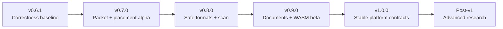

# Roadmap

Steganographer is currently on the v0.6 line. Historical release contents are
recorded in [`CHANGELOG.md`](../CHANGELOG.md); active maintenance items remain in
[`TODO.md`](../TODO.md).

The detailed implementation source of truth is the
[Steganography Platform Expansion Plan](plans/steganography-platform/README.md).
Its specifications define contracts, dependencies, work-package IDs, security
limits, fixtures, and acceptance criteria.

## Release sequence

```mermaid
flowchart LR
    V061["v0.6.1<br/>Correctness baseline"]
    V070["v0.7.0<br/>Packet + placement alpha"]
    V080["v0.8.0<br/>Safe formats + scan"]
    V090["v0.9.0<br/>Documents + WASM beta"]
    V100["v1.0.0<br/>Stable platform contracts"]
    POST["Post-v1<br/>Advanced research"]

    V061 --> V070 --> V080 --> V090 --> V100 --> POST
```

Release numbers define dependency order, not calendar commitments.

## v0.6.1 — Correctness baseline

Status: implemented on 2026-07-28; release packaging remains. No legacy wire
protocol change.

- [x] Make encode/extract bits and configuration symmetric.
- [x] Complete DCT offline encode/verify.
- [x] Preserve image/audio carrier properties.
- [x] Block destructive spatial-LSB output.
- [x] Calculate capacity from decoded carrier slots.
- [x] Route CLI analysis through the canonical core analyzers.
- [x] Resolve toolchain/lockfile and license-artifact hygiene.

Exit gate: existing signed-frame behavior remains compatible and each corrected
path has an end-to-end fixture.

## v0.7.0 — Packet and placement alpha

Status: in progress. The public locator, canonical bounded envelope, generic
packet codec, legacy adapter, shared spatial-LSB carrier contract, and opt-in
PNG/raw encode/decode vertical slice are implemented.

- [x] Add bounded generic packet and canonical envelope.
- [x] Preserve v2 `SignaturePayload` through a legacy codec/adapter.
- [x] Add the public locator and sequential spatial-LSB discovery.
- [x] Add shared carrier descriptors and checked capacity for the first kernel.
- [x] Prove the opt-in generic PNG/raw vertical slice at one through four bits.
- [ ] Freeze immutable packet and placement vectors after alpha review.
- Add keyed locator/discovery without changing public discovery semantics.
- Add interleaved, keyed, and adaptive placement schedules.
- Expand carrier descriptors with component/channel policies.
- Prove the generic WAV vertical slice.
- Implement the transform, payload-signature, key-hierarchy, and nesting work.

Exit gate: generic payload support is opt-in, legacy remains the default, and
the protocol/key review is complete for alpha use.

## v0.8.0 — Safe formats and scanning

- Stabilize safe PNG/WAV I/O and post-write extraction.
- Introduce `steganographer-formats` and `steganographer-forensics` with their
  first complete vertical slices.
- Separate decode, verify, scan, and extract semantics.
- Publish JSON/JSONL schema v1 and stable exit codes.
- Register current chi-square, SPA, RS, and combined analysis.
- Add media/container/text detectors, bounded recursion, and calibration corpus.
- Migrate legacy configuration through explicit profiles.

Exit gate: automation uses the stable machine contract; standard scan is bounded
and evidence-oriented.

## v0.9.0 — Documents and browser-local beta

- Add OOXML package topology and WordprocessingML concealment analysis.
- Recursively scan embedded media under aggregate limits.
- Add the first bounded PDF structural scan if parser evaluation is complete.
- Build packet, PNG/WAV, and supported scan capabilities to WASM.
- Add browser-local dashboard workflows using Web Workers.

Exit gate: document and browser features share native schemas and fixtures, do
not execute active content, and perform no implicit upload.

## v1.0.0 — Stable platform contracts

- Freeze packet major v1 and JSON v1.
- Publish compatibility and deprecation policy.
- Close protocol, parser/resource, supply-chain, and license reviews.
- Enforce wire-vector, schema, and corpus immutability in CI.
- Publish robustness, detectability, detector-calibration, and performance data.
- Validate supported native, minimal-feature, and WASM build matrices.
- Update all user/API/security/configuration/contributing documentation.

Exit gate: every stable claim is backed by fixtures and measurements, legacy v2
remains supported, and hostile-input paths are bounded.

## Post-v1 research

These remain independent, experimental tracks:

- JPEG F5/matrix encoding from permissively licensed sources or clean Rust.
- PVD, chroma, palette, and document/text embedding under the lab profile.
- Learned watermarking with reproducible model and dataset licensing.
- Broader containers/codecs and hardware acceleration.
- Optional MCP/agent adapter after a real consumer validates JSON v1.
- Post-quantum and hybrid signatures once payload size and dependency maturity
  meet the existing cryptographic roadmap constraints.

## Parallel maintenance backlog

The platform sequence does not replace maintenance and distribution work in
[`TODO.md`](../TODO.md). Crates.io and `cargo install` support, Windows CI, a
native GStreamer transform, WebRTC,
Homebrew distribution, certificate chains, and related research can proceed
when they do not destabilize an active protocol/format vertical slice.

Where work overlaps, shared platform contracts win—for example, container I/O
should build on carrier descriptors rather than introduce another raw-byte path.

## Workstream specifications

| Workstream | Plan |
| --- | --- |
| Program charter and dependency graph | [Overview](plans/steganography-platform/README.md) |
| Packet, transforms, discovery, compatibility | [Protocol](plans/steganography-platform/01-protocol-and-compatibility.md) |
| Carrier slots, placement, kernels, safe formats | [Carriers](plans/steganography-platform/02-carriers-placement-formats.md) |
| Media/text/container/OOXML/PDF scanning | [Forensics](plans/steganography-platform/03-forensics-and-documents.md) |
| CLI, JSON, dashboard, WASM, optional agents | [Product surfaces](plans/steganography-platform/04-product-surfaces.md) |
| Corpus, tests, fuzzing, security, performance | [Validation](plans/steganography-platform/05-validation-security-corpus.md) |
| Issue sizing, PR order, migration, release gates | [Delivery](plans/steganography-platform/06-delivery-and-migration.md) |

## Extension rules

- New algorithms implement shared packet/carrier/kernel contracts rather than
  adding another CLI-specific byte path.
- New formats provide decoded descriptors, preservation policy, compatibility
  checks, and hostile-input tests.
- New detectors register stable IDs, evidence locations, budgets, calibration,
  and false-positive limitations.
- New config fields require shared embed/extract/capacity semantics.
- New dependencies pass advisory, licensing, platform, MSRV, and WASM review.
