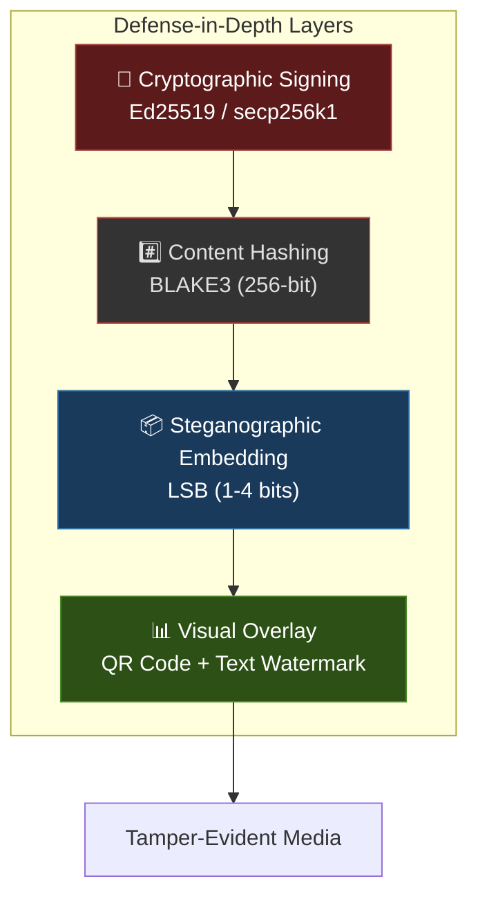

# Security

## Security Model

Steganographer provides **tamper-evident** watermarking, not **tamper-proof** protection. The system is designed to detect unauthorized modifications to media streams, not to prevent them.



> For the theoretical foundations of steganographic security, see [Steganography Theory](steganography-theory.md). For cryptographic details, see [Cryptography](cryptography.md).

### Cachin's Security Framework

Christian Cachin (2004) formalized steganographic security using the Kullback-Leibler (KL) divergence between the probability distributions of cover and stego objects:

| Security Level | KL Divergence | Meaning |
| --- | --- | --- |
| Perfectly secure | D_KL = 0 | Stego object is statistically indistinguishable from cover |
| ε-secure | D_KL ≤ ε | Bounded distinguishability |
| Detectable | D_KL → ∞ | Trivially detectable |

Steganographer's LSB embedding at 1-bit with only 864 out of 921,600 bytes modified achieves a very low embedding rate (~0.09%), placing it in the **low-ε regime** for practical purposes.

### What It Guarantees

| Property | Mechanism | Strength |
| --- | --- | --- |
| **Integrity** | BLAKE3 hash over frame data | Collision resistance: 128-bit security |
| **Authenticity** | Ed25519 signature over hash | Forgery resistance: ~128-bit security |
| **Non-repudiation** | Asymmetric key — signer can't deny producing a valid signature | Same as Ed25519 |
| **Frame ordering** | Frame index included in hash domain | Reordering/replay detected |

### What It Does NOT Guarantee

| Limitation | Description |
| --- | --- |
| **Confidentiality** | Embedded data is not encrypted; extraction reveals the payload |
| **Robustness** | LSB data is destroyed by lossy transcoding (H.264, JPEG, MP3) |
| **Covertness** | Statistical steganalysis may detect the presence of LSB embedding |
| **Availability** | An attacker can strip LSB data by re-encoding the media |

---

## Threat Analysis

### Adversary Model

We assume an adversary who can:

- Intercept the media stream after steganographic embedding
- Modify individual frames or audio buffers
- Attempt to forge or replace signatures
- Attempt to extract the embedded data

### Attack Vectors

| Attack | Protected? | Notes |
| --- | --- | --- |
| Bit-flip on frame data | ✅ | Hash mismatch detected |
| Replace frame content | ✅ | Hash mismatch detected |
| Reorder frames | ✅ | Frame index in hash domain |
| Forge signature without key | ✅ | Ed25519 prevents forgery |
| Strip LSB watermark | ❌ | Re-encoding destroys LSBs (use overlay as backup) |
| Statistical detection of LSB | ⚠️ | Audio uses keyed PRNG; video uses sequential (more detectable) |
| Side-channel (timing) | ⚠️ | Depends on `ed25519-dalek` implementation |
| Quantum computing | ❌ | Ed25519 is not post-quantum |

---

## Key Management

### Key Generation

Keys are generated using `OsRng` (operating system cryptographic random number generator), which is cryptographically secure on all supported platforms.

### Key Storage

| Format | Content | Security |
| --- | --- | --- |
| `.key` file | 64 hex characters (32 bytes) | **Not encrypted** — protect with file permissions |
| `.pub` file | 64 hex characters (32 bytes) | Public — safe to distribute |

### Recommendations

1. **Restrict file permissions**:

   ```bash
   chmod 600 mykey.key
   chmod 644 mykey.pub
   ```

2. **Use per-session keys**: Generate a fresh key pair for each recording session to limit the impact of key compromise.

3. **Distribute public keys securely**: Use a trusted channel (e.g., HTTPS, signed email) to share public keys for verification.

4. **Consider key rotation**: Even within a session, rotating keys periodically (e.g., every hour) limits the window of compromised authenticity.

5. **For production use**: Consider integrating with a key management system (KMS) or hardware security module (HSM).

---

## LSB Key Security

### Video (Sequential)

Video LSB embedding uses sequential byte indices. This is:

- **Simple and efficient** for embedding/extraction
- **More susceptible** to statistical steganalysis (chi-squared test)
- **Acceptable** when the primary goal is tamper detection, not covert communication

### Audio (Keyed PRNG)

Audio LSB embedding uses a 32-byte key to derive a pseudo-random permutation of sample indices:

```text
seed = key ⊕ frame_index
PRNG = ChaCha8(seed)
indices = Fisher-Yates shuffle with PRNG
```

This provides:

- **Index unpredictability**: Without the key, the embedding locations are unknown
- **Per-frame variation**: Each frame uses a different permutation
- **Resistance to statistical attacks**: Scattered indices defeat sequential analysis

**Important**: The PRNG key should be treated as sensitive. If compromised, an adversary can determine the embedding pattern and extract/modify the payload.

---

## Dependencies Security

| Dependency | Purpose | Supply Chain Risk |
| --- | --- | --- |
| `blake3` | Hashing | Low — well-audited, single-purpose |
| `ed25519-dalek` | Signatures | Low — widely used, formally verified |
| `rand` | Key generation | Low — standard library, uses OS entropy |
| `rand_chacha` | PRNG for audio indexing | Low — well-analyzed ChaCha stream cipher |
| `gstreamer-rs` | Media I/O | Medium — large surface area, C bindings |
| `clap` | CLI parsing | Low — widely used, no crypto |
| `serde` / `toml` | Config parsing | Low — widely used, well-maintained |

### Auditing Dependencies

```bash
# Check for known vulnerabilities
cargo install cargo-audit
cargo audit

# Check for unsafe code
cargo install cargo-geiger
cargo geiger
```

---

## Responsible Disclosure

If you discover a security vulnerability in steganographer, please report it responsibly:

1. **Do not** open a public GitHub issue
2. Contact the maintainers directly via the repository's security policy
3. Include reproduction steps and impact assessment
4. Allow reasonable time for a fix before public disclosure

---

## Capacity–Security Tradeoff

Steganographer's design sits at a specific point on the capacity–security curve:

| Parameter | Steganographer's Choice | Impact |
| --- | --- | --- |
| Embedding rate | ~0.09% of cover bytes | Very low → low detectability |
| Payload size | 104 bytes (fixed) | Minimal footprint |
| LSB bits | 1 (default, configurable 1–4) | Higher bits → more detectable |
| Index selection | Sequential (video), Keyed PRNG (audio) | Audio more secure against steganalysis |
| Overlay | Visible info bar (optional) | Deliberate visibility — deterrence model |

The system prioritizes **authenticity and integrity** over **covertness**. The visible Info Bar overlay explicitly signals that watermarking is present — this is a **deterrence-based** security model, not a **secrecy-based** one.

---

## Real-World Threat Models

### Threat Model 1: Deepfake Defense

**Scenario**: A public figure records video statements. An adversary creates deepfake versions to spread misinformation.

| Phase | Without Steganographer | With Steganographer |
| --- | --- | --- |
| **Recording** | Raw video, no provenance | Each frame cryptographically signed with Ed25519/Ethereum identity |
| **Distribution** | No way to verify origin | Recipient extracts LSB payload, verifies signature chain |
| **Deepfake attack** | Indistinguishable from original | Deepfake frames lack valid signatures → verification fails |
| **Court evidence** | "It could be fake" | Chain of cryptographic proof: hash + signature + frame index |

**Dashboard configuration**: LSB Bits = 1, Sign Rate = 5/s, Overlay = organization name, QR Scale = 15%

### Threat Model 2: Evidence Chain of Custody

**Scenario**: Body-worn cameras in law enforcement. Video evidence must be tamper-evident from capture to courtroom.

| Requirement | Implementation |
| --- | --- |
| **Continuous integrity** | Every signed frame includes BLAKE3 hash of pixel data |
| **Temporal ordering** | Frame index embedded prevents reordering or selective deletion |
| **Identity binding** | Ed25519 key tied to officer badge number or device ID |
| **Tamper detection** | Any modification (cropping, editing, re-encoding) invalidates signatures |
| **Audit trail** | Dashboard verification log records all verification results with timestamps |

**Dashboard configuration**: LSB Bits = 1, Sign Rate = 1/s, Overlay Opacity = 0.3, Resolution = 1280×720

### Threat Model 3: Broadcast Authentication

**Scenario**: Live news broadcast. Viewers need to verify the broadcast hasn't been intercepted and modified in transit (man-in-the-middle).

| Attack Vector | Protection |
| --- | --- |
| **Stream interception** | LSB-embedded signatures survive pass-through (lossless transport) |
| **Frame injection** | Injected frames lack valid Ed25519 signatures |
| **Audio substitution** | Audio LSB signatures detect replacement of audio tracks |
| **Delayed replay** | Frame index + timestamp in hash domain detect replay attacks |

### Threat Model 4: Confidential Document Recording

**Scenario**: Recording screen shares or presentations containing sensitive information. The recording must prove who created it and when.

| Component | Role |
| --- | --- |
| **Video steganography** | Embeds identity + timestamp into each frame |
| **Audio steganography** | Signs audio track independently (meeting recordings) |
| **Overlay text** | Visible classification label: "CONFIDENTIAL", "INTERNAL ONLY" |
| **MetaMask integration** | Links recording to Ethereum wallet for blockchain-verifiable identity |
| **Record button** | Exports signed video (WebM) or audio (WAV) with embedded integrity data |

### Threat Model 5: Audio Forensics

**Scenario**: Audio recordings used as legal evidence (phone calls, depositions, surveillance). Must prove audio hasn't been edited.

| Audio Attack | Detection |
| --- | --- |
| **Silence insertion** | Hash mismatch on modified chunks |
| **Word removal/reordering** | Chunk index discontinuity detected |
| **Voice splicing** | BLAKE3 hash of PCM samples detects any bit-level change |
| **Speed manipulation** | Sample rate mismatch in extracted payload |
| **AI voice cloning** | Cloned audio lacks valid cryptographic signatures |

**Dashboard configuration**: Buffer Size = 2048, Sample Rate = 44100, Sign Rate = 2/s, LSB Bits = 1

---

## Use Case Examples

### Journalism & Media Verification

Journalists can watermark raw footage at capture time, providing cryptographic proof that video/audio hasn't been modified since recording. This is critical in the era of AI-generated media.

```text
Capture → LSB Embed → Sign → Distribute → Verify
                ↑                               ↑
          Steganographer                  Any verifier with
          (private key)                   public key
```

### Intellectual Property Protection

Creative professionals (filmmakers, musicians, podcasters) embed invisible authorship signatures into their raw media. Even if content is re-uploaded or redistributed, the LSB signatures can prove original authorship.

### Regulatory Compliance (GDPR, HIPAA)

Healthcare and financial institutions recording video consultations or audio calls can prove recordings haven't been tampered with for regulatory audits.

### Supply Chain Integrity

Manufacturing inspection videos and quality assurance recordings can be signed to prove inspection actually occurred and results weren't fabricated.

### Whistleblower Protection

Recordings of evidence can be cryptographically signed at capture time, preventing accusation that evidence was fabricated or manipulated after the fact.

### Academic Research Integrity

Lab recordings (microscopy video, experimental audio data) can be signed at capture to prevent data fabrication accusations.

---

## Dashboard Security Controls

The web dashboard provides **real-time** security configuration through intuitive controls. Each control has detailed mouseover tooltips explaining its function:

### Video Tab Controls

| Control | Range | Security Impact |
| --- | --- | --- |
| **Overlay Opacity** | 0–100% | 0% = invisible watermark only; 100% = visible deterrent |
| **LSB Bits** | 1–4 | More bits = more capacity but more detectable by steganalysis |
| **Sign Backend** | Ed25519 / Ethereum | Ed25519 = lightweight; Ethereum = blockchain-verifiable identity |
| **Overlay Text** | Free text | Visible classification label burned into video |
| **Sign Rate** | 0.2–5 per second | Higher = more frames verified but more CPU |
| **QR Scale** | 5–100% | Size of the visible data matrix encoding hash/signature metadata |
| **Resolution** | 320×240 to 1920×1080 | Higher = more embedding capacity per frame |
| **Record** | Toggle | Exports signed video as WebM for archival |

### Audio Tab Controls

| Control | Range | Security Impact |
| --- | --- | --- |
| **LSB Bits** | 1–4 | 1 = inaudible; 4 = max capacity but may be audible |
| **Sign Backend** | Ed25519 / Ethereum | Same as video — choose based on verification ecosystem |
| **Sign Rate** | 0.2–5 per second | Audio chunk signing frequency |
| **Buffer Size** | 1024–8192 samples | Larger = more embedding capacity per chunk |
| **Sample Rate** | 22050–48000 Hz | Higher = more samples for embedding |
| **Record** | Toggle | Exports signed audio as WAV for archival/evidence |

### MetaMask Integration

Connect an Ethereum wallet via the **Connect MetaMask** button to:

- Sign frames/chunks with your Ethereum address (secp256k1)
- Create blockchain-verifiable authorship proofs
- Generate EIP-191 personal signatures compatible with on-chain verification

---

## Deployment Security Recommendations

### For Personal Use

- Use default Ed25519 signing with auto-generated keys
- Store `.key` file with `chmod 600` permissions
- Use the dashboard's Record button for evidence capture

### For Organizational Use

- Issue per-user or per-device key pairs from a central authority
- Use Ethereum signing with organizational wallets for audit trails
- Set Overlay Text to organization name + classification level
- Deploy dashboard behind HTTPS reverse proxy (nginx, Caddy)
- Enable CORS restrictions in production (currently permissive for development)

### For Legal/Forensic Use

- Use maximum Sign Rate (5/s) for finest-grained tamper detection
- Keep LSB Bits at 1 for minimum detectability
- Record both video and audio channels simultaneously
- Preserve `.key` and `.pub` files in tamper-evident storage
- Document the key generation ceremony and chain of custody

---

## Further Reading

- [Steganography Theory](steganography-theory.md) — Deep dive into information hiding theory
- [Cryptography](cryptography.md) — BLAKE3 + Ed25519 deep dive, provable security
- [Algorithms](algorithms.md) — Embedding protocol details
- [Threat Model](threat-model.md) — Adversary model, 8 threat categories, use-case scenarios
- [Configuration](configuration.md) — TOML config reference
- [FAQ](faq.md) — Frequently asked questions
