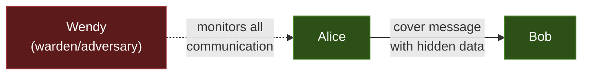
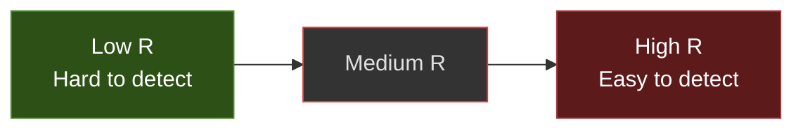
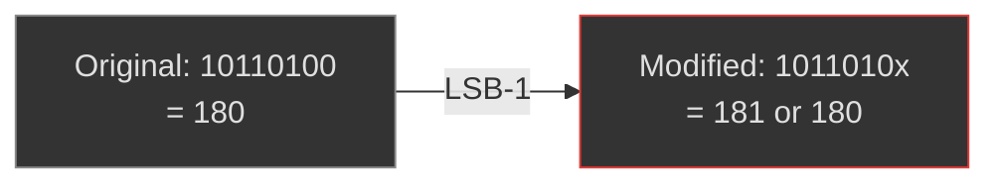
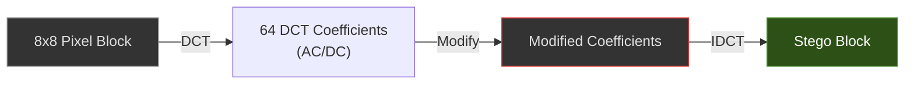
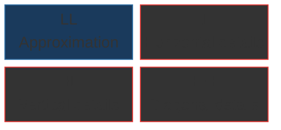

# Steganography Theory

A comprehensive guide to the science of information hiding — the theoretical foundations, mathematical models, practical techniques, and security analysis underpinning the Steganographer toolkit.

---

## Table of Contents

1. [Historical Context](#historical-context)
2. [Information-Theoretic Foundations](#information-theoretic-foundations)
3. [Spatial-Domain Techniques](#spatial-domain-techniques)
4. [Frequency-Domain Techniques](#frequency-domain-techniques)
5. [Audio Steganography](#audio-steganography)
6. [Video Steganography](#video-steganography)
7. [Steganalysis — Detecting Hidden Data](#steganalysis)
8. [Steganography Meets Cryptography](#steganography-meets-cryptography)
9. [Modern Advances](#modern-advances)
10. [Further Reading](#further-reading)

---

## Historical Context

### Ancient Origins

Steganography (from Greek *στεγανός* "covered" + *γράφειν* "writing") predates cryptography as a discipline of secret communication:

| Era | Technique | Description |
| --- | --- | --- |
| ~440 BC | Histiaeus' slave | Shaved the slave's head, tattooed a message on his scalp, waited for hair to regrow, and sent him to Aristagoras |
| ~480 BC | Demaratus' wax tablets | Scraped wax off wooden tablets, carved message into wood, re-covered with wax |
| 1st century | Pliny's invisible ink | Used milk or plant juices that become visible when heated |
| Renaissance | Trithemius' *Steganographia* (1499) | Systematic treatise disguised as a book on angel magic |
| WWII | Microdots | Photographs shrunk to the size of a period, pasted into letters |
| Modern | Digital steganography | Embedding data in digital media (images, audio, video, network packets) |

### The Prisoners' Problem (Simmons, 1983)

Gustavus Simmons formalized the steganographic scenario: two prisoners, Alice and Bob, wish to communicate covertly while being monitored by a warden, Wendy. They can exchange seemingly innocent cover messages (e.g., images) but must hide their true communication within them. This model remains the foundation of modern steganographic security analysis.



---

## Information-Theoretic Foundations

### Cover Object and Stego Object

| Term | Symbol | Definition |
| --- | --- | --- |
| Cover object | *C* | The innocent carrier medium (e.g., unmodified video frame) |
| Stego object | *S* | The carrier after embedding the hidden message |
| Message | *M* | The secret data to embed (e.g., `SignaturePayload`) |
| Key | *K* | Optional shared secret controlling embedding (e.g., PRNG seed) |
| Embedding function | *Emb(C, M, K) → S* | Produces the stego object |
| Extraction function | *Ext(S, K) → M* | Recovers the hidden message |

### Cachin's ε-Security (2004)

Christian Cachin formalized steganographic security using the Kullback-Leibler (KL) divergence between the probability distributions of cover and stego objects:

```text
D_KL(P_C || P_S) ≤ ε
```

- **ε = 0**: *Perfectly secure* steganography — the stego object is statistically indistinguishable from the cover. This is the gold standard but is hard to achieve in practice.
- **ε > 0**: *ε-secure* steganography — the distributions differ by at most ε. Smaller ε means harder to detect.
- **ε → ∞**: Trivially detectable.

### Shannon's Information-Theoretic Model

Claude Shannon's foundational work on information theory underpins steganographic capacity:

- **Embedding rate** (*R*): bits of hidden data per sample of cover object. For LSB-1: *R* = 1 bit/sample.
- **Distortion** (*D*): perceptual difference between cover and stego objects. For LSB-1: *D* = ½ (expected Hamming distance).
- **Capacity–Distortion Tradeoff**: higher embedding rates cause more distortion and are easier to detect.



> As embedding rate (R) increases, detectability increases. The **security boundary** defines the maximum R before steganalysis becomes reliable.

### Kerckhoffs' Principle Applied to Steganography

Just as Kerckhoffs' principle states that a cipher should be secure even if everything except the key is public, **steganographic security must not rely on secrecy of the embedding algorithm**. An adversary should be assumed to know:

- The embedding method (LSB replacement, DCT, etc.)
- The cover source distribution
- The presence of a hidden message

Security must derive from the **key** or from the statistical indistinguishability of the embedding.

---

## Spatial-Domain Techniques

Spatial-domain methods directly modify pixel/sample values.

### LSB Replacement (Used by Steganographer)

The simplest and most widely deployed technique. Replace the least significant bit(s) of each sample with message bits:



**Advantages**: Simple, fast, high capacity
**Disadvantages**: Vulnerable to chi-squared and RS steganalysis

#### LSB Matching (±1 Embedding)

Instead of *replacing* LSBs, randomly *add or subtract* 1 from samples whose LSB doesn't match. This preserves the natural statistical distribution (no "pairs of values" artifact that chi-squared attacks exploit):

```text
If sample LSB ≠ message bit:
    sample += random_choice(-1, +1)
```

LSB matching is significantly harder to detect than LSB replacement.

### Pixel-Value Differencing (PVD)

Proposed by Wu & Tsai (2003). Embeds data in the *difference* between adjacent pixel pairs. Larger differences (edge regions) can embed more bits because the human visual system is less sensitive to changes in high-contrast areas:

| Pixel Difference | Bits Embedded | Rationale |
| --- | --- | --- |
| 0–15 (smooth) | 2 bits | Low tolerance for change |
| 16–31 | 3 bits | Moderate tolerance |
| 32–63 | 4 bits | High tolerance |
| 64–127 | 5 bits | Edge region, high tolerance |
| 128–255 | 6 bits | Strong edge, maximum capacity |

### Matrix Encoding

Uses error-correcting codes to embed *n* bits by modifying only *1* cover sample in every *2^n - 1* samples. Dramatically reduces embedding distortion:

| Technique | Bits per change | Efficiency |
| --- | --- | --- |
| LSB-1 | 1 bit / 1 change | 1.0 |
| Hamming(3,1) | 1 bit / ~0.5 changes | 2.0 |
| Hamming(7,1) | 1 bit / ~0.25 changes | 4.0 |
| Syndrome coding | Approaching theoretical limit | ~*n* |

---

## Frequency-Domain Techniques

Frequency-domain methods transform the signal first, then embed in the transform coefficients. They are inherently more robust to compression and noise.

### Discrete Cosine Transform (DCT)

Used by JPEG compression. Embeds data in the quantized DCT coefficients of 8×8 image blocks:



**Key properties**:

- Survives JPEG re-compression (if quality factor is similar)
- Mid-frequency coefficients are preferred (balancing perceptibility and robustness)
- JSteg, F5, and OutGuess are well-known DCT steganographic algorithms

### Discrete Wavelet Transform (DWT)

Decomposes the image into multi-resolution sub-bands (LL, LH, HL, HH). Embedding in the detail sub-bands (LH, HL, HH) provides good robustness:



**Advantage**: Better energy compaction than DCT; multi-scale embedding allows adaptive capacity.

### Spread Spectrum

Inspired by communications theory. The message is modulated onto a pseudo-noise (PN) sequence and added to the cover signal at low power:

```text
stego_signal = cover + α · PN_sequence · message_bit
```

Where *α* controls the embedding strength. Detection requires knowing the PN sequence (the key). Spread-spectrum watermarks survive noise, compression, and geometric attacks.

---

## Audio Steganography

Audio steganography exploits properties of human auditory perception (psychoacoustics).

### Techniques

| Method | Principle | Robustness | Capacity |
| --- | --- | --- | --- |
| **LSB (used by Steganographer)** | Modify least significant bits of PCM samples | Low | High |
| **Phase coding** | Modify phase of FFT bins; human ears are insensitive to absolute phase | Medium | Low |
| **Echo hiding** | Add short echoes (delay + attenuation); one delay = bit-0, another = bit-1 | Medium | Low |
| **Spread spectrum** | Spread signal across frequency band with PN code | High | Low |
| **Patchwork** | Systematically alter pairs of samples in opposite directions | High | Very low |
| **Wavelet-based** | Embed in DWT coefficients of audio signal | High | Medium |

### Psychoacoustic Masking

Human hearing has frequency-dependent masking thresholds. A loud tone at one frequency "masks" quieter sounds at nearby frequencies. Steganographic embedding below the masking threshold is completely inaudible, even at higher embedding strengths than uniform LSB.

### Keyed Permutation (as used in Steganographer)

Steganographer's audio module scatters embedded bits across pseudo-random sample indices using a per-frame key-derived Fisher-Yates shuffle:

```text
seed = PRNG_key ⊕ frame_index
rng = ChaCha8(seed)
indices = Fisher-Yates_shuffle(0..N, rng)
```

This defeats sequential statistical analysis while maintaining deterministic extraction with the key.

---

## Video Steganography

Video steganography extends image techniques with temporal considerations.

### Temporal Approaches

| Category | Technique | Description |
| --- | --- | --- |
| **Intra-frame** | Per-frame LSB/DCT/DWT | Each frame treated independently (Steganographer's approach) |
| **Inter-frame** | Temporal difference embedding | Embed in the differences between consecutive frames |
| **Motion vector** | Modify H.264/HEVC motion vectors | Robust to spatial processing but fragile to re-encoding |
| **Scene change** | Embed at scene boundaries | Low capacity but high imperceptibility |
| **Compressed domain** | Modify VLC/CAVLC coefficients directly | No decode/re-encode needed |

### Frame Selection Strategies

Not all frames are equally suitable for embedding:

- **I-frames** (keyframes): Full spatial data, best for spatial-domain methods
- **P-frames** (predicted): Contain motion vectors and residuals
- **B-frames** (bidirectional): Most complex, least stable for embedding

Steganographer currently embeds in every frame (intra-frame LSB), which maximizes embedding capacity at the cost of robustness.

### Capacity vs. Robustness per Frame

Steganographer's 109-byte payload requires only 904 pixels at 1-bit LSB. A single 640×480 RGB frame provides 921,600 bytes — providing a **1,067× capacity surplus**. This surplus is a design choice: using fewer embedding locations reduces detectability.

---

## Steganalysis

Steganalysis is the science of detecting hidden data. It is the adversary to steganography.

### Passive vs. Active Wardens

| Warden Type | Capability | Countermeasure |
| --- | --- | --- |
| **Passive** | Only observes; detects presence of hidden data | Statistical indistinguishability |
| **Active** | Modifies the medium (e.g., re-compression) to destroy hidden data | Robust embedding (DCT, spread spectrum) |
| **Malicious** | Replaces or forges content | Cryptographic authentication (Steganographer's approach) |

### Detection Techniques for LSB Replacement

#### Chi-Squared Attack (Westfeld & Pfitzmann, 1999)

Exploits the fact that LSB replacement creates "pairs of values" (POVs). For example, pixel values 180 and 181 (which differ only in the LSB) occur with nearly equal frequency in stego images but not in natural images:

```text
Natural image:  P(180) ≠ P(181)  (random natural distribution)
After LSB stego: P(180) ≈ P(181)  (forced equalization)
```

The chi-squared statistic measures this equalization. Steganographer's **video** module is vulnerable to this attack because it uses sequential LSB replacement.

#### RS Analysis (Fridrich et al., 2001)

Classifies pixel groups as Regular (R), Singular (S), or Unusable (U) based on a smoothness criterion. In natural images:

```text
|R_+1| > |S_+1|  and  |R_-1| > |S_-1|
```

After LSB embedding, the counts converge: `|R_+1| ≈ |S_+1|`. The degree of convergence estimates the embedding rate.

#### Sample Pair Analysis (SPA) (Dumitrescu et al., 2003)

Analyzes the relationship between pairs of adjacent samples to detect LSB replacement without requiring knowledge of the cover image distribution.

#### Deep Learning Steganalysis

Modern steganalysis uses convolutional neural networks (CNNs) trained on cover/stego image pairs. Networks like SRNet, YeNet, and Zhu-Net achieve >95% detection accuracy on traditional LSB embedding at embedding rates as low as 0.1 bits per pixel.

**Implications for Steganographer**: At Steganographer's embedding rate (~0.001 bits/pixel for a 640×480 frame), deep learning steganalysis would struggle to detect the embedding due to the extremely low payload-to-carrier ratio.

### Steganalysis Resistance of Steganographer

| Component | Steganalysis Resistance | Notes |
| --- | --- | --- |
| LSB Video (sequential) | Low–Medium | Vulnerable to chi-squared, RS analysis. Mitigated by extremely low embedding rate |
| LSB Audio (keyed PRNG) | Medium–High | Scattered indices defeat sequential attacks. Key-dependent permutation adds cryptographic security |
| Text Overlay | N/A | Visible by design |
| Info Bar | N/A | Visible by design |

---

## Steganography Meets Cryptography

### The Composition Principle

Steganography and cryptography are complementary but distinct:

| Property | Cryptography | Steganography |
| --- | --- | --- |
| **Goal** | Make data unreadable | Make data invisible |
| **Failure mode** | Data readable but known to exist | Data detectable but may remain unreadable |
| **Key role** | Decrypt/verify | Locate/extract |
| **Without key** | Ciphertext visible, content hidden | Hidden data exists but is unlocatable |

**Best practice**: Encrypt the payload *before* steganographic embedding. Steganographer implements this conceptually: the `SignaturePayload` contains a cryptographic signature that is meaningless without the public key context, even if extracted.

### Provable Security for Steganography

Hopper, Langford, and von Ahn (2002) proved that **perfectly secure steganography is possible if and only if the channel distribution is perfectly sampleable**. In practice:

- If you can *exactly* sample from the cover distribution, you can construct a stego object that is statistically identical to a cover object.
- For natural images/video, this is an open problem — we can approximate but not perfectly sample the distribution of "natural photographs."

### Deniable Steganography

Some steganographic schemes support **plausible deniability**: the sender can reveal a decoy message if coerced, while the true message remains hidden. This requires multiple layers of embedding with independent keys.

### Post-Quantum Considerations

| Threat | Impact on Steganography | Impact on Cryptography |
| --- | --- | --- |
| Grover's algorithm | Halves the effective security of symmetric keys (e.g., 256-bit → 128-bit effective) | Moderate |
| Shor's algorithm | Breaks nothing directly in steganography | Breaks RSA, ECDSA, Ed25519 |

Steganographer's Ed25519 signatures would need replacement with post-quantum schemes (ML-DSA / Dilithium) in a quantum-computing future. The steganographic embedding itself is unaffected by quantum computing.

---

## Modern Advances

### Generative Adversarial Network (GAN) Steganography

GANs can generate cover images that are *optimized* for embedding, or can directly produce stego images from scratch:

- **SteganoGAN** (Zhang et al., 2019): Encoder/decoder network pair trained end-to-end
- **HiDDeN** (Zhu et al., 2018): Differentiable noise layers simulate attacks during training
- **ISSBA** (Li et al., 2021): Invisible sample-specific backdoor attacks as steganographic channels

### Adversarial Embedding

Uses adversarial machine learning to embed data in regions that specifically fool steganalysis networks. The embedding function is trained against a discriminator (steganalysis CNN):

```text
min_Embed  max_Analyzer  L(Analyzer(Embed(cover, message)), "cover")
```

### Neural Network Watermarking (Video Seal)

Meta's Video Seal (2024) uses a learned encoder–decoder architecture to embed imperceptible watermarks that survive:

- Lossy compression (H.264, H.265, VP9, AV1)
- Resolution changes
- Frame cropping
- Brightness/contrast adjustments
- Screen recording

This represents the future of robust video watermarking and is a planned integration for Steganographer (see [Roadmap](roadmap.md)).

### Blockchain-Verified Steganography

Combining steganographic embedding with blockchain timestamping provides:

1. Proof of existence at a specific time (blockchain timestamp)
2. Proof of authorship (embedded signature)
3. Tamper evidence (hash chain)

---

## Further Reading

### Foundational Papers

| Paper | Authors | Year | Contribution |
| --- | --- | --- | --- |
| *The Prisoners' Problem* | G. Simmons | 1983 | Formal steganographic model |
| *An Information-Theoretic Model for Steganography* | C. Cachin | 2004 | ε-security framework |
| *Attacks on Steganographic Systems* | A. Westfeld, A. Pfitzmann | 1999 | Chi-squared steganalysis |
| *Reliable Detection of LSB Steganography* | J. Fridrich et al. | 2001 | RS analysis |
| *Detection of LSB Steganography via Sample Pair Analysis* | S. Dumitrescu et al. | 2003 | SPA method |
| *Provably Secure Steganography* | N. Hopper et al. | 2002 | Theoretical foundation |
| *Defining Security in Steganographic Systems* | C. Cachin | 1998 | KL divergence model |

### Textbooks

- **Katzenbeisser & Petitcolas**, *Information Hiding: Techniques for Steganography and Digital Watermarking* (2000)
- **Fridrich**, *Steganography in Digital Media: Principles, Algorithms, and Applications* (2009)
- **Cox, Miller, Bloom**, *Digital Watermarking and Steganography* (2nd ed., 2007)

### Standards

| Standard | Scope |
| --- | --- |
| ISO/IEC 19794-5 | Biometric data interchange (watermarking context) |
| FIPS 204 (ML-DSA) | Post-quantum digital signatures |
| RFC 8032 | Ed25519 specification (used by Steganographer) |
| NIST SP 800-188 | De-identification of personal information (related) |

### Related Steganographer Documentation

- [Algorithms](algorithms.md) — Implementation-specific algorithm details
- [Cryptography](cryptography.md) — BLAKE3 + Ed25519 deep dive
- [Security](security.md) — Threat model and attack analysis
- [Architecture](architecture.md) — System design and module interactions
