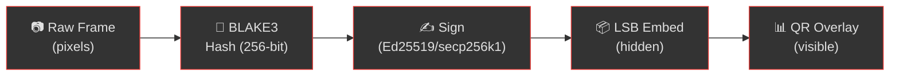

# Threat Model

Comprehensive threat analysis for the Steganographer cryptographic watermarking system. This document defines the adversary model, enumerates threats, maps countermeasures, and explains the security boundaries of the system.

> For implementation details, see [Security](security.md). For cryptographic primitives, see [Cryptography](cryptography.md).

---

## System Overview

Steganographer provides **tamper-evident** (not tamper-proof) cryptographic watermarking. Every video frame and audio chunk is:

1. **Hashed** — BLAKE3 (256-bit) over raw pixel/sample data
2. **Signed** — Ed25519 or Ethereum secp256k1 digital signature over the hash
3. **Embedded** — Signature hidden in Least Significant Bits (LSB) of the media
4. **Overlaid** — Optional visible QR data matrix encoding the hash + signature metadata

---

## Adversary Model

### Who Are the Adversaries?

| Adversary | Goal | Capability |
| --------- | ---- | ---------- |
| **Content Forger** | Pass off fabricated media as authentic | Can generate synthetic video/audio (deepfakes, voice cloning) |
| **Tamperer** | Modify signed media without detection | Can edit pixel values, cut/splice frames, alter audio samples |
| **Impersonator** | Claim authorship of another's signed media | Can strip and re-sign with a different key |
| **Steganalyst** | Detect or remove the hidden watermark | Has statistical analysis tools (RS analysis, chi-square, ML detectors) |
| **Man-in-the-Middle** | Intercept and alter media streams in transit | Can modify network traffic between encoder and verifier |
| **Insider** | Leak signed media while denying involvement | Has access to signing keys and raw media |

### What the Adversary Cannot Do

- **Break BLAKE3** — 256-bit pre-image resistance (2²⁵⁶ operations)
- **Forge Ed25519** — 128-bit security level (EUF-CMA secure)
- **Forge secp256k1** — 128-bit security under ECDLP hardness
- **Read the private key** — Keys never leave the signing process

---

## Threat Catalog

### T1: Deepfake Injection

| Property | Value |
| -------- | ----- |
| **Threat** | AI-generated video is inserted into a supposedly authentic stream |
| **Impact** | High — could be used for disinformation, fraud, or legal deception |
| **Countermeasure** | Every frame carries a cryptographic signature. A deepfake frame lacks the correct Ed25519/Ethereum signature for the claimed identity |
| **Detection** | Verification extracts LSB data → parses signature → checks against known public key. Deepfake frames will have NO valid signature or a DIFFERENT signer |
| **Residual Risk** | If the deepfake generator has the private key, they can sign fake frames |

### T2: Frame Tampering

| Property | Value |
| -------- | ----- |
| **Threat** | Individual pixels or regions of a signed frame are modified |
| **Impact** | Medium — subtle edits could alter evidence (timestamps, faces, text) |
| **Countermeasure** | BLAKE3 hash covers the ENTIRE raw RGB/PCM buffer. ANY modification to even 1 byte invalidates the hash, which invalidates the signature |
| **Detection** | Extract hash from LSB → recompute BLAKE3 over current frame → compare. Mismatch = tampered |
| **Residual Risk** | None — cryptographic hash guarantees any modification is detected |

### T3: Frame Splice/Reorder

| Property | Value |
| --- | --- |
| **Threat** | Frames from different times or sessions are rearranged |
| **Impact** | Medium — timeline manipulation for legal evidence |
| **Countermeasure** | Each signed frame includes a frame index counter in the payload. The QR overlay also encodes timestamps. Gaps or reversals in the sequence reveal splicing |
| **Detection** | Compare sequential frame indices. Missing numbers or non-monotonic sequences indicate tampering |
| **Residual Risk** | Frame reordering within a single signature interval (between signed frames) may not be detected |

### T4: Signature Stripping

| Property | Value |
| --- | --- |
| **Threat** | Adversary removes all steganographic data from the media |
| **Impact** | Loss of provenance — media becomes "unsigned" |
| **Countermeasure** | (a) The QR overlay is visible and cannot be removed without visible damage. (b) LSB data removal would require changing bit values, altering the visual/audio output |
| **Detection** | Absence of extractable signature = media has no integrity guarantee |
| **Residual Risk** | If only LSB data is targeted, a sophisticated adversary could zero the least significant bits. The visible QR overlay defends against this second-layer attack |

### T5: Re-signing Attack

| Property | Value |
| --- | --- |
| **Threat** | Adversary strips the original signature and re-signs with their own key |
| **Impact** | High — claim of authorship is transferred to the adversary |
| **Countermeasure** | Public key distribution. The original signer's public key is distributed out-of-band (published, registered, or verified via Ethereum address on-chain) |
| **Detection** | Signature verification against the EXPECTED public key fails if a different key signed |
| **Residual Risk** | Requires trust in the public key infrastructure (PKI or blockchain identity) |

### T6: Audio Manipulation

| Property | Value |
| --- | --- |
| **Threat** | Audio samples are modified to change spoken words or add/remove sounds |
| **Impact** | High — voice evidence alteration for legal, journalistic, or financial fraud |
| **Countermeasure** | Audio LSB steganography embeds BLAKE3 + Ed25519 signatures in PCM sample LSBs, keyed with PRNG permutation for scatter-embedding |
| **Detection** | Extract audio signature → verify against hash of current audio chunk |
| **Residual Risk** | Very short clips (< 1 signature interval) may not have signatures embedded |

### T7: Compression/Transcoding Attack

| Property | Value |
| --- | --- |
| **Threat** | Media is re-encoded (JPEG, H.264, MP3) which destroys LSB data |
| **Impact** | LSB signature is lost; QR overlay may be degraded but survives |
| **Countermeasure** | (a) QR overlays survive lossy compression. (b) DCT-domain embedding (`dct_video`) places signatures in frequency coefficients that survive JPEG/H.264 re-encoding. (c) Spread-spectrum embedding (`spread_spectrum_video`) disperses the signal across a wide band, surviving noise and moderate compression. (d) WAV recordings from the dashboard preserve LSB data |
| **Detection** | LSB verification failure after transcoding is expected; DCT-domain and spread-spectrum modules provide fallback robustness |
| **Residual Risk** | Pure LSB steganography is inherently fragile to aggressive lossy compression — DCT and spread-spectrum reduce but do not eliminate this risk |

### T8: Side-Channel Leakage

| Property | Value |
| --- | --- |
| **Threat** | Signing timing or patterns reveal information about the private key |
| **Impact** | Low — potential key compromise via timing analysis |
| **Countermeasure** | Ed25519 uses constant-time operations. BLAKE3 is designed for constant-time execution |
| **Detection** | N/A — prevented by algorithmic design |
| **Residual Risk** | Hardware-level side channels theoretically possible but impractical |

### T9: Partial LSB Corruption

| Property | Value |
| --- | --- |
| **Threat** | Noise or minor corruption damages some LSB-embedded bytes, causing extraction failure |
| **Impact** | Medium — signature may be partially unrecoverable |
| **Countermeasure** | Reed-Solomon error correction codes (GF(2⁸)) add redundancy to the embedded payload, enabling recovery from partial corruption |
| **Detection** | Error correction decoder attempts to recover the original payload; success/failure reported |
| **Residual Risk** | If corruption exceeds the error correction capacity (number of redundant symbols), recovery fails |

### T10: Payload Interception

| Property | Value |
| --- | --- |
| **Threat** | Adversary extracts the LSB-embedded payload and reads the signature/hash data |
| **Impact** | Low — signature and hash are not secret, but payload metadata may reveal signer identity |
| **Countermeasure** | ChaCha20-Poly1305 AEAD encryption (`encrypt` in `PayloadConfig`) encrypts the payload before embedding. Only holders of the encryption key can decrypt |
| **Detection** | Without the encryption key, extracted data appears as random noise |
| **Residual Risk** | If the encryption key is compromised, the payload is readable |

---

## Security Boundaries

### What Steganographer Guarantees

| Guarantee | Mechanism |
| --- | --- |
| **Integrity** | BLAKE3 hash detects any byte-level modification |
| **Authenticity** | Ed25519/secp256k1 signature proves the signer's identity |
| **Non-repudiation** | A valid signature proves the holder of the private key created it |
| **Tamper evidence** | Any modification to signed data invalidates verification |
| **Visual deterrence** | QR overlay and text watermarks discourage unauthorized use |
| **Payload confidentiality** | Optional ChaCha20-Poly1305 encryption hides signer identity in embedded data |

### What Steganographer Does NOT Guarantee

| Non-guarantee | Reason |
| --- | --- |
| **Tamper prevention** | Media can still be modified — modifications are just detectable |
| **Covert channels** | LSB embedding is detectable by statistical steganalysis at high bit counts |
| **Compression survival (LSB)** | Pure LSB data is destroyed by lossy compression (JPEG, H.264, MP3) — DCT and spread-spectrum modules improve robustness |
| **Key management** | The system generates keys but does not manage their lifecycle |

---

## Dashboard Security Controls

The web GUI exposes several security-relevant controls:

### Video Tab — Encode Panel

| Control | Security Impact |
| --- | --- |
| **LSB Bits** (1–4) | Higher = more capacity but more detectable. Use 1 for best covertness |
| **Sign Backend** | Ed25519 or Ethereum — determines which key signs each frame |
| **Sign Rate** | Frames/second receiving signatures. Higher = more frames verified |
| **QR Scale** | Larger QR = more readable by scanners, but more visually intrusive |
| **Overlay Text** | Visible classification label (e.g., CONFIDENTIAL, EVIDENCE) |
| **Resolution** | Higher resolution = more pixels for embedding = more capacity |

### Video Tab — Verify Panel

| Field | Meaning |
| --- | --- |
| **Frame Index** | Sequential counter — gaps indicate potential splicing |
| **BLAKE3 Hash** | The hash extracted from LSB data — must match recomputed hash |
| **Backend** | Which signature algorithm was used to sign |
| **Verify Latency** | Time to extract + verify — should be consistent |
| **✅ Verified / ❌ Failed** | Running count of successful and failed verifications |

### Audio Tab

| Control | Security Impact |
| --- | --- |
| **LSB Bits** | Same as video — lower = more covert |
| **Sign Backend** | Determines audio chunk signature algorithm |
| **Sign Rate** | Audio chunks per second receiving signatures |

### MetaMask Integration

| Feature | Security Impact |
| --- | --- |
| **Connect Wallet** | Links Ethereum address as the signing identity |
| **On-chain identity** | Signatures can be verified against a public Ethereum address |
| **EIP-191** | Standard personal message signing — widely supported |

### Keyboard Shortcuts

| Shortcut | Action | Security Impact |
| --- | --- | --- |
| **Space** | Toggle camera on/off | Controls whether signing is active |
| **R** | Toggle recording | Creates persistent evidence artifacts |
| **E** | Export session report | Exports config, metrics, and identity as downloadable JSON |
| **H** | Toggle help overlay | No security impact — informational only |

### Session Export (`GET /api/session`)

| Field | Security Consideration |
| --- | --- |
| **identity** | Exposes the signer's public key fingerprint — this is public information by design |
| **config** | Reveals current signing backend, LSB bits, and overlay text |
| **metrics** | Shows frame counts, verification rates, and latencies |
| **uptime_secs** | Reveals session duration |

> ⚠️ The session export endpoint is available to any client on the local network. In production deployments, consider restricting access via firewall rules or authentication middleware.

### Docs Tab

| Feature | Security Impact |
| --- | --- |
| **In-app documentation viewer** | No security impact — serves read-only embedded markdown files |
| **`GET /api/docs`** | Returns list of documentation filenames |
| **`GET /api/docs/:name`** | Returns markdown content; only serves files from the compile-time embedded set — no filesystem access |

---

## Use Case Threat Scenarios

### Scenario 1: Courtroom Evidence

**Situation**: Body camera footage is submitted as evidence.

**Threats**: T1 (deepfake), T2 (pixel edit), T3 (splice), T4 (strip signatures)

**Mitigation**:

- Camera runs the Steganographer pipeline, signing every frame
- Officer's Ed25519 public key is registered with the department
- QR overlay provides quick visual verification
- Chain of custody: every frame has a cryptographic proof of origin

### Scenario 2: Journalism in Conflict Zones

**Situation**: Reporter captures footage of events under dispute.

**Threats**: T1 (deepfake counter-claims), T5 (impersonation), T6 (audio manipulation)

**Mitigation**:

- Reporter signs with their personal Ed25519 key
- News organization can verify any frame against the reporter's published public key
- Audio and video both carry independent signatures
- QR metadata includes timestamps for timeline reconstruction

### Scenario 3: Supply Chain Inspection

**Situation**: Remote video inspection of manufacturing processes.

**Threats**: T2 (edit defects out), T3 (show old footage), T7 (lossy compression strips proofs)

**Mitigation**:

- Inspection device signs all frames with facility-specific key
- Dashboard recording saves raw WebM (preserving QR overlays)
- Audio PCM saved as WAV (preserving LSB signatures)
- Missing frame indices reveal if footage is truncated

### Scenario 4: Whistleblower Protection

**Situation**: Internal recordings need to prove authenticity without revealing the source.

**Threats**: T5 (re-signing by adversary), T8 (key leakage), T4 (signature stripping)

**Mitigation**:

- Use Ethereum signing with a pseudonymous wallet
- QR overlay burns proof into the visible video
- Even if LSB data is stripped, the QR overlay persists in recordings
- Verification requires only the public key, protecting the whistleblower's identity

---

## Residual Risks Summary

| Risk | Severity | Mitigation Path |
| --- | --- | --- |
| Private key compromise | Critical | Hardware security modules (HSMs), key rotation |
| Encryption key compromise | High | Separate key management, key rotation, HSM storage |
| Lossy compression destroying LSB | Medium | DCT-domain embedding, spread-spectrum, QR overlay as fallback |
| Steganalysis detecting LSB at high bit depths | Low | Use 1-bit LSB (below RS analysis threshold) |
| Partial corruption exceeding ECC capacity | Low | Increase Reed-Solomon redundancy symbols |
| Frame reordering between signed frames | Low | Multi-frame spreading, sign at maximum rate |
| Quantum computing breaking Ed25519 | Future | ML-DSA (post-quantum) backend planned in roadmap |

---

## Further Reading

- [Security](security.md) — Security model, Cachin's framework, deployment guidance
- [Cryptography](cryptography.md) — BLAKE3, Ed25519, Ethereum signing details
- [Algorithms](algorithms.md) — LSB embedding, QR overlay, info bar implementations
- [Steganography Theory](steganography-theory.md) — Information-theoretic foundations
- [Configuration](configuration.md) — TOML settings for security parameters
- [Roadmap](roadmap.md) — Post-quantum and DCT-domain planned features
